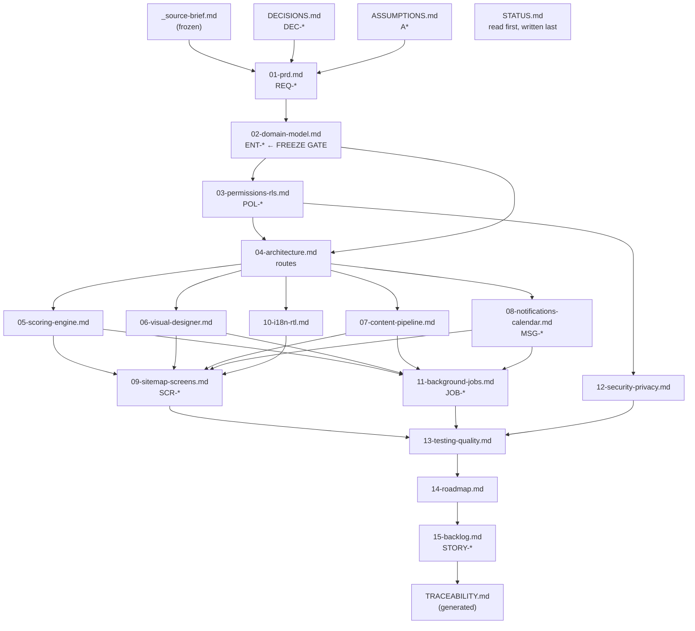

# 00 — Overview

**Status:** `settled` · **Owns:** the glossary, the ID scheme, the document index
**Serves:** every requirement · **Cites:** `_source-brief.md`, `DECISIONS.md`

---

## 1. The product

**كريم معرفة | Knowledge Kareem** is a multi-tenant web platform where an organization's members
share knowledge through **offline, in-person sessions**.

A member proposes a topic. An org admin reviews it, schedules a date and a venue, produces a
poster, and publishes it. Members reserve a seat — with capacity, a waitlist, and deadlines — add
the session to their calendar, work through reminder-only preparation tasks, and download
pre-reads. In the room, the presenter announces a rotating check-in code; entering it is the
**only** proof of attendance. The event page carries threaded comments, reactions, photos, and
the presenter's materials: slides in an in-browser page-by-page viewer, audio, video links,
images. Attending, presenting, rating and taking part earn points on an admin-configurable,
auditable ledger that feeds individual, monthly, per-topic and per-company leaderboards, badges,
levels, streaks and perks. Certificates come out of a visual builder that shares its engine with
the poster designer, arrive as PDF and email, and verify by QR at a public page.

**Arabic is the source language, with full right-to-left layout.** English is added later.

The tagline the product already ships under: **«شارك المعرفة.. واصنع الأثر»**.

## 2. Goals

| # | Goal | How the plan serves it |
|---|---|---|
| G1 | Make sharing knowledge **low-friction for the person doing the sharing** | A proposal is a topic and nothing else (D13). The admin does the scheduling, the venue, the poster. Auto-generated posters (DEC-012) mean most sessions need no design work at all. |
| G2 | Make attendance **provable, and therefore worth rewarding** | One mechanism — the verified check-in event — gates attendance points, attendee ratings, attendee certificates and photo-upload rights (D24). Nothing else grants them. |
| G3 | Make recognition **explainable** | Every point movement is a ledger row a member can read in their own history, with its reason and its source event (D37). |
| G4 | Make the knowledge **findable after the room empties** | Every material belongs to a session (D25), is viewable in-browser, and is searchable by metadata across the org (A15). |
| G5 | Make Arabic **first-class, not translated** | RTL is the source composition. Every export must shape Arabic exactly as the editor does (D66), enforced in three testable tiers (DEC-017). |
| G6 | Make org isolation **structural** | Cross-org reads are impossible at the database, not filtered in application code (D3, DEC-014). |

## 3. Personas

### مدير المنصة — Super admin
One person, platform-wide. Creates and suspends orgs, appoints each org's first admin, manages
allowed email domains, maintains the platform-wide template libraries, reads platform metrics.
**Has no data-plane access to any org's content** (DEC-014) — reaching into an org's data
requires time-bounded impersonation that is logged in *that org's own* audit log, where its
admins can see it.

### مشرف المؤسسة — Org admin
Runs one org. Reviews proposals; schedules sessions; manages venues, categories, tags, the
company list, members and roles; works the moderation queues; configures scoring, badges, levels,
streaks and perks; owns the org's template libraries, email templates, branding and reminder
schedule; exports CSV; reads the audit log. The busiest role in the product.

### مُنظِّم — Moderator (A1)
A narrower operator tier. Works the moderation queues, runs event-day operations (sees check-in
status, marks attendance manually when someone's phone fails), removes comments and photos.
**No settings, no scoring configuration, no member management, no session scheduling.**

### مُقدِّم — Presenter
Not a role — a per-session state of a member (D9). Proposes a topic, prepares materials, runs the
host view in the room (where the rotating check-in code lives), uploads slides afterwards, reads
aggregate ratings, earns presenter points and a presenter certificate. May be a co-presenter
alongside others (A5), and may need a perk to host at all (D48).

### حاضر — Attendee
Also a per-session state. Browses sessions, reserves a seat or joins the waitlist, adds the
session to a calendar, works through preparation tasks, checks in with the code, comments,
reacts, uploads photos, rates the session and the presenter, collects points, badges, levels and
certificates. **The default state of every member.**

## 4. Glossary — المصطلحات

Arabic is the source language, so the Arabic term is the definition and the English is the gloss.
**One Arabic word per concept, used consistently across UI strings, notification copy and screen
names.** A synonym introduced later is a bug, not a style choice.

| العربية | English | المعنى |
|---|---|---|
| **المنصة** | platform | The whole product, all orgs. |
| **مؤسسة** | org / organization | One tenant. Has its own admins, members, content, scoring and branding. |
| **شركة** | company | A profile field within an org (D12). Drives سباق الشركات. Never a tenant. |
| **عضو** | member | A user account. Belongs to exactly one مؤسسة (D4). |
| **مدير المنصة** | super admin | Platform-level role (D7). |
| **مشرف المؤسسة** | org admin | Org-level role with full control (D8). |
| **مُنظِّم** | moderator | The narrower operator tier (A1). Chosen over «مُراقِب» — the job includes event-day organizing, and «مراقب» reads punitive. |
| **مُقدِّم** | presenter | Per-session state (D9). Plural: المقدِّمون. |
| **مُقدِّم مشارك** | co-presenter | A second or further presenter on one session (A5). |
| **حاضر** | attendee | Per-session state. Plural: الحاضرون. |
| **جلسة** | session | One offline, in-person knowledge-sharing event. The product's central noun. |
| **مقترح** | proposal | A member's submitted topic — no date, no venue (D13). |
| **المكان** | venue | Where a جلسة happens (D17). |
| **الحجز** | RSVP / reservation | A member's seat reservation. Verb in UI: «احجز مقعدك». |
| **قائمة الانتظار** | waitlist | Where a حجز goes when السعة is full (D19). |
| **السعة** | capacity | Maximum confirmed حجوزات (D18). |
| **آخر موعد للحجز** | RSVP deadline | After it, no new حجز (D20). |
| **آخر موعد للإلغاء** | cancellation cutoff | After it, cancelling is an إلغاء متأخر (D21). |
| **إلغاء متأخر** | late cancellation | A cancellation after آخر موعد للإلغاء. |
| **تغيّب** | no-show | Confirmed حجز, no تسجيل حضور. |
| **تسجيل الحضور** | check-in | The single verified proof of attendance (D22, D24). |
| **رمز الحضور** | check-in code | The 6-character rotating code announced in the room (A7). |
| **مادة** | material | Anything the presenter uploads or links. Plural: مواد. Always belongs to a جلسة (D25). |
| **مادة تحضيرية** | pre-read | A مادة marked available *before* the جلسة (D28). |
| **مهمة تحضيرية** | pre-session task | A reminder-only preparation item (D29, D30). |
| **العارض** | viewer | The in-browser page-by-page slide viewer (D27). |
| **تعليق** | comment | Threaded, one level of replies (D31). |
| **تفاعل** | reaction | Earns zero points, always (D42). |
| **صورة** | photo | Uploaded by checked-in attendees, presenters, admins (D33). |
| **تقييم** | rating | 1–5 stars for the جلسة and the مُقدِّم, anonymous to the presenter (D35, D36). |
| **نقاط** | points | The scoring currency. Already promised in the live marketing copy. |
| **سجل النقاط** | points ledger | Append-only. Every movement, with its reason and source (D37). |
| **لوحة الصدارة** | leaderboard | All-time, monthly, per-topic (D43). |
| **سباق الشركات** | company leaderboard | Companies compete on aggregated points (D44). The live marketing copy already calls it «سباق بين شركات المجموعة». |
| **شارة** | badge | An achievement award (D47). |
| **مستوى** | level / rank | Sustained-commitment tier with a title (D47). |
| **سلسلة** | streak | e.g. three حضور in a calendar month (D47). |
| **ميزة** | perk | A privilege tied to a مستوى or a شارة (D48). |
| **شهادة** | certificate | Attendance, presenting, or achievement (D49). |
| **الرقم التسلسلي** | serial | `KM-2026-000123`. Human reference, gapless, per-org, enumerable by design (DEC-010). |
| **رمز التحقق** | verification code | 22+ random characters. The QR target and the only accepted lookup key (DEC-010). |
| **صفحة التحقق** | verification page | The public, unauthenticated `/verify` page (A13). |
| **ملصق** | poster | Every published جلسة has one (D53). |
| **المصمّم** | designer | The one engine behind both ملصق and شهادة (D54). |
| **قالب** | template | A versioned designer document with dynamic fields (D67). |
| **هوية المؤسسة** | brand kit | An org's logo, colours and fonts — one source of truth (DEC-008). |
| **إشعار** | notification | In-app or email (D56). |
| **تذكير** | reminder | A scheduled إشعار before a جلسة (A19). |
| **تصنيف** | category | Admin-defined. Already in the live registration form. |
| **وسم** | tag | Free-form (A15). |
| **المحفوظات** | bookmarks | Personal, earns nothing (A15). |
| **سجل التدقيق** | audit log | Immutable record of privileged actions. |

**Terms that are deliberately *not* in the glossary,** because the product does not have them:
tickets, payment, livestream, virtual attendance, push notification, series, public page.
See `_source-brief.md` §4.22.

## 5. ID scheme

Every artifact in this document set has an ID, and every ID space has **exactly one owning
document**. Cite IDs; never restate the thing the ID points at.

| Space | Form | Owned by | Example |
|---|---|---|---|
| Requirement | `REQ-<AREA>-<NNN>` | `01-prd.md` — **the only document that may define one** | `REQ-CHK-004` |
| Entity | `ENT-<table_name>` | `02-domain-model.md` | `ENT-check_ins` |
| Policy | `POL-<table>.<action>.<role>` | `03-permissions-rls.md` | `POL-sessions.select.member` |
| Screen | `SCR-<NNN>` | `09-sitemap-screens.md` | `SCR-042` |
| Job | `JOB-<job_name>` | `11-background-jobs.md` | `JOB-render_poster_variant` |
| Message | `MSG-<key>` | `08-notifications-calendar.md` | `MSG-rsvp_promoted` |
| Story | `STORY-<EPIC>-<NNN>` | `15-backlog.md` | `STORY-CHK-003` |
| Decision | `DEC-<NNN>` | `DECISIONS.md` | `DEC-010` |
| Assumption | `A<NN>` | `ASSUMPTIONS.md` | `A28` |
| Open question | `OQ-<NNN>` | `OPEN-QUESTIONS.md` | `OQ-007` |
| Brief decision | `D<NN>` | `_source-brief.md` §4 — **final, never edited** | `D66` |

**Entity, policy and job IDs are name-based on purpose.** A numbered `ENT-017` drifts from the
SQL the moment a table is renamed; `ENT-check_ins` cannot, because the name *is* the table.

### Requirement area codes

| Code | Area | Code | Area |
|---|---|---|---|
| `TEN` | Tenancy and orgs | `RAT` | Ratings |
| `AUT` | Authentication and membership | `PTS` | Scoring and the ledger |
| `PRF` | Profiles and companies | `LDR` | Leaderboards |
| `PRO` | Proposals | `REC` | Recognition |
| `SES` | Sessions, scheduling, venues | `CRT` | Certificates |
| `RSV` | RSVP and waitlist | `DSG` | Designer, posters, templates |
| `CHK` | Check-in and attendance | `NTF` | Notifications |
| `MAT` | Materials and viewer | `CAL` | Calendar |
| `TSK` | Pre-session tasks | `ADM` | Admin consoles |
| `EVT` | Event page | `DSC` | Discovery and search |
| `INT` | i18n, RTL, typography | `NFR` | Non-functional |

Sequences are **per area**, not global. A global sequence tempts renumbering, and a renumbered
requirement breaks every citation pointing at it.

## 6. How the documents fit together

### Owning-document table

If two documents disagree, **the owner wins** and the other one is wrong.

| Subject | Owner | Everyone else |
|---|---|---|
| Requirements and acceptance criteria | `01-prd.md` | cites `REQ-*` |
| Tables, columns, constraints, enums, state machines | `02-domain-model.md` | cites `ENT-*` |
| RLS policies, grants, storage policies | `03-permissions-rls.md` | cites `POL-*` |
| **The canonical route table** | `04-architecture.md` | `09` cites screen IDs against it |
| Queue, worker topology, deployment, secrets | `04-architecture.md` | |
| Point values, caps, cooldowns, leaderboard maths | `05-scoring-engine.md` | |
| Layer JSON model, presets, export formats, parity suite | `06-visual-designer.md` | |
| Upload limits, storage layout, rendering pipeline | `07-content-pipeline.md` | |
| Notification matrix, email templates, ICS, calendar sync | `08-notifications-calendar.md` | cites `MSG-*` |
| Screen inventory, states, mobile/desktop/RTL notes | `09-sitemap-screens.md` | cites `SCR-*` |
| Typography tokens, locale routing, bidi, numerals | `10-i18n-rtl.md` | |
| Job catalogue, triggers, retries, idempotency keys | `11-background-jobs.md` | cites `JOB-*` |
| Threat model, rate limits, retention, PDPL | `12-security-privacy.md` | |
| Milestones and their order | `14-roadmap.md` | |

### Coupled-change table

Changing the left column **requires** changing the right column in the same pull request. These
are the pairs that drift when someone is in a hurry.

| If you change… | You must also change… | Because |
|---|---|---|
| A table or column in `02` | `03` policies · `TRACEABILITY.md` | A table without a policy set fails the quality bar. |
| A route in `04` | `09` screens · `12` if the route's auth posture changed | `04` owns the route table; `09` cites it. |
| A point value or cap in `05` | `08` if a notification announces it · `11` if a job computes it | Scoring changes the copy members read. |
| A notification in `08` | `11` if it is scheduled · `10` if the copy is new | Every scheduled message is a job. |
| A job in `11` | `04` deployment notes if it needs new capacity | A 2 GB Chromium job is a topology fact. |
| A preset or export format in `06` | `07` if it shares storage layout · `13` parity suite | Parity is a test, not an intention. |
| A field's visibility in `03` | `09` profile screens · `DECISIONS.md` if it touches DEC-011 | Profile visibility is an owner decision. |
| **Anything in a `settled` or `frozen` document** | **`DECISIONS.md`, first** | That is the rule that keeps the set from rotting. |

## 7. Ground rules that apply to every document

1. **Only `01-prd.md` defines a requirement.** Everything else cites `REQ-*` IDs. A document
   that finds itself inventing a requirement has found a gap in the PRD — fix the PRD.
2. **Arabic is written in Arabic.** User-facing strings — glossary terms, notification copy,
   screen names, error messages — are authored in Arabic inside these documents. Drafting in
   English and translating inverts "Arabic leads" on day one.
3. **Every table has an org key and a policy set.** No exceptions, including join tables,
   ledgers and storage buckets.
4. **Nothing outside the brief's §4 and §5 is planned.** §4.22 items appear only in the
   out-of-scope list.
5. **`_source-brief.md` is never edited.** It is the frozen record of what was asked for.

## 8. What the set contains

| | Count |
|---|---|
| Requirements (`REQ-*`), across 22 areas | **251** |
| Entities (`ENT-*`) | **64** |
| Screens (`SCR-*`) | **53** |
| Jobs (`JOB-*`) | **34** |
| Messages (`MSG-*`) | **17**, plus the full matrix in `08` |
| Stories (`STORY-*`) | **112**, every one citing a requirement |
| Assumptions (`A*`) | **40** — A1–A32 from the brief, A33–A40 added |
| Open questions (`OQ-*`) | **26**, each with a default already in force |
| Decisions (`DEC-*`) | **20** seeded from the planning session |

`node scripts/traceability.mjs` proves the set holds together: no orphan requirement, no broken
citation, no requirement without a story or a milestone.

## 9. What this session did *not* do

No application code. Nothing in `src/`, `supabase/` or `public/` was touched. The live Supabase
project (`qnwbgzsgkftqaixzuhdo`) was not connected to. The live pre-launch site is unaffected.
