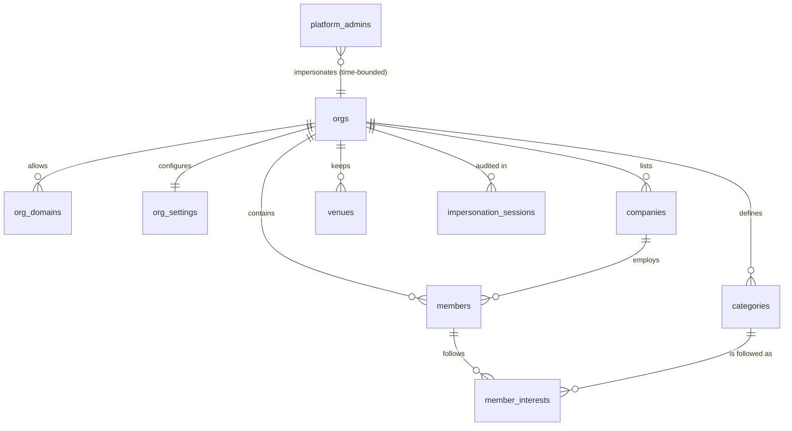
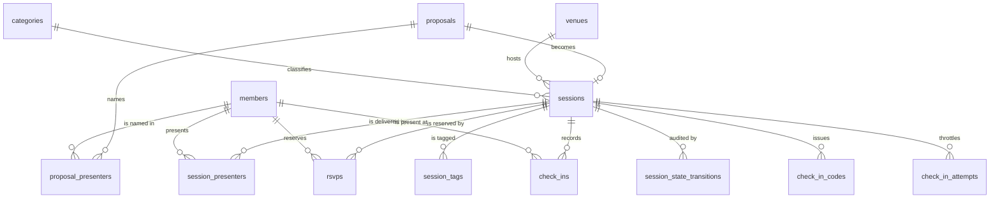
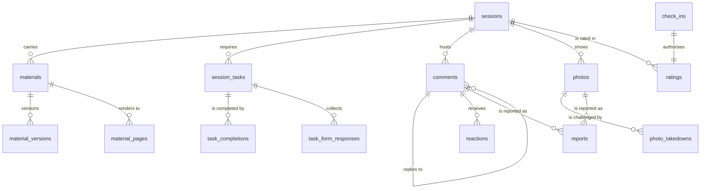
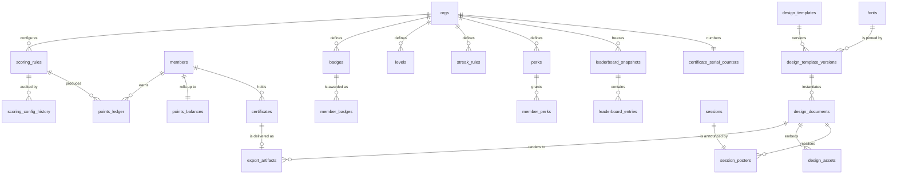
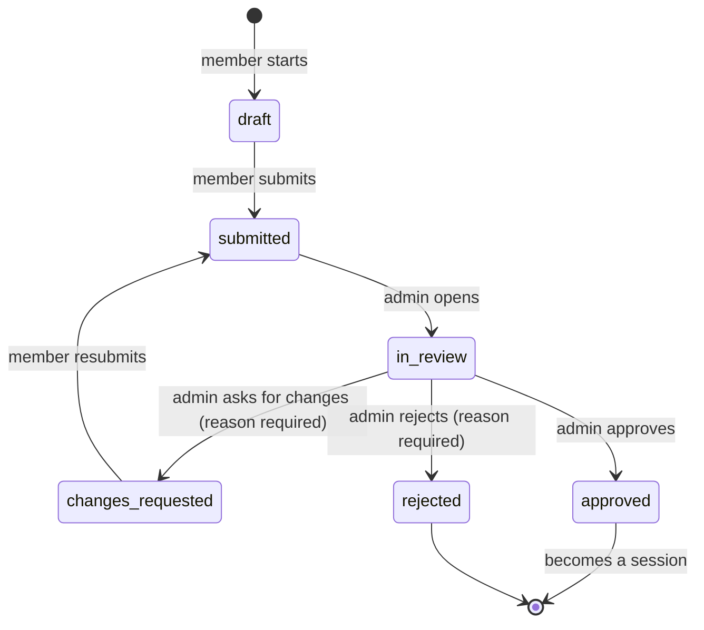
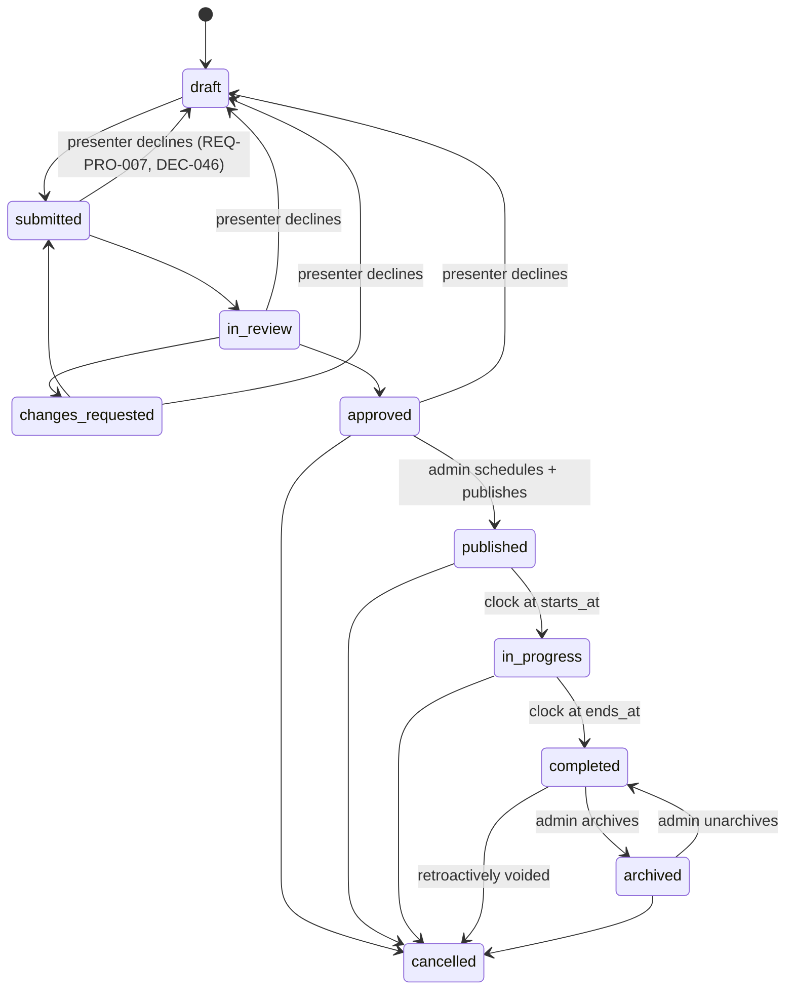
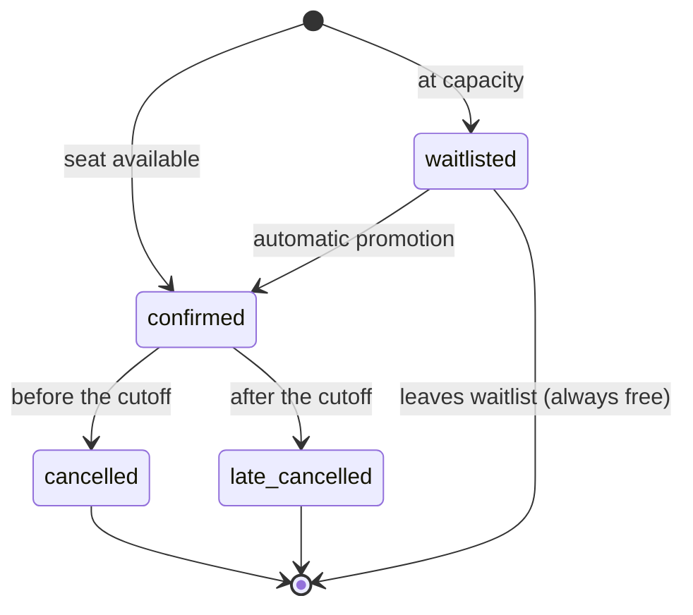
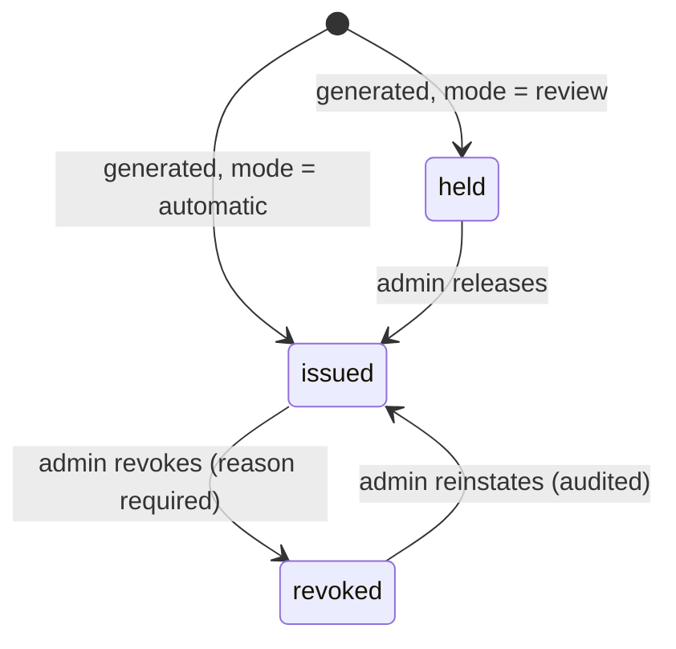
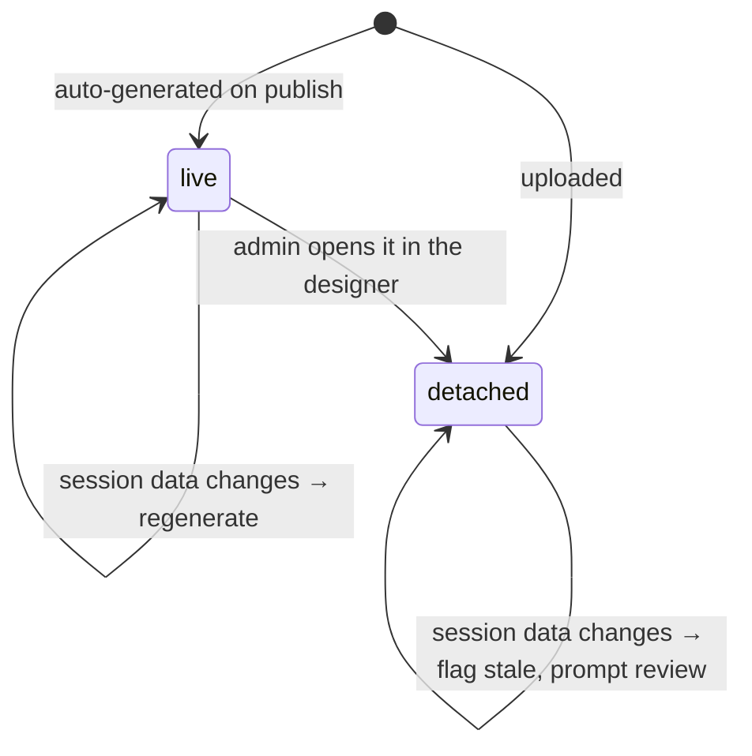

# 02 — Domain Model

**Status:** `draft` → `frozen` at the end of Wave 0 · **Owns:** the `ENT-*` ID space
**Serves:** the requirements cited per table · **Cited by:** `03`, `04`, `05`, `06`, `07`, `08`,
`09`, `11`, `12`

> **This is the freeze gate.** Nine documents cite it. Feature documents may **propose** entities
> in their own "Proposed entities" section; those merge back here **in one batch at wave end**,
> never continuously. Trickling entity changes while five documents cite the model is exactly how
> a document set rots.

---

## 1. Modelling principles

These hold for **every** table without exception. A table that breaks one is a defect.

1. **Tenancy key on every table.** `org_id uuid not null references orgs(id)` — including join
   tables, ledgers and audit tables. Even where `org_id` is derivable through a foreign key, it is
   **stored**, because an RLS policy that has to join to find the tenant is a policy that can be
   written wrong. Serves `REQ-TEN-003`, `REQ-NFR-001`.
2. **RLS enabled on every table, with a matching `grant`.** A policy without a grant fails with
   `42501`. This repository has already paid for that lesson — migration `0002` exists solely
   because `0001` forgot it. Policies are in `03-permissions-rls.md`.
3. **UUID primary keys**, `gen_random_uuid()`. No sequential surrogate keys anywhere a value could
   leak into a URL. The **one** deliberate exception is the certificate serial, which is
   sequential **by requirement** and never appears in a URL (`REQ-CRT-008`, `REQ-CRT-009`).
4. **`timestamptz` only.** Every timestamp stored in UTC (A20). A `timestamp without time zone`
   column is a defect.
5. **Deactivate, not delete**, wherever history references the row — companies, venues,
   categories, members, badges (`REQ-ADM-006`). `deactivated_at timestamptz` plus a partial index
   on the active set.
6. **Append-only tables are append-only at the database.** `revoke update, delete` for every role
   on `points_ledger` and `audit_log` (`REQ-PTS-001`, `REQ-NFR-006`).
7. **Derived state is never stored** where it could disagree with its source. `full` is
   `confirmed_count >= capacity`, computed (`REQ-SES-003`). The two deliberate exceptions are the
   **points rollup** and **leaderboard snapshots**, both justified below.
8. **Naming:** tables plural `snake_case`; foreign keys `<singular>_id`; booleans read as
   assertions (`allow_download`, not `downloadable`); enums singular `snake_case`; timestamps end
   in `_at`.
9. **Every enum is a Postgres enum type**, not a `text` with a check constraint — a typo becomes a
   migration error rather than a row.

---

## 2. ERD

Split into four diagrams; one diagram covering 50+ tables is unreadable and therefore unread.

### 2.1 Tenancy, identity and profiles



### 2.2 Proposals, sessions, RSVP and check-in



### 2.3 Content, interaction and recognition



### 2.4 Scoring, certificates and the designer



---

## 3. Enums

```sql
-- Tenancy and identity
create type org_status        as enum ('active', 'suspended');
create type org_role          as enum ('admin', 'moderator', 'member');
create type member_status     as enum ('active', 'deactivated');
create type numeral_system    as enum ('western', 'arabic_indic');

-- Proposals and sessions
create type proposal_state    as enum ('draft', 'submitted', 'in_review',
                                       'changes_requested', 'approved', 'rejected');
create type session_state     as enum ('draft', 'submitted', 'in_review', 'changes_requested',
                                       'approved', 'published', 'in_progress',
                                       'completed', 'archived', 'cancelled');
create type session_level     as enum ('introductory', 'intermediate', 'advanced');
create type session_language  as enum ('ar', 'en');
create type certificate_mode  as enum ('off', 'automatic', 'review');

-- RSVP and attendance
create type rsvp_status       as enum ('confirmed', 'waitlisted', 'cancelled', 'late_cancelled');
create type check_in_method   as enum ('code', 'manual');

-- Materials and tasks
create type material_kind     as enum ('pdf', 'powerpoint', 'keynote', 'image',
                                       'audio', 'video_link', 'external_link');
create type material_phase    as enum ('before', 'after');
create type render_status     as enum ('pending', 'rendering', 'ready', 'failed', 'not_applicable');
create type task_kind         as enum ('read_material', 'form', 'checklist', 'external');

-- Interaction and moderation
create type report_target     as enum ('comment', 'photo');
create type report_status     as enum ('open', 'resolved', 'dismissed');
create type moderation_action as enum ('removed', 'restored', 'dismissed');

-- Scoring and recognition
create type point_actor       as enum ('attendee', 'presenter', 'system', 'admin');
create type ledger_source     as enum ('check_in', 'rating', 'comment', 'photo', 'streak',
                                       'proposal_accepted', 'session_delivered',
                                       'attendee_bonus', 'rating_bonus', 'materials_uploaded',
                                       'no_show', 'late_cancellation', 'content_removed',
                                       'manual_adjustment', 'reversal');
create type leaderboard_kind  as enum ('all_time', 'monthly', 'seasonal', 'topic', 'company');
create type company_metric    as enum ('total_points', 'points_per_active_member');

-- Certificates
create type certificate_kind  as enum ('attendance', 'presenter', 'achievement');
create type certificate_state as enum ('held', 'issued', 'revoked');

-- Designer
create type template_scope    as enum ('platform', 'org');
create type template_purpose  as enum ('poster', 'certificate');
create type poster_mode       as enum ('auto', 'customised', 'uploaded');
create type poster_binding    as enum ('live', 'detached');
create type layer_kind        as enum ('text', 'image', 'shape', 'qr', 'dynamic_field');
create type export_format     as enum ('png', 'webp', 'pdf', 'jpeg');
create type export_status     as enum ('queued', 'rendering', 'ready', 'failed');

-- Notifications and calendar
create type notify_channel    as enum ('in_app', 'email');
create type delivery_status   as enum ('queued', 'sent', 'delivered', 'bounced', 'failed');
create type calendar_provider as enum ('google');
create type calendar_sync_state as enum ('pending', 'synced', 'failed', 'removed');
```

**Why `session_state` repeats the proposal states.** A6 defines one chain running from `draft`
through to `archived`. The chain is modelled as **two entities sharing a vocabulary** rather than
one entity with a long state list, because a proposal and a session have genuinely different
shapes — a proposal has no date, by requirement (`REQ-PRO-001`) — and a session row should not
exist in a state where its `starts_at` must be null. The shared enum values keep the audit trail
readable across the handoff.

---

## 4. Table catalogue

Every table below carries, implicitly and without repetition:

```sql
id          uuid primary key default gen_random_uuid(),
org_id      uuid not null references orgs(id) on delete cascade,
created_at  timestamptz not null default now(),
updated_at  timestamptz not null default now()   -- except append-only tables
```

…plus `create index on <table> (org_id)` and RLS enabled. Only deviations are noted.

### 4.1 Tenancy and identity

#### `ENT-orgs`
**Serves:** `REQ-TEN-001`, `REQ-TEN-002`, `REQ-TEN-006`
The tenant root. **The only table with no `org_id`** — it *is* the org.

| Column | Type | Notes |
|---|---|---|
| `name` | `text not null` | Arabic display name |
| `slug` | `text not null unique` | URL-safe, immutable |
| `status` | `org_status not null default 'active'` | `REQ-TEN-006` |
| `certificate_prefix` | `text not null` | e.g. `KM` — `REQ-CRT-008` |
| `created_by` | `uuid not null` | the super admin — `REQ-TEN-002` |
| `first_admin_email` | `citext` | named at creation; `provision_member()` grants `admin` when it signs in — `REQ-TEN-002` (DEC-035) |
| `suspended_at`, `suspended_reason` | `timestamptz`, `text` | |

#### `ENT-org_domains`
**Serves:** `REQ-TEN-007`, `REQ-AUT-003`, `REQ-AUT-004`

| Column | Type | Notes |
|---|---|---|
| `domain` | `citext not null` | stored lowercase, no leading `@` |

`unique (org_id, domain)`. **Deliberately not globally unique** — A2 requires that one domain may
appear on more than one org's list, which is exactly what makes `REQ-AUT-004`'s picker necessary.
Index on `(domain)` for the sign-in lookup.

#### `ENT-org_settings`
**Serves:** `REQ-TEN-008`, and A7/A16/A19/A20/A30
One row per org (`unique (org_id)`). Typed columns, not a JSON blob, so a bad value is a
constraint violation rather than a runtime surprise.

| Column | Type | Default |
|---|---|---|
| `time_zone` | `text not null` | `'Asia/Riyadh'` |
| `numerals` | `numeral_system not null` | `'western'` |
| `check_in_rotation_seconds` | `int not null` | `600` |
| `check_in_grace_seconds` | `int not null` | `120` |
| `reminder_offsets_minutes` | `int[] not null` | `'{10080,1440,120}'` |
| `rating_prompt_delay_minutes` | `int not null` | `60` |
| `rating_window_days` | `int not null` | `14` |
| `comment_edit_window_minutes` | `int not null` | `15` |
| `max_co_presenters` | `int not null` | `4` |
| `company_metric` | `company_metric not null` | `'points_per_active_member'` |
| `priority_rsvp_hours` | `int not null` | `24` |
| `limit_document_mb`, `limit_audio_mb`, `limit_image_mb`, `limit_poster_mb` | `int not null` | `50`, `200`, `20`, `30` |
| `allow_jpeg_export` | `boolean not null` | `false` |
| `email_from_name`, `email_reply_to` | `text` | OQ-016 |
| `rating_min_aggregate` | `int not null` | `3` — OQ-009 |

Every change writes to `ENT-scoring_config_history`, which is deliberately general enough to carry
non-scoring settings too.

#### `ENT-companies`
**Serves:** `REQ-PRF-002`, `REQ-PRF-003`, `REQ-LDR-004`
`name text not null`, `deactivated_at timestamptz`. `unique (org_id, name) where deactivated_at is null`.

#### `ENT-members`
**Serves:** `REQ-AUT-003`, `REQ-TEN-004`, `REQ-TEN-005`, `REQ-PRF-001`, `REQ-AUT-007`

| Column | Type | Notes |
|---|---|---|
| `auth_user_id` | `uuid not null unique references auth.users(id)` | keyed to the auth user, **not** to an email or a provider ID — `REQ-AUT-002` |
| `email` | `citext not null` | `unique (org_id, email)` |
| `display_name`, `avatar_url` | `text` | refreshed from Google on sign-in |
| `company_id` | `uuid references companies(id)` | required before RSVP or proposal — `REQ-PRF-001` |
| `job_title`, `bio` | `text` | `bio` capped at 600 chars |
| `org_role` | `org_role not null default 'member'` | `REQ-TEN-005` |
| `status` | `member_status not null default 'active'` | |
| `claims_version` | `int not null default 1` | bumped on role/status change — `REQ-AUT-007` |
| `leaderboard_opt_out` | `boolean not null default false` | `REQ-LDR-008` |
| `deactivated_at`, `deactivated_reason`, `deactivated_by` | | `REQ-AUT-008` |
| `anonymised_at` | `timestamptz` | OQ-019, `REQ-PRF-007` |

**`org_id` is immutable** — enforced by a trigger that raises on any change (`REQ-TEN-004`).
Indexes: `(org_id, status)`, `(org_id, company_id)`, `(auth_user_id)`.

#### `ENT-member_interests`
**Serves:** `REQ-PRF-001`
Join: `(member_id, category_id)`, `primary key (member_id, category_id)`.

#### `ENT-platform_admins`
**Serves:** `REQ-ADM-001`, `REQ-ADM-002`
`auth_user_id uuid not null unique`. **No `org_id`** — it is a platform table, and it is the
second of exactly two tables without one. Super admins hold **no data-plane access**
(`REQ-ADM-002`), so no policy anywhere references this table.

#### `ENT-impersonation_sessions`
**Serves:** `REQ-ADM-002`, `REQ-ADM-019`
`org_id`, `platform_admin_id`, `reason text not null`, `started_at`, `expires_at not null`,
`ended_at`. Append-only. **Visible to the org's own admins** — that is the point of the table.
`check (expires_at > started_at and expires_at <= started_at + interval '4 hours')`.

### 4.2 Taxonomy and venues

#### `ENT-categories`
**Serves:** `REQ-DSC-001`, `REQ-LDR-003`
`name text not null`, `deactivated_at`. Seeded for the first org with **فني**, **إداري**,
**إبداعي**, **درس من تجربة** — the set members already saw on the pre-launch form.

#### `ENT-tags` · `ENT-session_tags`
**Serves:** `REQ-DSC-002`
`tags`: `label text not null`, `normalised text not null` (`REQ-DSC-004`'s folding applied),
`unique (org_id, normalised)`. `session_tags` is the join, `primary key (session_id, tag_id)`.

#### `ENT-venues`
**Serves:** `REQ-SES-006`, `REQ-SES-007`, OQ-018
`name`, `address`, `map_url`, `capacity int`, `notes`, `time_zone text` (override — OQ-018),
`deactivated_at`. A venue referenced by a future session cannot be deleted (`REQ-SES-006`).

### 4.3 Proposals and sessions

#### `ENT-proposals`
**Serves:** `REQ-PRO-001`, `REQ-PRO-002`, `REQ-PRO-006`

| Column | Type | Notes |
|---|---|---|
| `proposer_id` | `uuid not null references members(id)` | |
| `title` | `text not null` | ≤ 150 chars |
| `abstract` | `text not null` | ≤ 2000 chars |
| `category_id` | `uuid not null references categories(id)` | |
| `level` | `session_level not null` | |
| `target_audience` | `text` | |
| `expected_duration_minutes` | `int` | **pre-fills, never authoritative** — OQ-001 |
| `admin_notes` | `text` | member → admin |
| `state` | `proposal_state not null default 'draft'` | |
| `decision_reason` | `text` | mandatory on reject / changes_requested — `REQ-PRO-005` |

**There is no date, time or venue column on this table.** `REQ-PRO-001` is a schema fact, not a
form-validation rule.

#### `ENT-proposal_presenters` · `ENT-session_presenters`
**Serves:** `REQ-PRO-003`, A5, OQ-021
`(proposal_id | session_id, member_id, accepted boolean, declined_at)`.
`primary key (proposal_id, member_id)`. A trigger enforces `count <= org_settings.max_co_presenters + 1`.

#### `ENT-sessions`
**Serves:** `REQ-SES-001`, `REQ-SES-002`, `REQ-SES-003`, `REQ-SES-011`

**Amended under DEC-047 (migration `0037`):** `search_vector tsvector generated always as (…ar_normalize(title)… ‖ …ar_normalize(abstract)…) stored`, with a GIN index and a trigram index on the normalised title (`REQ-DSC-003`).

| Column | Type | Notes |
|---|---|---|
| `proposal_id` | `uuid references proposals(id)` | null when admin-created — `REQ-PRO-007` |
| `title`, `abstract`, `category_id`, `level` | | carried from the proposal, independently editable |
| `language` | `session_language not null default 'ar'` | OQ-017 |
| `starts_at` | `timestamptz` | null until scheduled |
| `duration_minutes` | `int` | |
| `ends_at` | `timestamptz` | **stored**, derived at scheduling, independently editable — OQ-001 |
| `time_zone` | `text not null` | venue's, else org's — OQ-018 |
| `venue_id` | `uuid references venues(id)` | |
| `custom_venue_name`, `custom_venue_address`, `custom_venue_map_url` | `text` | `REQ-SES-007` |
| `capacity` | `int` | |
| `rsvp_deadline_at`, `cancellation_cutoff_at` | `timestamptz` | |
| `certificate_mode` | `certificate_mode not null default 'off'` | `REQ-CRT-002` |
| `state` | `session_state not null default 'draft'` | |
| `published_at`, `completed_at`, `cancelled_at`, `cancellation_reason` | | |

Constraints:
```sql
check (ends_at is null or starts_at is null or ends_at > starts_at)
check (rsvp_deadline_at is null or starts_at is null or rsvp_deadline_at <= starts_at)
check (cancellation_cutoff_at is null or starts_at is null or cancellation_cutoff_at <= starts_at)
check (venue_id is not null or custom_venue_name is not null or state in ('draft','submitted','in_review','changes_requested','approved'))
check (state <> 'published' or (starts_at is not null and ends_at is not null
        and capacity is not null and (venue_id is not null or custom_venue_name is not null)))
```
The last one is `REQ-SES-001`'s publish gate expressed as a constraint rather than as a code path
that can be bypassed. Indexes: `(org_id, state, starts_at)`, `(org_id, category_id)`,
`(org_id, starts_at)`.

**`full` is not a column.** `REQ-SES-003`.

#### `ENT-session_state_transitions`
**Serves:** `REQ-SES-003`, `REQ-PRO-006`, `REQ-SES-005`
Append-only. `session_id`, `from_state`, `to_state`, `actor_id` (null when the clock did it),
`is_manual boolean not null`, `reason text`, `occurred_at` (`default clock_timestamp()` since
migration `0024`, DEC-046 — rows from one transaction order by time alone).
**Every transition writes a row.** A transition without one is a defect. **Every transition is a
drawn edge of §6.2**: migration `0024`'s `sessions_guard_transition` trigger refuses any other
change of `state` with `23514`, whoever the writer is.

### 4.4 RSVP

#### `ENT-rsvps`
**Serves:** `REQ-RSV-001` … `REQ-RSV-008`

| Column | Type | Notes |
|---|---|---|
| `session_id`, `member_id` | `uuid not null` | `unique (session_id, member_id)` |
| `status` | `rsvp_status not null` | |
| `waitlist_position` | `int` | non-null only while `waitlisted` |
| `reserved_at`, `promoted_at`, `cancelled_at` | `timestamptz` | |
| `was_late_cancellation` | `boolean not null default false` | `REQ-RSV-007` |

```sql
unique (session_id, waitlist_position) where status = 'waitlisted'
check ((status = 'waitlisted') = (waitlist_position is not null))
```

**Capacity is enforced in the reserving transaction**, not by reading a count and then inserting
(`REQ-RSV-002`): the seat is taken by an `insert … select` guarded by a `select … for update` on
the session row, so N concurrent reservations against N−1 seats confirm exactly N−1. A partial
unique index cannot express "at most K rows", which is why the lock is the mechanism.

### 4.5 Check-in

> The integrity keystone. Three tables, and the constraints do the work.

#### `ENT-check_in_codes`
**Serves:** `REQ-CHK-002`, `REQ-CHK-007`, DEC-015
**Stored per rotation window, not derived** (DEC-015).

| Column | Type | Notes |
|---|---|---|
| `session_id` | `uuid not null` | |
| `code` | `text not null` | 6 chars from an unambiguous alphabet |
| `valid_from`, `valid_until` | `timestamptz not null` | window + grace |
| `revoked_at`, `revoked_by` | | `REQ-CHK-007` — burn a leaked code |

`unique (session_id, code)`. Index `(session_id, valid_until desc)`.
The alphabet excludes `0/O`, `1/I/L`, `5/S`, `2/Z`, `8/B` — a code is read aloud across a room and
typed by someone who is not looking at it.

#### `ENT-check_ins`
**Serves:** `REQ-CHK-003`, `REQ-CHK-005`, `REQ-CHK-009`, `REQ-CHK-013`, A8

| Column | Type | Notes |
|---|---|---|
| `session_id`, `member_id` | `uuid not null` | |
| `method` | `check_in_method not null` | `code` \| `manual` — A8 |
| `code_id` | `uuid references check_in_codes(id)` | null for manual |
| `manual_reason` | `text` | **mandatory when `method = 'manual'`** |
| `marked_by` | `uuid references members(id)` | the admin/moderator, for manual |
| `arrived_at` | `timestamptz not null default now()` | `REQ-CHK-012` |
| `session_window` | `tstzrange not null` | generated from the session's `[starts_at, ends_at)` |

```sql
unique (session_id, member_id)                                   -- REQ-CHK-005
check (method <> 'manual' or (manual_reason is not null and marked_by is not null))
exclude using gist (member_id with =, session_window with &&)    -- REQ-CHK-013
```

**The exclusion constraint is the point.** A member physically cannot be in two rooms at once, so
the database refuses to record it. This is a structural guarantee, not a validation that a code
path might skip.

#### `ENT-check_in_attempts`
**Serves:** `REQ-CHK-006`, `REQ-NFR-005`
`session_id`, `member_id`, `submitted_code text`, `succeeded boolean`, `attempted_at`.
Index `(session_id, member_id, attempted_at desc)`.

**Rate limiting counts rows in this table inside the check-in transaction** (DEC-015). The
existing in-memory limiter in this repo resets per lambda instance — acceptable for a registration
form backed by a unique index, wrong for code guessing. Retained 90 days (OQ-019).

### 4.6 Materials and tasks

**Amended under DEC-050 (wave 3):** `photos.removal_reason text` — additive (`0059`, `REQ-EVT-014`).

#### `ENT-materials`
**Serves:** `REQ-MAT-001` … `REQ-MAT-011`

| Column | Type | Notes |
|---|---|---|
| `session_id` | `uuid not null` | **not null — there are no standalone uploads** (`REQ-MAT-001`) |
| `kind` | `material_kind not null` | |
| `title` | `text not null` | |
| `phase` | `material_phase not null default 'after'` | `REQ-MAT-006` |
| `allow_download` | `boolean not null default true` | `REQ-MAT-005` |
| `external_url` | `text` | for link kinds |
| `current_version_id` | `uuid` | → `material_versions` |
| `render_status` | `render_status not null default 'pending'` | `'not_applicable'` for Keynote and links |
| `font_substitution_warning` | `text` | `REQ-MAT-011` |
| `removed_at`, `removed_by`, `removal_reason` | | `REQ-MAT-008` |

```sql
check ((kind in ('video_link','external_link')) = (external_url is not null))
check (kind <> 'keynote' or render_status = 'not_applicable')   -- DEC-006
```

#### `ENT-material_versions`
**Serves:** `REQ-MAT-010`, A16
`material_id`, `version int not null`, `storage_path text not null`, `byte_size bigint not null`,
`sniffed_mime text not null`, `sha256 text not null`, `uploaded_by`, `uploaded_at`.
`unique (material_id, version)`. **`sniffed_mime` is the sniffed type, not the declared one**
(`REQ-MAT-012`).

#### `ENT-material_pages`
**Serves:** `REQ-MAT-003`
`material_version_id`, `page_number int not null`, `image_path text not null`,
`thumbnail_path text not null`, `width int`, `height int`.
`unique (material_version_id, page_number)`.
**No rows ever exist for a Keynote material** (DEC-006).

#### `ENT-session_tasks` · `ENT-task_completions` · `ENT-task_form_responses`
**Serves:** `REQ-TSK-001` … `REQ-TSK-004`, A9
`session_tasks`: `kind task_kind not null`, `title`, `description`, `material_id` (for
`read_material`), `form_schema jsonb` (for `form`), `external_url`, `sort_order`.
`task_completions`: `(task_id, member_id)` unique, `completed_at`.
`task_form_responses`: `(task_id, member_id)` unique, `response jsonb not null`. Visible to
presenters and admins only (`REQ-TSK-003`).

**No table here is ever consulted by the check-in path** (`REQ-TSK-002`).

### 4.7 Event page

**Amended under DEC-050 (wave 3):** `comments.removal_reason text` — additive (`0059`, `REQ-EVT-014`); a staff removal writes its audit row with it.

#### `ENT-comments`
**Serves:** `REQ-EVT-002`, `REQ-EVT-005`, `REQ-EVT-006`
`session_id`, `author_id`, `parent_id uuid references comments(id)`, `body text not null`,
`edited_at`, `deleted_at`, `deleted_by`, `mentions uuid[]`.
```sql
check (parent_id is null or (select parent_id from comments p where p.id = parent_id) is null)
```
— enforced by trigger rather than a subquery in a check (Postgres forbids the latter): **one level
of replies only** (`REQ-EVT-002`). Soft delete leaves a tombstone when replies exist
(`REQ-EVT-005`).

#### `ENT-reactions`
**Serves:** `REQ-EVT-004`
`comment_id` or `session_id`, `member_id`, `kind text not null`.
`unique (member_id, comment_id, kind)`. **Never referenced by the scoring engine**
(`REQ-PTS-010`).

#### `ENT-photos`
**Serves:** `REQ-EVT-009` … `REQ-EVT-014`, DEC-005
`session_id`, `uploader_id`, `storage_path`, `width`, `height`, `byte_size`, `sha256`,
`exif_stripped boolean not null default false`, `hidden_at`, `hidden_reason`, `removed_at`,
`removed_by`.
```sql
check (exif_stripped)   -- REQ-EVT-011: a row cannot exist for an unstripped image
```
That constraint is deliberate: stripping happens **before** the row is written, so an unstripped
photo cannot be recorded, let alone served.

#### `ENT-photo_takedowns`
**Serves:** `REQ-EVT-012`, DEC-005
`photo_id`, `requester_id`, `requested_at`, `resolved_at`, `resolution moderation_action`,
`resolved_by`. **Inserting a row hides the photo immediately**, by trigger — before any human sees
it. The uploader is notified without being told who asked.

#### `ENT-reports`
**Serves:** `REQ-EVT-008`
`target report_target not null`, `comment_id`, `photo_id`, `reporter_id`, `reason text not null`,
`status report_status not null default 'open'`, `resolved_by`, `resolution moderation_action`.
```sql
check ((target = 'comment') = (comment_id is not null))
check ((target = 'photo') = (photo_id is not null))
```

**Amended under DEC-047 (migration `0037`):** `photo_id` now carries its foreign key to `photos`, which `0010` left bare because the table did not exist.

### 4.8 Ratings

#### `ENT-ratings`
**Serves:** `REQ-RAT-001` … `REQ-RAT-006`, A17

| Column | Type | Notes |
|---|---|---|
| `session_id`, `member_id` | | `unique (session_id, member_id)` — A17 |
| `check_in_id` | `uuid not null references check_ins(id)` | **the authorisation, in the schema** |
| `session_stars`, `presenter_stars` | `int not null check (between 1 and 5)` | |
| `comment` | `text` | optional free text |
| `submitted_at`, `edited_at` | | |

**`check_in_id not null` is `REQ-RAT-001` made structural.** A rating cannot exist without a
check-in to point at, so "only checked-in attendees rate" is not a policy that could be forgotten
— it is a foreign key.

Presenter-facing reads go through a view that exposes aggregates only, and only at
`org_settings.rating_min_aggregate` or above (`REQ-RAT-004`, `REQ-RAT-006`). Org admins read the
base table (`REQ-RAT-005`); moderators do not (`REQ-ADM-020`).

### 4.9 Scoring and the ledger

#### `ENT-scoring_rules`
**Serves:** `REQ-PTS-004`, `REQ-PTS-006`, `REQ-PTS-007`, `REQ-PTS-008`, A10
The configurable catalogue. One row per org per action.

| Column | Type | Notes |
|---|---|---|
| `action_key` | `text not null` | e.g. `check_in`, `comment`, `no_show` |
| `actor` | `point_actor not null` | |
| `points` | `int not null` | may be negative (D40) |
| `enabled` | `boolean not null default true` | negative actions ship `enabled` with `points = 0` |
| `cap_per_session` | `int` | null = uncapped |
| `cap_per_period`, `cap_period` | `int`, `interval` | |
| `cooldown` | `interval` | `REQ-PTS-007` |
| `version` | `int not null default 1` | bumped on every change; ledger rows name it |

`unique (org_id, action_key)`.

**The action catalogue is fixed in code; only its values are data.** An org admin cannot add
`action_key = 'rsvp'` or `'reaction'` — `REQ-PTS-010` requires the anti-gaming rules to be
structural, so the set of awardable actions is an application constant and this table configures
only what already exists. Seeded per A10.

#### `ENT-scoring_config_history`
**Serves:** `REQ-PTS-005`, `REQ-TEN-008`
Append-only. `scope text not null` (`'scoring'` | `'org_settings'` | `'badges'` | …),
`entity_id uuid`, `field text not null`, `old_value jsonb`, `new_value jsonb`, `actor_id`,
`changed_at`. General enough to carry every configuration surface, so there is one history to read
rather than six.

#### `ENT-points_ledger`
**Serves:** `REQ-PTS-001`, `REQ-PTS-002`, `REQ-PTS-012`, DEC-016
**Append-only. `revoke update, delete … from anon, authenticated, service_role`.**

**Amended under DEC-046/DEC-047 (migration `0027`):** `occurred_at timestamptz not null default clock_timestamp()`; update and delete raise for every writer by trigger, except an org deletion's cascade.

| Column | Type | Notes |
|---|---|---|
| `member_id` | `uuid not null` | |
| `amount` | `int not null` | signed |
| `source` | `ledger_source not null` | |
| `source_id` | `uuid` | the check-in, comment, photo, rating… |
| `session_id` | `uuid` | null for non-session points — excluded from topic boards (`REQ-LDR-003`) |
| `reason` | `text not null` | **Arabic**, member-facing (`REQ-PTS-003`) |
| `rule_key`, `rule_version` | `text`, `int` | which rule produced it (`REQ-PTS-004`) |
| `actor_id` | `uuid` | non-null only for manual adjustments |
| `idempotency_key` | `text not null unique` | see below |
| `occurred_at` | `timestamptz not null default now()` | |

**No `updated_at`.** A ledger row is never updated.

**The idempotency key** is `<rule_key>:<source>:<source_id>:<member_id>:v1` — deterministic, so
the same award computed twice collides. The trailing **epoch** (`v1`) is what makes a *deliberate*
recompute distinguishable from an *accidental* double-award: bumping it to `v2` is an explicit act
that produces new rows, while every accidental replay hits `on conflict do nothing` (DEC-016).
`on conflict do nothing` is the **only** conflict action used here — it is the only one compatible
with an append-only table.

Indexes: `(org_id, member_id, occurred_at desc)`, `(org_id, session_id)`,
`(org_id, occurred_at)`.

#### `ENT-points_balances`
**Serves:** `REQ-PTS-011`, DEC-016
A **rollup**, maintained by trigger on ledger insert. One row per member.

| Column | Type | Notes |
|---|---|---|
| `member_id` | `uuid not null unique` | |
| `total_points` | `int not null default 0` | |
| `last_entry_id` | `uuid` | the newest ledger row folded in |
| `current_level_id` | `uuid references levels(id)` | derived |

**Why a rollup is safe here and would not be elsewhere:** the ledger is *insert-only*, so the
rollup is a pure left fold with nothing to un-apply. There is no update or delete that could
require reversing a contribution. A nightly job re-derives every balance with `sum()` and compares
via `last_entry_id`, alerting on any divergence (`REQ-PTS-011`) — the rollup is an optimisation
that must always agree with the ledger, and the ledger is the truth.

### 4.10 Recognition

#### `ENT-badges` · `ENT-member_badges`
**Serves:** `REQ-REC-001`, `REQ-REC-002`, `REQ-CRT-012`
`badges`: `key text not null`, `name text not null` (Arabic), `description`, `rule jsonb`,
`issues_certificate boolean not null default false` (OQ-020), `retired_at`.
`unique (org_id, key)`.
`member_badges`: `(member_id, badge_id)` unique, `awarded_at`, `awarded_by` (null when automatic),
`award_reason` (mandatory when manual — `REQ-REC-001`).
**Retiring a badge does not revoke it** — no cascade from `badges.retired_at`.

#### `ENT-levels`
**Serves:** `REQ-REC-003`, `REQ-REC-004`, OQ-010
`name text not null` (Arabic), `threshold_points int not null`, `sort_order int not null`.
`unique (org_id, threshold_points)`. Seeded: مشارِك 0 · مشارِك نشِط 100 · صاحب أثر 300 ·
كريم معرفة 700 · سفير المعرفة 1500.

#### `ENT-streak_rules` · `ENT-streak_awards`
**Serves:** `REQ-REC-005`, A10
`streak_rules`: `key`, `window interval not null`, `required_count int not null`,
`bonus_points int not null`, `enabled`. Default: 3 check-ins in a calendar month, 15 points.
`streak_awards`: `(member_id, rule_id, period_start)` unique — **the uniqueness is what makes
streak evaluation idempotent** (`REQ-REC-005`).

#### `ENT-perks` · `ENT-member_perks`
**Serves:** `REQ-REC-006`, `REQ-REC-007`, `REQ-REC-008`, OQ-012
`perks`: `key text not null` (`priority_rsvp`, `can_host`), `required_level_id`,
`required_badge_id`, `enabled boolean not null default false`.
`check (required_level_id is not null or required_badge_id is not null)`.
`member_perks`: materialised grants, `(member_id, perk_id)` unique, `granted_at`, `revoked_at` —
re-evaluated when a level or badge changes so the RSVP path is a single indexed lookup rather than
a recursive computation on a hot path.

**`can_host` ships `enabled = false`** — `REQ-REC-008` requires every member to be able to propose
unless an org turns the gate on.

### 4.11 Leaderboards

#### `ENT-leaderboard_snapshots` · `ENT-leaderboard_entries`
**Serves:** `REQ-LDR-002`, `REQ-LDR-006`, A11, DEC-016
`leaderboard_snapshots`: `kind leaderboard_kind not null`, `period_start`, `period_end`,
`category_id` (topic boards), `metric company_metric` (company boards),
`active_member_count int` (**the frozen denominator**), `taken_at`, `is_final boolean`.
`unique (org_id, kind, period_start, period_end, category_id)`.
`leaderboard_entries`: `snapshot_id`, `member_id` **or** `company_id`, `rank int not null`,
`points int not null`, `points_per_active_member numeric`.

**Snapshots are required, not an optimisation** (A11, DEC-016). Points-per-active-member has a
**time-dependent denominator**: computing it live means deactivating one member silently rewrites
last quarter's standings, and reissues a different winner's certificate (`REQ-CRT-012`). Freezing
`active_member_count` into the snapshot is the fix, and requiring a reason for deactivation
(`REQ-AUT-008`) closes the incentive to shrink the denominator.

The **all-time** board is computed live from `points_balances` — it has no period and therefore no
denominator problem.

### 4.12 Certificates

#### `ENT-certificates`
**Serves:** `REQ-CRT-001` … `REQ-CRT-014`, DEC-010

| Column | Type | Notes |
|---|---|---|
| `member_id` | `uuid not null` | the recipient |
| `kind` | `certificate_kind not null` | |
| `session_id` | `uuid` | for attendance and presenter kinds |
| `check_in_id` | `uuid references check_ins(id)` | **required for `kind = 'attendance'`** |
| `badge_id`, `snapshot_id` | `uuid` | for achievement kinds |
| `serial` | `text not null` | `KM-2026-000123` — `unique (org_id, serial)` |
| `verification_code` | `text not null unique` | 22+ random chars, **platform-wide unique** |
| `state` | `certificate_state not null default 'held'` | |
| `template_version_id` | `uuid not null` | pinned — `REQ-CRT-014` |
| `font_hashes` | `text[] not null` | pinned — `REQ-CRT-014`, A39 |
| `recipient_name_snapshot` | `text not null` | the name **as printed**, frozen |
| `issued_at`, `revoked_at`, `revoked_by`, `revocation_reason` | | `REQ-CRT-011` |

```sql
check (kind <> 'attendance' or check_in_id is not null)   -- REQ-CHK-009 made structural
unique (org_id, session_id, member_id, kind)              -- REQ-CRT-003 idempotency
```

**Two identifiers, deliberately** (DEC-010). `serial` is sequential, human-facing, gapless,
enumerable **by design**, and never appears in a URL. `verification_code` is random, unguessable,
and is the **only** key `/verify` accepts. If the URL carried the serial, anyone could walk
`/verify/KM-2026-000001`, `000002`, `000003` and harvest the name of every person the org ever
certified plus which sessions they attended (`REQ-CRT-009`).

`recipient_name_snapshot` exists because a certificate is a record of what was printed. A member
later changing their display name must not retroactively change a document someone is holding.

#### `ENT-certificate_serial_counters`
**Serves:** `REQ-CRT-008`, DEC-010
`(org_id, year)` unique, `next_value int not null default 1`.

**A counter row, not a Postgres `SEQUENCE`.** A `SEQUENCE` is non-transactional by design: a
rolled-back issuance consumes a number and leaves a hole. In a certificate register, a gap reads
as a lost or hidden certificate. So the number is allocated by
`select … for update` on this row **inside the issuing transaction**, and a rollback returns it.
Volume is hundreds per month (A24), so the row-lock contention this introduces is irrelevant.

### 4.13 The designer

**Amended under DEC-050 (wave 3):** `design_documents.draft_for_template_id uuid unique` (a template's one working draft; the one-binding check becomes poster | certificate | template draft — `0057`); `export_artifacts.render_context jsonb` (the pinned faces and bindings a render is reproduced from — `0060`); `fonts` gains the materialisation columns of `0064`; `design_templates_single_default` keeps exactly one default per (org, purpose, family) (`0057`). `ENT-fonts` carries no `org_id` (DEC-049, §7).

#### `ENT-design_templates` · `ENT-design_template_versions`
**Serves:** `REQ-DSG-007`, `REQ-DSG-008`, `REQ-DSG-026`, D67
`design_templates`: `scope template_scope not null`, `purpose template_purpose not null`,
`family text not null` (`talk`, `workshop`, `panel`, `meetup`, `announcement`, `attendance`,
`presenter`, `achievement`), `name`, `org_id` **nullable for `scope = 'platform'`**.

> This is the **third and last** table permitted a null `org_id`, and it is the only one where the
> nullability is meaningful rather than structural: a platform template belongs to no org by
> requirement (D67). Its RLS policy is correspondingly special — readable by every org, writable
> only by a super admin — and is written out explicitly in `03-permissions-rls.md` rather than
> inherited from the standard pattern.

`design_template_versions`: `template_id`, `version int not null`, `document jsonb not null`
(the layer tree), `dynamic_fields jsonb not null`, `safe_areas jsonb not null`,
`font_hashes text[] not null`, `published_at`, `published_by`.
`unique (template_id, version)`.

**Publishing a new version never alters an existing artifact** (`REQ-DSG-007`): artifacts reference
a `template_version_id`, not a `template_id`.

#### `ENT-design_documents`
**Serves:** `REQ-DSG-005`, `REQ-DSG-006`
An instance: `template_version_id`, `purpose`, `document jsonb not null`, `bound_session_id`,
`bound_certificate_id`, `updated_by`.
The `document` is the **JSON layer tree** (`06-visual-designer.md` owns its schema). A document is
fully described by its JSON — nothing about its appearance lives outside it (`REQ-DSG-005`).

#### `ENT-design_assets`
**Serves:** `REQ-DSG-018`, `REQ-DSG-019`, `REQ-DSG-022`
`storage_path`, `sniffed_mime text not null`, `width`, `height`, `byte_size`, `sha256`,
`focal_x numeric`, `focal_y numeric` (focal-point cropping — A31).
```sql
check (sniffed_mime in ('image/png','image/jpeg','image/webp'))   -- DEC-009: no SVG, ever
```
**The constraint is on the sniffed type, not the filename** (`REQ-DSG-018`). An SVG would be XML
rendered inside a privileged headless Chromium; dropping the format removes the vector rather than
mitigating it.

#### `ENT-fonts`
**Serves:** `REQ-DSG-016`, `REQ-DSG-017`, A39
The **font manifest** — the single source of truth the editor, the worker's Chromium and the
worker's LibreOffice all read.

| Column | Type | Notes |
|---|---|---|
| `family`, `style`, `weight` | | |
| `source` | `text not null` | `'platform'` \| `'google'` |
| `storage_path` | `text not null` | **our** storage, never a CDN URL |
| `sha256` | `text not null unique` | what templates pin |
| `subsets` | `text[] not null` | must contain `'arabic'` to be selectable |
| `parity_status` | `text not null default 'pending'` | `pending` \| `passed` \| `failed` |
| `parity_report` | `jsonb` | which goldens failed, for the admin |

```sql
check (parity_status <> 'passed' or 'arabic' = any(subsets))
```
A font becomes selectable **only** at `parity_status = 'passed'` (A39). A font with partial `GSUB`
or `mark` coverage renders Latin perfectly and silently breaks lam-alef and stacked tashkeel — a
Latin smoke test would pass it.

#### `ENT-session_posters`
**Serves:** `REQ-DSG-001`, `REQ-DSG-002`, `REQ-DSG-003`, DEC-012
`session_id unique`, `document_id`, `mode poster_mode not null`,
`binding poster_binding not null default 'live'`, `uploaded_asset_id`, `detached_at`,
`stale_since timestamptz`.

```sql
check ((mode = 'uploaded') = (uploaded_asset_id is not null))
check (mode <> 'auto' or binding = 'live')
```

**The live/detached rule lives here** (DEC-012). An `auto` poster is a pure function of template
plus session data, so a change to title, date, venue or presenter regenerates it. The moment an
admin customises it, `binding` flips to `detached` and `mode` to `customised`; a later data change
then sets `stale_since`, which raises **«تغيّرت تفاصيل الجلسة — راجع الملصق»** instead of
overwriting someone's hand-tuned design.

#### `ENT-export_artifacts`
**Serves:** `REQ-DSG-011`, `REQ-DSG-012`, `REQ-DSG-013`, A29
`document_id`, `preset text not null` (`master`, `square`, `story`, `landscape`, `og`, `a4`,
`a3`, `cert_landscape`, `cert_portrait`), `format export_format not null`,
`width_px`, `height_px`, `storage_path`, `byte_size`, `status export_status not null`,
`source_fingerprint text not null`, `rendered_at`, `error text`.

`unique (document_id, preset, format, source_fingerprint)`.

**`source_fingerprint` is the cache key** (`REQ-DSG-013`): a hash of the document JSON, the
template version, the bound data and the font hashes. Reuse is automatic and invalidation is
impossible to forget, because a changed source produces a different key rather than requiring
someone to remember to clear something.

### 4.14 Notifications and calendar

#### `ENT-notification_templates`
**Serves:** `REQ-NTF-007`, `REQ-NTF-002`
`key text not null` (the `MSG-*` key — `08` owns the catalogue), `channel notify_channel not null`,
`locale text not null default 'ar'`, `subject`, `body`, `required_fields text[] not null`.
`unique (org_id, key, channel, locale)`.
A template missing a `required_field` fails validation **before it can be saved**
(`REQ-NTF-007`).

#### `ENT-notifications`
**Serves:** `REQ-NTF-006`
`member_id`, `key`, `payload jsonb`, `session_id`, `read_at`, `created_at`.
Index `(org_id, member_id, read_at nulls first, created_at desc)` — the unread-count query.

#### `ENT-notification_preferences`
**Serves:** `REQ-NTF-003`
`(member_id, category text, channel)` unique, `enabled boolean not null`.
Categories the member **cannot** disable are enforced in the send path and listed in `08`:
certificate issued, seat promoted, session cancelled, session time or venue changed.

**Amended under DEC-047 (migration `0026`):** `updated_at`, per the repo-wide `set_updated_at()` convention.

#### `ENT-email_deliveries`
**Serves:** `REQ-NTF-008`
`member_id`, `key`, `provider_message_id`, `status delivery_status not null`, `error`,
`sent_at`, `delivered_at`. Retained 180 days (OQ-019).

**Amended under DEC-047 (migration `0026`):** `notification_id uuid references notifications on delete set null` — null when the message was email-only.

#### `ENT-calendar_connections`
**Serves:** `REQ-CAL-003`, `REQ-CAL-007`, A33
`member_id unique`, `provider calendar_provider not null`, `access_token_encrypted`,
`refresh_token_encrypted`, `expires_at`, `scope`, `connected_at`, `disconnected_at`.

**No policy grants `select` on the token columns to anyone** — not the member, not the org admin,
not a moderator (A33, `REQ-PRF-004`). Only the worker's narrow job interface reads them. This is
the single place in the product where admin access is *narrower* than member self-access, and it
is deliberate: a token is a credential for a third-party account, not org data. Disconnect
**deletes** the rows immediately rather than scheduling them (`REQ-CAL-007`).

#### `ENT-calendar_events`
**Serves:** `REQ-CAL-004`, `REQ-CAL-005`, `REQ-CAL-006`
`member_id`, `session_id`, `provider_event_id`, `state calendar_sync_state not null`,
`last_synced_at`, `error`. `unique (member_id, session_id)` — **one calendar event per member per
session**, which is `REQ-CAL-004`'s idempotency expressed as a constraint.

### 4.15 Discovery

#### `ENT-bookmarks`
**Serves:** `REQ-DSC-006`
`(member_id, session_id)` unique. Private to the member. **Never referenced by the scoring
engine.**

#### Search
**Serves:** `REQ-DSC-003`, `REQ-DSC-004`, A15 caveat

Postgres ships **no Arabic FTS dictionary** — `to_tsvector('arabic', …)` does not exist. So
normalization is ours:

```sql
create function ar_normalize(txt text) returns text
language sql immutable strict parallel safe as $$
  select regexp_replace(
           translate(
             regexp_replace(txt, '[ً-ْٰـ]', '', 'g'),  -- tashkeel + tatweel
             'أإآٱىة', 'اااايه'                                            -- alef, yaa, taa-marbuta
           ),
           '\s+', ' ', 'g')
$$;
```

`sessions` carries a generated column:

```sql
search_vector tsvector generated always as (
  setweight(to_tsvector('simple', ar_normalize(coalesce(title, ''))), 'A') ||
  setweight(to_tsvector('simple', ar_normalize(coalesce(abstract, ''))), 'B')
) stored
```
plus `gin (search_vector)` and a `gin (ar_normalize(title) gin_trgm_ops)` for fuzzy matching.
Presenter and company terms are matched through a joined, normalised view rather than denormalised
onto the session, so a member changing شركة does not require a reindex.

**Material search is metadata-only** (`REQ-DSC-007`). No job extracts text from PDFs: Arabic PDF
extraction commonly returns **visual rather than logical order**, producing reversed words that
would be indexed as gibberish and would match nothing a member could type.

### 4.16 Audit

#### `ENT-audit_log`
**Serves:** `REQ-ADM-018`, `REQ-NFR-006`
**Append-only. `revoke update, delete` from every role, including `service_role`.**

| Column | Type |
|---|---|
| `actor_id` | `uuid` (null when the system acted) |
| `actor_role` | `org_role` or `'platform_admin'` |
| `action` | `text not null` — e.g. `session.published`, `points.adjusted` |
| `subject_type`, `subject_id` | `text`, `uuid` |
| `before`, `after` | `jsonb` |
| `reason` | `text` — mandatory for the actions that require one |
| `ip`, `user_agent` | `inet`, `text` |
| `occurred_at` | `timestamptz not null default clock_timestamp()` — per statement, not per transaction, so rows one transaction writes order by time alone (migration `0024`, DEC-046; was `now()`) |

Indexes: `(org_id, occurred_at desc)`, `(org_id, actor_id, occurred_at desc)`,
`(org_id, subject_type, subject_id)`. Retained **7 years** (OQ-019).

### 4.17 Queue

**graphile-worker owns its own schema** (`graphile_worker`), created by the library and not
modelled here (A35, DEC-018). Two facts that belong in this document because they are data-model
facts:

1. Jobs are **enqueued from SQL inside the originating transaction** — `perform graphile_worker.add_job(...)`
   in the same transaction as the write that causes them. This removes the dual-write window
   entirely: there is no state where the row is committed and the job is not, or the reverse.
2. **Job keys** are the idempotency mechanism (`11-background-jobs.md` owns the catalogue).
   Re-saving a poster leaves **one** pending render; rescheduling a session **moves** its reminder
   rather than adding a second.

### 4.18 Frozen legacy

#### `ENT-registrations` — **frozen, do not touch**
**Serves:** DEC-002, `REQ-NFR-020`

The live pre-launch interest table. It holds real signups including provider topic proposals.

- **Never dropped, never altered, never read by platform code.**
- It has **no `org_id`**, no RLS beyond its `anon`-insert policy, and it is the **fourth and final**
  table exempt from this document's principles — by decision, not by oversight.
- Its exemption is recorded here so that a future session reading principle 1 does not "fix" it.
- The premise of A26 was wrong — there **is** data — but its conclusion holds: we choose not to
  import it. Those rows describe people who registered interest, not members: no Google identity,
  no org membership, no verified email. Importing them would manufacture accounts that never
  signed in.

---

## 5. DDL sketch

Not the migrations — the shape the migrations take. The tables chosen here are the ones where the
constraint *is* the requirement.

```sql
-- ─── tenancy ────────────────────────────────────────────────────────────────
create table orgs (
  id                  uuid primary key default gen_random_uuid(),
  name                text not null,
  slug                text not null unique,
  status              org_status not null default 'active',
  certificate_prefix  text not null check (certificate_prefix ~ '^[A-Z]{2,5}$'),
  created_by          uuid not null,
  suspended_at        timestamptz,
  suspended_reason    text,
  created_at          timestamptz not null default now(),
  updated_at          timestamptz not null default now()
);
alter table orgs enable row level security;
grant select on orgs to authenticated;           -- the grant is not optional; see §1.2

create table members (
  id              uuid primary key default gen_random_uuid(),
  org_id          uuid not null references orgs(id) on delete cascade,
  auth_user_id    uuid not null unique references auth.users(id) on delete cascade,
  email           citext not null,
  display_name    text,
  avatar_url      text,
  company_id      uuid references companies(id),
  job_title       text,
  bio             text check (char_length(bio) <= 600),
  org_role        org_role not null default 'member',
  status          member_status not null default 'active',
  claims_version  int not null default 1,
  leaderboard_opt_out boolean not null default false,
  deactivated_at  timestamptz,
  deactivated_reason text,
  deactivated_by  uuid references members(id),
  anonymised_at   timestamptz,
  created_at      timestamptz not null default now(),
  updated_at      timestamptz not null default now(),
  unique (org_id, email),
  check (deactivated_at is null or deactivated_reason is not null)
);
alter table members enable row level security;
create index on members (org_id, status);
create index on members (org_id, company_id);

-- org_id is immutable: D4 / REQ-TEN-004 as a trigger, not as etiquette
create function members_org_immutable() returns trigger
language plpgsql as $$
begin
  if new.org_id is distinct from old.org_id then
    raise exception 'members.org_id is immutable (REQ-TEN-004)';
  end if;
  return new;
end $$;
create trigger members_org_immutable before update on members
  for each row execute function members_org_immutable();

-- ─── check-in: the integrity keystone ───────────────────────────────────────
create table check_ins (
  id             uuid primary key default gen_random_uuid(),
  org_id         uuid not null references orgs(id) on delete cascade,
  session_id     uuid not null references sessions(id) on delete cascade,
  member_id      uuid not null references members(id) on delete cascade,
  method         check_in_method not null,
  code_id        uuid references check_in_codes(id),
  manual_reason  text,
  marked_by      uuid references members(id),
  arrived_at     timestamptz not null default now(),
  session_window tstzrange not null,
  created_at     timestamptz not null default now(),

  unique (session_id, member_id),                                   -- REQ-CHK-005
  check (method <> 'manual' or (manual_reason is not null and marked_by is not null)),
  check (method <> 'code'   or code_id is not null),
  exclude using gist (member_id with =, session_window with &&)      -- REQ-CHK-013
);
alter table check_ins enable row level security;
create index on check_ins (org_id, session_id);
create index on check_ins (org_id, member_id, arrived_at desc);

-- ─── the ledger: append-only, idempotent ────────────────────────────────────
create table points_ledger (
  id               uuid primary key default gen_random_uuid(),
  org_id           uuid not null references orgs(id) on delete cascade,
  member_id        uuid not null references members(id) on delete cascade,
  amount           int not null,
  source           ledger_source not null,
  source_id        uuid,
  session_id       uuid references sessions(id),
  reason           text not null,                    -- Arabic, member-facing
  rule_key         text,
  rule_version     int,
  actor_id         uuid references members(id),
  idempotency_key  text not null unique,
  occurred_at      timestamptz not null default now()
  -- deliberately no updated_at: a ledger row is never updated
);
alter table points_ledger enable row level security;
create index on points_ledger (org_id, member_id, occurred_at desc);
create index on points_ledger (org_id, session_id);

revoke update, delete on points_ledger from anon, authenticated, service_role;
-- REQ-PTS-001: append-only is a grant, not a convention. The worker inserts
-- through a SECURITY DEFINER function; nothing anywhere can rewrite history.

-- the rollup, maintained by trigger. Safe because the ledger is insert-only:
-- a pure left fold, nothing to un-apply.
create function points_rollup() returns trigger
language plpgsql as $$
begin
  insert into points_balances (org_id, member_id, total_points, last_entry_id)
  values (new.org_id, new.member_id, new.amount, new.id)
  on conflict (member_id) do update
    set total_points  = points_balances.total_points + excluded.total_points,
        last_entry_id = excluded.last_entry_id,
        updated_at    = now();
  return new;
end $$;
create trigger points_rollup after insert on points_ledger
  for each row execute function points_rollup();

-- ─── certificates: two identifiers, one gapless ─────────────────────────────
create table certificate_serial_counters (
  org_id      uuid not null references orgs(id) on delete cascade,
  year        int  not null,
  next_value  int  not null default 1,
  primary key (org_id, year)
);

create function allocate_serial(p_org uuid, p_year int) returns text
language plpgsql as $$
declare v int; p text;
begin
  -- FOR UPDATE inside the caller's transaction: a rollback returns the number.
  -- A Postgres SEQUENCE would not, and a gap in a certificate register reads
  -- as a lost or hidden certificate (DEC-010 / REQ-CRT-008).
  insert into certificate_serial_counters (org_id, year) values (p_org, p_year)
    on conflict (org_id, year) do nothing;
  select next_value into v
    from certificate_serial_counters
   where org_id = p_org and year = p_year
     for update;
  update certificate_serial_counters
     set next_value = next_value + 1
   where org_id = p_org and year = p_year;
  select certificate_prefix into p from orgs where id = p_org;
  return format('%s-%s-%s', p, p_year, lpad(v::text, 6, '0'));
end $$;

create table certificates (
  id                      uuid primary key default gen_random_uuid(),
  org_id                  uuid not null references orgs(id) on delete cascade,
  member_id               uuid not null references members(id) on delete cascade,
  kind                    certificate_kind not null,
  session_id              uuid references sessions(id),
  check_in_id             uuid references check_ins(id),
  badge_id                uuid references badges(id),
  snapshot_id             uuid references leaderboard_snapshots(id),
  serial                  text not null,
  verification_code       text not null unique,
  state                   certificate_state not null default 'held',
  template_version_id     uuid not null references design_template_versions(id),
  font_hashes             text[] not null,
  recipient_name_snapshot text not null,
  issued_at               timestamptz,
  revoked_at              timestamptz,
  revoked_by              uuid references members(id),
  revocation_reason       text,
  created_at              timestamptz not null default now(),

  unique (org_id, serial),
  unique (org_id, session_id, member_id, kind),          -- REQ-CRT-003
  check (kind <> 'attendance' or check_in_id is not null), -- REQ-CHK-009, structural
  check (state <> 'revoked' or revocation_reason is not null),
  check (char_length(verification_code) >= 22)             -- REQ-CRT-009
);
alter table certificates enable row level security;
create index on certificates (org_id, member_id);
-- the /verify lookup, and the only index anyone reaches it by:
create unique index on certificates (verification_code);
-- NOTE: there is deliberately no index that makes serial a lookup path.
```

---

## 6. State machines

### 6.1 Proposal — `REQ-PRO-006`



`approved` does **not** publish. Scheduling is a separate act (`REQ-PRO-005`, `REQ-SES-001`).

### 6.2 Session — `REQ-SES-003`, A6



Four notes:
- **The four edges back to `draft` were added under DEC-046.** `REQ-PRO-007` says a presenter
  "can decline, which returns the session to `draft`"; migration `0020` implements it and
  migration `0024` makes the whole edge set a `before update` trigger on the table, so the
  diagram had to say what the table enforces. A published session is not returned to draft by a
  decline — people hold seats against it (`REQ-SES-009` is the path for a withdrawn presenter).
- **`full` is not here.** It is `confirmed_count >= capacity`, derived at read time
  (`REQ-SES-003`).
- The clock transitions are **idempotent** and never override a manual one (`REQ-SES-004`,
  `REQ-SES-005`).
- `cancelled` is reachable from `completed` because a session can be retroactively voided (A6, as
  read in `ASSUMPTIONS.md`).

### 6.3 RSVP — `REQ-RSV-001` … `REQ-RSV-008`



Promotion is **atomic with the cancellation that freed the seat** (`REQ-RSV-003`) — there is no
window in which a seat is free but unassigned. Leaving the waitlist can never become
`late_cancelled` (`REQ-RSV-008`).

### 6.4 Certificate — `REQ-CRT-002` … `REQ-CRT-011`



A `held` certificate is invisible to its recipient and is not emailed (`REQ-CRT-004`). Revocation
changes what `/verify` shows immediately (`REQ-CRT-011`) and **never deletes the PDF** — a printed
copy cannot be recalled, so the page, not the file, is the source of truth.

### 6.5 Poster binding — DEC-012, `REQ-DSG-003`



**The asymmetry is the decision.** `live → detached` happens on the first edit and is one-way.
Losing someone's hand-tuned design to an automatic rerender is the worse of the two failure modes.

---

## 7. Tenancy key coverage

Every table in §4 carries `org_id not null`, with exactly **five** exceptions, each deliberate and
each named (the fifth added under DEC-049):

| Table | Why no `org_id` |
|---|---|
| `ENT-orgs` | It **is** the org. |
| `ENT-platform_admins` | Platform-level. No policy anywhere references it (`REQ-ADM-002`). |
| `ENT-design_templates` where `scope = 'platform'` | A platform template belongs to no org by requirement (D67). Nullable, with an explicitly written policy in `03`. |
| `ENT-registrations` | Frozen legacy, predating the platform (DEC-002). |
| `ENT-fonts` | Content-addressed and platform-wide by requirement (`REQ-DSG-016`, `06` §6.4, §7.3): the editor, the worker's Chromium and LibreOffice must read the **same bytes**, and the `fonts` bucket is deliberately not org-prefixed. `sha256` is unique platform-wide; `parity_status` is written by the job alone. DEC-049. |

Everything else — join tables, ledgers, snapshots, audit rows, storage metadata — carries it, even
where it is derivable. An RLS policy that has to join to find the tenant is a policy that can be
written wrong.

---

## 8. Proposed entities

*(Empty at the freeze. Feature documents in Waves 2–3 add proposals here, and they merge into §4
in one batch at wave end — never continuously. See the header note.)*

**Merged in Wave 2:** none — `05`, `06`, `07`, `08` and `10` were written against the model as
frozen and proposed no new entities.
**Merged in Wave 3:** none — `09`, `11` and `12` likewise.

That the feature documents needed nothing new is the freeze gate working as intended, not an
absence of detail: each of them found the entity it needed already present, because the model was
written from the PRD rather than from a partial view of it.
