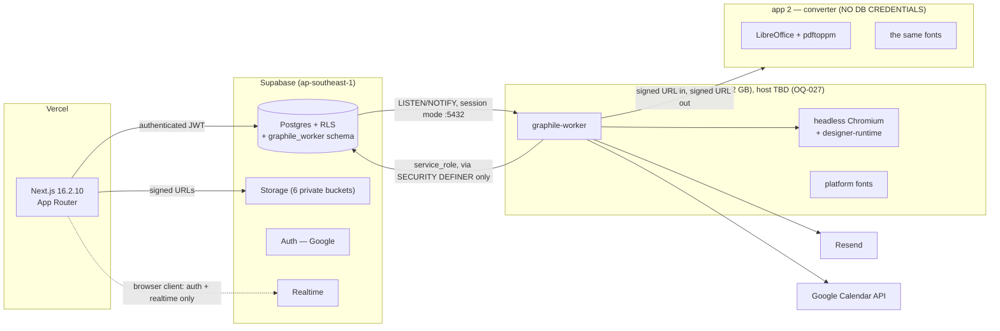
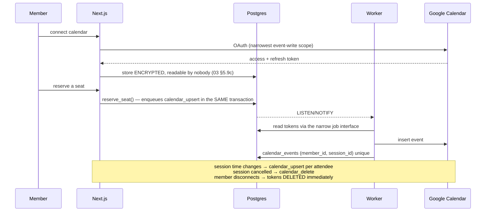

# 04 — Architecture

**Status:** `draft` · **Owns:** the canonical route table, the worker topology, deployment, secrets
**Serves:** `REQ-NFR-004`, `REQ-NFR-011`, `REQ-NFR-016`, `REQ-NFR-017`, `REQ-NFR-019`, D61–D64
**Cites:** `02-domain-model.md`, `03-permissions-rls.md`

> **Written against Next 16.2.10, verified in `node_modules/next/dist/docs/`.** Several things in
> this document contradict what a model trained before this release would assume. Each such point
> is marked **[v16]** and the contradiction is stated, because a correction that does not say what
> it corrects gets silently "fixed" back.

---

## 1. Verified baseline

| Package | Version | Notes |
|---|---|---|
| next | **16.2.10** | Middleware is `proxy.ts`; async request APIs |
| react / react-dom | 19.2.4 | |
| next-intl | 4.13.2 | Makes `[locale]` the real root |
| tailwindcss | 4.x | `@theme` in CSS; no `tailwind.config.*` |
| zod | 4.4.3 | |
| @supabase/supabase-js | 2.110.2 | `@supabase/ssr` **not yet installed** |
| vitest | 4.1.10 | `environment: "node"` only — no jsdom |
| typescript | 5.9.3 | |
| supabase CLI | 2.109.1 | linked to `qnwbgzsgkftqaixzuhdo` |

**Not installed, and needed:** `@supabase/ssr`, `@radix-ui/*`, `graphile-worker`, Playwright,
jsdom, `@testing-library/*`, `resend`, `@sentry/nextjs`.

### 1.1 What the repository looks like today

One dynamic segment, `[locale]`. **No route groups and no `src/app/layout.tsx`** — next-intl makes
`src/app/[locale]/layout.tsx` the real root layout. Middleware is **`src/proxy.ts`**, today just
`createMiddleware(routing)`. All 882 lines of styling live in `globals.css`. `src/components/ui/`
contains exactly one file. There is one table and one live Supabase project, and that project is
production.

---

## 2. Version-correct facts that shape this document

**[v16] `cookies()`, `headers()`, `params` and `searchParams` are async-only.** Every access is
awaited. Synchronous access is not deprecated — it does not exist.

**[v16] `revalidateTag` requires a second argument.** `revalidateTag(tag, 'max')` for
stale-while-revalidate; the one-argument form is deprecated and is a TypeScript error.
**`updateTag(tag)`** is new and is **Server-Action-only** — it expires immediately so the action's
own re-render waits for fresh data (read-your-own-writes). **`refresh()`** refetches the current
route's RSC payload without invalidating any cache. `cacheLife` / `cacheTag` are stable.

**[v16] Server Actions dispatch one at a time per client.** The client dispatcher serialises them,
so `Promise.all` over three actions runs them sequentially — never parallelise actions from the
client. Parallel work goes **inside** one action, or into a Route Handler.

**[v16] Server Actions carry a 1 MB body cap** (`serverActions.bodySizeLimit`). Designer autosave
and every upload therefore go through **Route Handlers**, not actions. This is an architectural
constraint, not a preference.

**[v16] Server Action IDs rotate on deploy** — at most every 14 days even with unchanged source.
A client on the previous build calling a vanished ID gets *"Failed to find Server Action"*. In a
product used **live in a room**, that is a member failing to check in while the presenter watches.
Mitigations in §9.

**[v16] Next's own auth guidance is DAL + React `cache()`**, with checks **close to the data** and
**never in layouts** — layouts do not re-render on navigation under Partial Rendering, so a check
there is not a boundary. `proxy.ts` is for **optimistic cookie checks only**.

**[v16] `next/image`: `priority` is replaced by `preload`**; `images.qualities` defaults to `[75]`.

**Supabase `getClaims()` verifies JWTs locally via WebCrypto** against a cached JWKS. It returns a
**three-way union**, and `{data: null, error: null}` is a reachable no-session state — so code must
**narrow on `data`, not on `error`**. Narrowing on `error` lets unauthenticated requests through,
which is the failure mode that looks like working code.

**Tailwind v4 `rtl:` / `ltr:` variants add zero specificity** (they compile to `:where()`), so they
must never be paired with a physical utility for the same property — the physical one wins
regardless of source order.

---

## 3. The caching decision — Cache Components **OFF**

**Decided on evidence, not preference** (DEC-013, A36).

Verified in the shipped bundle: next-intl resolves the active locale through a React `cache()`
slot. `use cache` isolates that slot, so the lookup falls through to `headers()` — which **throws
inside a cache scope**. Therefore **`getTranslations()` cannot be called inside any `use cache`
boundary**.

In an Arabic-first product, every cacheable fragment contains translated text. A flag that cannot
be used around translated content removes its own reason to exist here.

**Rejected:** Cache Components ON with PPR.

**The consequence, and why it keeps the door open:** routes become dynamic by **touching
`cookies()` in the DAL** — never via `export const dynamic = 'force-dynamic'`. Dynamism is then a
property of *reading session data*, which is what actually makes a route dynamic. If next-intl
resolves the conflict later, turning the flag on is a configuration change rather than unwinding
`export const dynamic` from forty files.

What we still get: `fetch` caching for the few external calls (the Google Fonts metadata list),
`revalidateTag(tag, 'max')` for them, and `updateTag()` in actions for read-your-own-writes on the
session's own data.

---

## 4. Route tree — **canonical**

> **`04` owns this table. `09-sitemap-screens.md` cites screen IDs against it.** If the two
> disagree, this one is right.

```
src/
├── proxy.ts                          # locale routing + CSP nonce + optimistic auth  [v16 name]
├── app/
│   ├── [locale]/                     # the real root; no src/app/layout.tsx
│   │   ├── layout.tsx                # <html dir> + fonts + NextIntlClientProvider + DirectionProvider
│   │   ├── page.tsx                  # ← FROZEN: marketing landing (REQ-NFR-019)
│   │   ├── register/                 # ← FROZEN: pre-launch interest form
│   │   ├── not-found.tsx             # ← FROZEN
│   │   ├── [...rest]/                # ← FROZEN
│   │   │
│   │   ├── (auth)/                   # unauthenticated platform routes
│   │   │   ├── sign-in/page.tsx
│   │   │   ├── choose-org/page.tsx   # REQ-AUT-004, only when the domain is ambiguous
│   │   │   └── no-access/page.tsx    # REQ-AUT-006
│   │   ├── legal/
│   │   │   ├── privacy/page.tsx      # unauthenticated (D58)
│   │   │   └── terms/page.tsx
│   │   ├── verify/
│   │   │   └── [code]/page.tsx       # unauthenticated, rate-limited (REQ-CRT-007)
│   │   │
│   │   └── app/                      # ─── everything below requires a session ───
│   │       ├── layout.tsx            # shell only — NO auth check here [v16]
│   │       ├── page.tsx              # home: upcoming, my sessions, my points
│   │       ├── sessions/
│   │       │   ├── page.tsx          # browse + filters + search
│   │       │   ├── [id]/
│   │       │   │   ├── page.tsx      # the event page
│   │       │   │   ├── materials/[materialId]/page.tsx   # the viewer
│   │       │   │   ├── check-in/page.tsx
│   │       │   │   ├── rate/page.tsx
│   │       │   │   └── host/page.tsx # presenter host view (REQ-CHK-001, OQ-013)
│   │       ├── propose/
│   │       │   ├── page.tsx
│   │       │   └── [id]/page.tsx
│   │       ├── members/
│   │       │   ├── page.tsx          # directory
│   │       │   └── [id]/page.tsx     # profile — two tiers (REQ-PRF-004)
│   │       ├── me/
│   │       │   ├── page.tsx
│   │       │   ├── points/page.tsx   # the full ledger (REQ-PTS-003)
│   │       │   ├── certificates/page.tsx
│   │       │   ├── bookmarks/page.tsx
│   │       │   ├── calendar/page.tsx
│   │       │   └── notifications/page.tsx
│   │       ├── leaderboards/
│   │       │   ├── page.tsx
│   │       │   └── companies/page.tsx # سباق الشركات
│   │       │
│   │       ├── admin/                # org admin + moderator
│   │       │   ├── layout.tsx        # shell only — NO auth check here [v16]
│   │       │   ├── page.tsx          # dashboard
│   │       │   ├── proposals/
│   │       │   ├── sessions/[id]/schedule/
│   │       │   ├── venues/ · categories/ · companies/ · members/
│   │       │   ├── moderation/{comments,photos,reports}/
│   │       │   ├── scoring/ · recognition/
│   │       │   ├── templates/{posters,certificates}/
│   │       │   ├── designer/[documentId]/page.tsx
│   │       │   ├── emails/ · branding/ · reminders/
│   │       │   ├── exports/ · audit/
│   │       │   └── settings/
│   │       │
│   │       └── platform/             # super admin
│   │           ├── orgs/ · domains/ · templates/ · metrics/
│   │           └── impersonate/
│   │
│   └── api/                          # Route Handlers — uploads, webhooks, anything > 1 MB [v16]
│       ├── auth/callback/route.ts
│       ├── upload/material/route.ts
│       ├── upload/photo/route.ts
│       ├── upload/design-asset/route.ts
│       ├── designer/autosave/route.ts        # > 1 MB; cannot be an action [v16]
│       ├── sessions/[id]/ics/route.ts
│       ├── verify/[code]/route.ts            # rate-limited, in front of verify_certificate()
│       └── webhooks/{resend,google-calendar}/route.ts
```

### 4.1 The app stays at the repository root

npm workspaces add `packages/*` — the first being **`@kareem/designer-runtime`** — **without**
moving the app to `apps/web` (DEC-029). Verified in `node_modules/next/dist/docs/`: **Turbopack
transpiles workspace packages automatically under the App Router**, so there is no
`transpilePackages` entry and no reason to change Vercel's root directory on a live deployment.

### 4.2 Why route groups now, when the repo has none

`(auth)` groups the three unauthenticated platform routes so they share a layout without adding a
URL segment. The frozen marketing routes stay exactly where they are — **`REQ-NFR-019` means
`/`, `/ar`, `/en`, `/ar/register` and `/og.png` do not move**, and a route group would not change
their URLs but would change their files, which is a diff on a live page for no benefit.

### 4.3 Actions vs Route Handlers

| Use a **Server Action** | Use a **Route Handler** |
|---|---|
| Form mutations under 1 MB | **Anything over 1 MB** [v16] |
| RSVP, cancel, comment, react, rate, check in | File uploads (materials, photos, design assets) |
| Admin configuration writes | Designer autosave (layer trees get large) |
| Anything wanting read-your-own-writes via `updateTag()` | ICS generation |
| | Public `/verify` (needs per-IP rate limiting before the DB) |
| | Webhooks |

**Never `Promise.all` over Server Actions from a client component** [v16] — they serialise, so the
code reads parallel and runs sequential. Parallel work belongs inside one action.

---

## 5. The Data Access Layer

The **only** place application code touches Supabase. Three rules:

1. `import 'server-only'` at the top of every DAL module (`REQ-NFR-004`).
2. Every function calls `requireSession()` first — the check is **at the data**, not in a layout
   [v16].
3. Every function returns a **DTO**, never a raw row (`REQ-PRF-004`'s tiering is a DAL guarantee,
   not a rendering one).

```ts
// src/lib/dal/session.ts
import 'server-only'
import { cache } from 'react'
import { cookies } from 'next/headers'
import { redirect } from 'next/navigation'
import { createServerClient } from '@/lib/supabase/server'

export const requireSession = cache(async () => {
  await cookies()                       // [v16] async — and this is what makes the route dynamic
  const supabase = await createServerClient()

  const { data } = await supabase.auth.getClaims()
  //  ^ narrow on `data`, NOT on `error`. getClaims() returns a three-way union and
  //    { data: null, error: null } is a reachable no-session state. Narrowing on
  //    `error` lets unauthenticated requests straight through.
  if (!data?.claims) redirect('/sign-in')

  const { org_id, member_id, org_role, claims_version } = data.claims.app_metadata ?? {}
  if (!org_id || !member_id) redirect('/no-access')

  return { orgId: org_id, memberId: member_id, role: org_role, claimsVersion: claims_version }
})
```

`cache()` memoises per render pass, so a page calling `requireSession()` in six components pays
for one verification. `getClaims()` verifies **locally via WebCrypto** against a cached JWKS, so
even that one is not a network round trip.

**Why `cookies()` is awaited and then ignored.** It is the dynamism marker. With Cache Components
off, touching `cookies()` opts the route out of static rendering — which is correct, because a
route that reads a session *is* dynamic. `export const dynamic` would achieve the same thing while
hiding the reason.

### 5.1 The three client factories

| Factory | Where | Role | Purpose |
|---|---|---|---|
| `createServerClient()` | Server Components, actions, handlers | `authenticated`, user's JWT | **All** data access. RLS applies. |
| `createBrowserClient()` | Client Components | `authenticated`, user's JWT | **Auth UI and Realtime only** (DEC-020). Every channel is **private**, and Realtime has its own RLS surface — `03` §7 (DEC-022). |
| `createWorkerClient()` | Worker process only | `service_role` | Narrow, audited job interface. |

**The worker never holds a request context**, and `service_role` **bypasses RLS entirely**. So
every worker write goes through the same `SECURITY DEFINER` functions the app uses, which is why
`points_ledger` and `audit_log` revoke `update` and `delete` from `service_role` explicitly
(`03` §5.7a, §5.10a). A `service_role` key is not a permission to rewrite history.

### 5.2 The `NEXT_PUBLIC_` reversal — stated loudly

This repository's README documents an invariant: **no `NEXT_PUBLIC_` variables exist and the
browser never talks to Supabase.** A18's realtime requirement breaks it. A browser Supabase client
needs `NEXT_PUBLIC_SUPABASE_URL` and the publishable key.

**RLS then becomes the only thing between a browser and the data** (DEC-020). That is exactly what
`03-permissions-rls.md` is for, and it is why the isolation sweep (§8.1 there) is generated over
every table rather than written by hand.

**Confirmed by the owner (DEC-021).** Server polling was the named alternative and is
**rejected** — it is no longer a fallback, and a later session should not reintroduce it as one.

Two consequences follow. The README's invariant is **retired at implementation time**, with
`README.md:35` updated to point at DEC-020 and DEC-021, so that someone reading the old line and
then finding a browser client finds the decision rather than assuming a mistake. And the
**generated isolation sweep becomes load-bearing** (`03` §8.1): it was already a blocking gate, but
it is now the *only* thing standing between a browser and another org's data. It must never be
weakened, skipped for a "trivial" table, or allowed to go red.

---

## 6. `proxy.ts` — three jobs, none of them authorization

```ts
// src/proxy.ts                                    [v16] renamed from middleware.ts
export default async function proxy(request: NextRequest) {
  // 1. CSP nonce, fresh per request (REQ-NFR-003)
  const nonce = Buffer.from(crypto.randomUUID()).toString('base64')

  // 2. next-intl locale routing — existing behaviour, unchanged
  const response = intlMiddleware(request)

  // 3. Optimistic auth: cookie presence only. NO database call. [v16]
  //    Proxy runs on every request including prefetches; a DB call here is a
  //    performance bug and is not a security boundary either way.
  if (isPlatformRoute(request.nextUrl.pathname) && !hasSessionCookie(request)) {
    return NextResponse.redirect(new URL('/sign-in?next=' + encodeURIComponent(path), request.url))
  }
  return withSecurityHeaders(response, nonce)
}
```

**The redirect carries `?next=`**, which is `REQ-AUT-005` — a poster QR scanned while signed out
must land on that session, not on a dashboard. The value is validated as an internal path before
use; an absolute URL is discarded.

**Authorization is not here.** Proxy does a cookie-presence check and nothing more; the real check
is in the DAL, at the data [v16]. A forged cookie gets past proxy and is then rejected by
`getClaims()` and by RLS — which is the correct ordering, because proxy's check is a UX
optimisation and the DAL's is the boundary.

---

## 7. Worker topology

**graphile-worker** (DEC-018, A35), as two separate apps, deliberately. *Hosting is undecided — DEC-034 dropped Fly.io; OQ-027 decides by M3. Until then both run locally and in CI.*



### 7.1 Why the converter is a separate app with no database credentials

The converter parses **PowerPoint files uploaded by users**. That is the most hostile input in the
product, handled by LibreOffice, which is a large C++ codebase with a long CVE history. It gets:
a signed input URL, a signed output URL, and **no Postgres connection string, no `service_role`
key, no Supabase URL**.

A remote-code-execution in LibreOffice then yields a container with two short-lived signed URLs.
In a single-app design it would yield `service_role`, which bypasses RLS on every table in every
org. The isolation costs one extra app.

### 7.2 The graphile-worker connection trap

graphile-worker needs **`LISTEN`/`NOTIFY`**, which requires a **session-mode** connection —
Supabase port **5432**, *not* the transaction pooler on **6543**.

**The failure mode is silent.** On a transaction-pooled connection `LISTEN` does not error; it just
never delivers. The worker falls back to polling, jobs still run, nothing logs an error, and
reminders arrive minutes late for months before anyone connects the two.

**So a boot-time probe is mandatory:** on start, `LISTEN` on a test channel on **one connection**,
`NOTIFY` it from **another**, and **refuse to start** if the notification does not cross within a
second. Two connections, not one: a connection that notifies itself passes through a transaction
pooler when the pool is idle — both statements reuse the same server connection — so a
one-connection probe approves the broken configuration (DEC-034, `worker/src/probe.ts`). A worker that cannot do
realtime job dispatch should fail loudly at boot, not degrade quietly in production.

### 7.3 Why graphile-worker, and why not the alternatives

**Justification:** job keys map directly onto D63's idempotency requirement — `job_key` makes
re-saving a poster leave **one** pending render and makes rescheduling a session **move** its
reminder rather than add a second — and jobs are enqueued **from SQL inside the originating
transaction** (`perform graphile_worker.add_job(...)`), which removes the dual-write window
entirely. Postgres-backed, so no extra infrastructure, which is D63's own constraint.

**Named alternative:** pg-boss — comparable, but its idempotency story is singleton keys rather
than the move-on-reschedule semantics that fit the reminder use case exactly.

**Hosting:** Fly.io was chosen over Railway for burst economics and private networking, then dropped on
cost (DEC-034). The host is OQ-027, decided by M3; the two-app split stands wherever they run.

### 7.4 Why the renderer is bundled in the worker image

DEC-017. The worker drives headless Chromium against a **self-contained renderer inside its own
image**, not a render route in the deployed Next app.

This trades automatic code identity for **guaranteed font identity**. The route approach would keep
renderer code identical to editor code for free — but a **font fetch failing in production
produces a plausible-looking poster with silently wrong Arabic**, which is precisely the D66
nightmare: no error, no alert, a printed A3 poster with broken lam-alef.

Code identity is recovered deliberately: a shared **`designer-runtime`** package pinned to one
version in both the app and the worker image, plus a **blocking CI parity gate** that turns skew
into a build failure instead of a rendering difference.

And decisively: **the preview an admin approves is the worker-rendered artifact itself**. Parity
stops being a property someone hopes holds and becomes a property of the workflow — the admin
approves the exact bytes that will be printed.

---

## 8. Google Calendar integration



Four properties worth naming:

- **Idempotency is a constraint, not a code path.** `unique (member_id, session_id)` on
  `calendar_events` is `REQ-CAL-004`.
- **The dual-write window does not exist**, because the job is enqueued inside the transaction
  that creates the RSVP.
- **Failures never block the app** (`REQ-CAL-008`). A Google outage retries with backoff; the RSVP
  stands regardless.
- **Tokens are refreshed by the worker only.** The app never holds one, so a compromised Vercel
  function does not yield calendar access to members' personal Google accounts.

---

## 9. Deployment topology and the live-site constraint

| Component | Platform | Notes |
|---|---|---|
| Web | **Vercel** | The **same project and domain** already serving the live pre-launch site (A38) |
| Database, Auth, Storage, Realtime | **Supabase cloud** | Today: one project, `ap-southeast-1`, and it is production |
| Worker | **host TBD** (OQ-027, DEC-034) — local + CI until M3 | ~2 GB: Chromium + `designer-runtime` + fonts |
| Converter | **host TBD**, separate app | LibreOffice + fonts, **no DB credentials** |
| Email | **Resend** | Alternative: Postmark |
| Errors | **Sentry** | Alternative: Bugsnag |
| Analytics | **PostHog** (optional, A22) | Alternative: none — it is optional by assumption |

### 9.1 Standing constraints on every milestone

1. **`main` stays deployable.** Every milestone ships to the live domain.
2. **`/`, `/ar`, `/en`, `/ar/register`, `/og.png` are a frozen public contract**, guarded by
   `scripts/qa.mjs` in CI (`REQ-NFR-019`).
3. **`registrations` is never dropped** (DEC-002).
4. **Every migration is forward-only** and tested against production-shaped data first
   (`REQ-NFR-020`).

### 9.2 Server Action ID rotation — a real operational risk

[v16] Action IDs rotate on deploy, at most every 14 days even with unchanged source. A client on
the old build calling a vanished ID fails.

**This product is used live in a room.** The failure lands on a member trying to check in while
forty people wait. Three mitigations:

1. **Freeze deploys during scheduled sessions.** The schedule is in the database — CI can read it
   and refuse to deploy inside a session window. This is the one that actually works.
2. **Set a stable `NEXT_SERVER_ACTIONS_ENCRYPTION_KEY`** so action references stay decryptable
   across instances and builds.
3. **Surface the error as a retry**, never as a hard failure — a refresh recovers the user, and the
   check-in screen says so in Arabic rather than showing a stack trace.

### 9.3 Environments

**dev / staging / prod, each with its own Supabase project** (`REQ-NFR-017`, A23).

**Today there is exactly one project and it is production.** Creating the other two is M0 work and
it is on the critical path — M1 retrofits auth and RLS onto a live database whose only policy is
`anon`-insert, and doing that without a staging copy is the highest-risk activity in the plan.

---

## 10. Secrets

| Secret | Held by | Never |
|---|---|---|
| `SUPABASE_SERVICE_ROLE_KEY` | Worker only | Vercel; the converter; any client bundle |
| `NEXT_PUBLIC_SUPABASE_URL`, publishable key | Vercel + browser | — (public by design; DEC-020) |
| `DATABASE_URL` (session mode, :5432) | Worker only | Vercel; the converter |
| `NEXT_SERVER_ACTIONS_ENCRYPTION_KEY` | Vercel, **stable across builds** | Rotated casually — see §9.2 |
| `RESEND_API_KEY` | Worker only | Vercel — all mail is sent from jobs |
| `GOOGLE_OAUTH_CLIENT_SECRET` | Vercel (auth callback) + worker (refresh) | Client bundles |
| `GOOGLE_FONTS_API_KEY` | Vercel only | Worker — it has a no-network policy |
| `SENTRY_DSN` | Both | — |

Two rules: **the converter app holds no secrets at all** (§7.1; a host without private networking adds one endpoint token, OQ-027), and
**Vercel never holds `service_role`** — anything needing it is a job.

---

## 11. UI foundation

**Radix primitives directly, no shadcn/ui** (DEC-019, A37 — supersedes A21).

The product needs real accessible dialog, popover, select, tabs and toast behaviour, and Radix
ships `DirectionProvider dir="rtl"` with unstyled markup — which is exactly the half of shadcn
that was wanted. The half that was not: a Tailwind layer written against `--background` /
`--foreground`, a **second token vocabulary** competing with the shipped `--color-canvas` /
`.theme-dark` system, and `lucide-react`, which **brand policy bans**.

The existing hand-written `button.tsx` already proves the house style. The permitted glyph set —
dots, lines, chevron, check, spinner — ships as roughly **eight inline SVGs**.

**Rejected:** shadcn re-themed onto the existing tokens (permanent divergence from upstream, for
components we would restyle anyway); hand-rolling every primitive (accessible combobox and dialog
focus management are not worth rediscovering).

Tailwind v4 is kept from A21, unchanged. Tokens are in `10-i18n-rtl.md`; the `@theme inline` block
is load-bearing and must not be flattened to a plain `@theme`, which would freeze the light values
at `:root` and break `.theme-dark`.

---

## 12. Feature runtime notes

*(Completed in Wave 3, after `05`–`08` and `10` settled their own mechanics. Split deliberately:
writing these in Wave 1 would have meant guessing at decisions those documents had not yet made,
which is how a route table ends up describing an application nobody built.)*

### 12.1 Scoring runtime → `05-scoring-engine.md`
Awards are enqueued from inside the transaction that creates the source event
(`03` §5.4b shows `check_in()` doing it). The app never computes points inline: a check-in returns
as soon as the row commits, and `JOB-award_points` does the rest. The member sees the award appear
via Realtime, typically within a second, and the check-in never waits on the scoring engine.

### 12.2 Designer runtime → `06-visual-designer.md`
Autosave is a **Route Handler**, not an action — layer trees exceed the 1 MB action cap [v16].
Export requests enqueue `JOB-render_variant` with `job_key = doc:{id}:{preset}:{format}`, so
re-saving a poster twice leaves **one** pending render. The editor polls artifact status; the
worker writes it.

### 12.3 Content pipeline runtime → `07-content-pipeline.md`
Uploads are Route Handlers issuing signed upload URLs; the browser uploads **directly to Storage**,
never through Vercel — a 200 MB audio file must not traverse a serverless function. The handler
then enqueues `JOB-convert_document`, which calls the credential-free converter app.

### 12.4 Notification runtime → `08-notifications-calendar.md`
**All mail is sent from the worker**, never from a request handler — which is why `RESEND_API_KEY`
is not on Vercel (§10). Reminders are scheduled with `job_key = remind:{session}:{offset}:{member}`,
so rescheduling a session **moves** the reminder rather than adding a second one (§7.3).

### 12.5 i18n runtime → `10-i18n-rtl.md`
`getTranslations()` is called in Server Components only and **never inside a `use cache`
boundary** — which, with Cache Components off (§3), is every boundary. `NextIntlClientProvider`
wraps the app in `[locale]/layout.tsx`, alongside Radix's `DirectionProvider`, and both read the
same `locale` param [v16: `params` is async].
