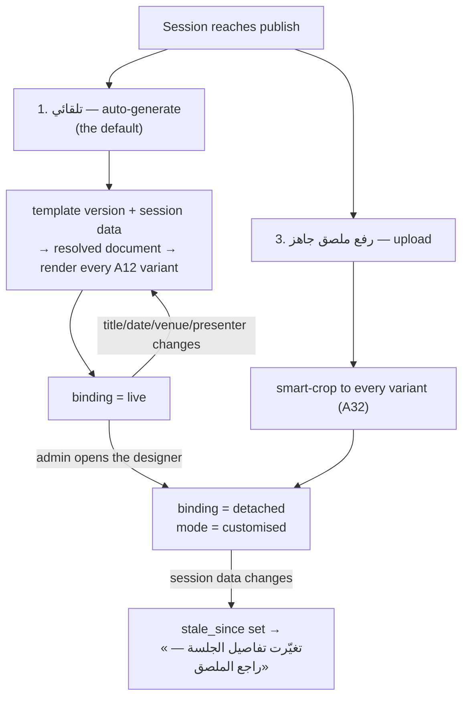
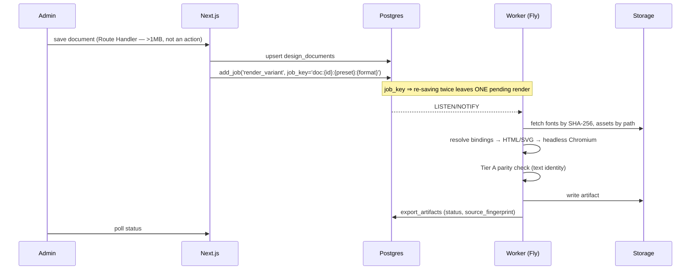
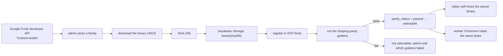

# 06 — The Visual Designer

**Status:** `draft` · **Serves:** `REQ-DSG-001` … `REQ-DSG-026`, `REQ-CRT-005`, `REQ-CRT-010`,
`REQ-CRT-014`, `REQ-INT-009`
**Cites:** `02-domain-model.md` (frozen), `04-architecture.md`

> **One engine, two template libraries** (D54). The ملصق designer and the شهادة builder are the
> same code over the same document model. A change to the layer model applies to both without a
> branch — that is the requirement, and this document is written so that it stays true.

---

## 1. Why not a raster canvas

**A28's conclusion, and this repository already proved it the hard way.**

The pre-launch site's Open Graph card could not be rendered with satori / `ImageResponse`, because
**satori cannot shape Arabic**. It is rendered instead from `scripts/og-card.html` through headless
Chrome. That workaround exists in this codebase, in production, today.

The general problem: correct Arabic needs a **real shaping engine**. Cursive joining (a letter's
glyph depends on its neighbours), ligatures (lam-alef is one glyph, not two), mark positioning
(stacked tashkeel), and bidi reordering are not string operations. Raster-canvas text APIs offer
basic RTL *direction* handling and no shaping; their Node back-ends carry known text limitations.
The output does not error — it renders **disconnected letterforms in visual order**, which looks
like a font problem and is actually an architecture problem.

**So: never render Arabic through a raster-canvas text API for anything that leaves the app.**
(D66, §6 of the brief.) The editor is **DOM/SVG**, so the browser's own text stack — HarfBuzz —
does the shaping. Exports render **the same document** in headless Chromium.

**Fallback if Chromium is ever rejected:** a HarfBuzz-based pipeline (`harfbuzzjs`) driving a raster
renderer. Heavier, and it must pass the identical parity suite (§9). Not chosen, but named.

---

## 2. The document model

### 2.1 Shape

A document is a **JSON layer tree** (`REQ-DSG-005`). It is fully self-describing: nothing about a
document's appearance lives outside it.

```jsonc
{
  "schemaVersion": 1,
  "purpose": "poster",                  // "poster" | "certificate"
  "master": { "width": 1080, "height": 1350, "unit": "px", "dpi": 72 },
  "direction": "rtl",                   // RTL is the source composition (D5)
  "background": { "type": "solid", "color": "{{brand.canvas}}" },
  "layers": [
    {
      "id": "l_title", "kind": "text", "locked": false,
      "frame": { "x": 80, "y": 300, "w": 920, "h": 320, "rotation": 0 },
      "opacity": 1, "z": 10,
      "text": { "binding": "session.title", "fallback": "عنوان الجلسة" },
      "font": { "family": "Reem Kufi", "hash": "sha256:4f2a…", "size": 96, "minSize": 56,
                "lineHeight": 1.4, "letterSpacing": 0, "weight": 600 },
      "align": "start",                 // logical, never "left"/"right"
      "color": "{{brand.fgHeading}}",
      "autoFit": { "mode": "shrink-then-wrap", "maxLines": 3 }
    },
    {
      "id": "l_qr", "kind": "qr", "locked": true,
      "frame": { "x": 80, "y": 1150, "w": 140, "h": 140 },
      "qr": { "binding": "session.eventUrl", "ecLevel": "M", "quietZoneModules": 4 }
    },
    {
      "id": "l_logo", "kind": "image", "locked": true,
      "frame": { "x": 860, "y": 80, "w": 140, "h": 140 },
      "image": { "binding": "brand.logoAssetId", "fit": "contain",
                 "focal": { "x": 0.5, "y": 0.5 } }
    }
  ]
}
```

Five layer kinds (`layer_kind`): **`text`** · **`image`** · **`shape`** · **`qr`** ·
**`dynamic_field`**. Every layer carries position, size, rotation, opacity, z-order and locking
(A28).

`schemaVersion` is bumped on any breaking change, and older versions keep rendering
(`REQ-DSG-005`) — a certificate issued in 2026 must still regenerate in 2031.

### 2.2 Two things the model does deliberately

**Colours are `{{brand.*}}` tokens, never hex.** Templates resolve them through the brand kit at
render time (`REQ-DSG-021`), which is what makes DEC-008's "one edit in one place" true rather than
aspirational. A literal `#0B1220` in a template is a defect.

**`align` is `start` / `end`, never `left` / `right`.** The mirrored LTR template variants (A27)
are then a `direction` flip rather than a second layout. A template written with physical alignment
has to be redrawn for English; one written logically does not.

### 2.3 Dynamic fields

| Binding | Source | Used by |
|---|---|---|
| `session.title`, `session.abstract` | `ENT-sessions` | posters |
| `session.startsAt` | formatted per locale, org time zone, org numerals (A30) | posters |
| `session.venueName`, `session.venueAddress` | venue or inline | posters |
| `session.presenters` | `ENT-session_presenters`, joined with «و» | posters |
| `session.eventUrl` | **absolute** URL | poster QR |
| `recipient.name` | `certificates.recipient_name_snapshot` — frozen, not live | certificates |
| `certificate.serial` | `KM-2026-000123` | certificates |
| `certificate.verificationCode` | the random code | certificates |
| `certificate.verifyUrl` | **absolute** URL | certificate QR |
| `certificate.issuedAt` | | certificates |
| `org.name`, `brand.logoAssetId`, `brand.*` | brand kit | both |

**`recipient.name` binds to the frozen snapshot, not to the live profile.** A certificate records
what was printed; a member later changing their display name must not retroactively change a
document someone is holding (`REQ-CRT-014`).

An unbound field renders as a **clearly marked placeholder**, never an empty box
(`REQ-DSG-006`) — an empty box exports as a blank space nobody notices until it is printed.

### 2.4 The editor previews with real data

`REQ-DSG-006`. Never lorem ipsum. The reason is specific to Arabic: Latin placeholder text has
none of the properties that break layouts here — no ascending/descending diacritics, no cursive
joining that changes width, and roughly **0.8×** the length of the Arabic that will replace it
(A30). A poster that fits with placeholder text and overflows with real text is the normal outcome
of previewing with fake data.

---

## 3. Templates

### 3.1 Two levels (D67, `REQ-DSG-008`)

**Platform templates** are managed by مدير المنصة, readable by every org, **never writable by
one**. **Org templates** are created by duplicating a platform template or starting blank. The
duplicate is a **copy** — later platform changes do not reach it, which is what makes a platform
template safe to improve.

This is the one deliberate cross-org read in the product, and its policy is written out
explicitly in `03` §5.9a rather than inherited from a pattern.

### 3.2 Versioning (`REQ-DSG-007`)

`ENT-design_template_versions`. **Publishing a new version never alters an existing artifact** —
artifacts reference a `template_version_id`, not a `template_id`. A certificate issued against v3
renders as v3 forever, even after v4 ships, which is D67's requirement and `REQ-CRT-014`'s
mechanism.

### 3.3 The baseline library (A27, `REQ-DSG-026`)

**Poster families**, each light and dark, RTL-first with a mirrored LTR variant reserved for
English:

> ★ **The poster default is the DARK scheme — `DEC-125`, 2026-09-16.** The variant is the *scheme*
> (`brand.canvas`), not a second template row, and `scheme` defaulted to `'light'` in all three
> signatures that take it, so generated posters were white while every poster in the canvas is dark.
> **Certificates stay light** — they are printed. The canvas paints its posters as a *gradient*,
> which `model.ts`'s `background: { type: 'solid' }` cannot express: the flat dark canvas is the
> default, and a gradient fill is a scoped change to this document, not a template improvisation.
> This **moves the parity goldens**, which is a reviewed diff and the lead's.

| Family | العربية | For |
|---|---|---|
| `talk` | جلسة | the default single-presenter session |
| `workshop` | ورشة | carries a **المهام التحضيرية** strip (A27) |
| `panel` | حوار | multi-presenter layout |
| `meetup` | لقاء | community/recurring-feel meetup |
| `announcement` | إعلان | generic |

**Certificate families**, each landscape and portrait, formal Naskh, with locked regions for the
logo, signature block, serial and QR:

| Family | العربية |
|---|---|
| `attendance` | شهادة حضور |
| `presenter` | شهادة تقديم |
| `achievement` | شهادة إنجاز |

**The brand constraint every template inherits** (DEC-003, A27 as constrained): no open books, no
graduation caps, no lightbulbs, no traditional education iconography, no cartoon illustration —
and by project policy **no icon libraries, no emoji, no photography**. Permitted glyphs: dots,
lines, chevron, check, spinner. The visual language is the **Knowledge Network**: connected dots,
thin silver lines, light.

Every template declares its **dynamic fields** and its **safe area per preset** (A27).

### 3.4 Locked regions (`REQ-DSG-024`)

A template can lock a region — logo, signature block, serial, QR. A locked layer cannot be moved,
resized, hidden or deleted in the org editor. Unlocking is a **platform-template-level** act, not
an in-editor one.

The QR and serial are locked on every certificate template for an obvious reason: a certificate
whose verification QR someone dragged off the page is a certificate that cannot be verified, and
the failure only appears after it is printed and handed over.

---

## 4. The three poster paths

DEC-012, `REQ-DSG-002`, `REQ-DSG-003`.



**The asymmetry is the decision.** `live → detached` happens on the first edit and is **one-way**.
An automatic poster is a pure function of template plus data, so regenerating it costs nothing. A
customised poster carries someone's judgement, and silently overwriting that is the worse of the
two failure modes — so a data change raises a prompt instead.

**Path 1 is the one that will carry most sessions.** D53 names only paths 2 and 3; making
auto-generation first-class is what keeps `REQ-DSG-001` ("every published session has a poster")
from becoming a publishing bottleneck that an admin resents.

---

## 5. Presets and safe areas

A12, `REQ-DSG-009`. **Master: 1080×1350 (4:5).** Every variant derives from it with no manual step.

| Preset | Size | Safe area (inset) | Purpose |
|---|---|---|---|
| `master` | 1080×1350 | 80 px | the source of truth |
| `square` | 1080×1080 | 80 px | feeds, WhatsApp |
| `story` | 1080×1920 | 120 px top/bottom | stories |
| `landscape` | 1920×1080 | 100 px | event-page hero, venue screens |
| `og` | 1200×630 | 72 px | link previews in email and chat |
| `a4` | 2480×3508 @300dpi | 5 mm + 3 mm bleed | print |
| `a3` | 3508×4961 @300dpi | 5 mm + 3 mm bleed | print |
| `cert_landscape` | 3508×2480 @300dpi | 5 mm + 3 mm bleed | certificates |
| `cert_portrait` | 2480×3508 @300dpi | 5 mm + 3 mm bleed | certificates |

**Text and logos are auto-constrained to the safe area** (A12). Content crossing it is flagged
**before** export, not after (`REQ-DSG-010`).

### 5.1 How one master becomes seven aspect ratios

Not by scaling — 4:5 to 16:9 is not a scale. Each layer carries a per-preset **anchor and
behaviour** declared by the template:

| Behaviour | Effect |
|---|---|
| `anchor: block-start / block-end / center` | where the layer sits when the canvas reflows |
| `scale: proportional / fixed / fill` | how its frame responds |
| `hide-at: [og, square]` | layers that do not survive a crop are declared, not discovered |
| `reflow: stack / inline` | the workshop family's task strip stacks on `story`, inlines on `landscape` |

Text re-fits per preset (§5.2), so the `og` variant's title is genuinely smaller rather than a
downscaled 1080-px raster. That matters for the one preset that is read at 600 px wide in an email
client.

### 5.2 Auto-fit (`REQ-DSG-025`)

Arabic runs roughly **1.2× the length of English** (A30), and an Arabic title is unpredictable in a
way a Latin one is not. So text boxes auto-fit: **shrink** toward `minSize`, then **wrap** to
`maxLines`, then **warn** — never silently clip, and never shrink below the template's stated
minimum.

A template at its auto-fit limit is one of the seven parity-suite cases (§9), because the limit is
exactly where editor and export are most likely to disagree by a pixel that becomes a wrapped line.

---

## 6. Export

### 6.1 Formats (A29, `REQ-DSG-011`)

| Target | Format | Details |
|---|---|---|
| Screen variants | **PNG**, sRGB, exact preset pixel size | plus a **WebP** copy for in-app display |
| Screen variants | JPEG | **only** if the org enables it for size (`org_settings.allow_jpeg_export`) |
| Print | **PDF**, 300 dpi, **RGB** | 3 mm bleed, 5 mm safe margin, fonts embedded, images at native resolution |
| Certificates | **PDF** A4 landscape or portrait | fonts embedded, QR ≥ **25 mm** with a 4-module quiet zone |
| Certificates | **PNG** 1600 px wide | in-app display and email |

**RGB, not CMYK, at launch** — and the UI says so, as a print-shop caveat rather than a footnote
(`REQ-DSG-011`). A print shop receiving an RGB PDF will convert it, and the navy will shift. Saying
that up front costs one line of UI; discovering it on 200 printed posters does not.

### 6.2 The pipeline



**The preview the admin approves is the worker-rendered artifact itself** (DEC-017). Parity stops
being a hope and becomes a property of the workflow: the admin approves the exact bytes that go to
print.

### 6.3 Caching (`REQ-DSG-013`)

`source_fingerprint` = hash of (document JSON + template version + bound data + font hashes).
`unique (document_id, preset, format, source_fingerprint)`.

**Invalidation is impossible to forget**, because a changed source produces a different key rather
than requiring someone to remember to clear a cache. Re-opening a session re-renders nothing; a
template version bump invalidates exactly the artifacts bound to it.

### 6.4 Storage layout

```
exports/{org_id}/exports/{document_id}/{preset}.{ext}
design-assets/{org_id}/design/assets/{asset_id}.{ext}
fonts/{sha256}.{woff2|ttf}          ← deliberately NOT org-prefixed
```

The `fonts` bucket is content-addressed and shared platform-wide because the **entire point** is
that the editor, the worker's Chromium and the worker's poppler load the **same bytes**
(`REQ-DSG-016`). Org-prefixing them would guarantee three copies and eventually three versions.

---

## 7. Typography and fonts

### 7.1 The app UI follows A30 in full

IBM Plex Sans Arabic is already the shipped face. A Kufi display face (Reem Kufi) for headings and
posters; a Naskh face (Amiri) for certificates. Rules in `10-i18n-rtl.md`, as tokens.

### 7.2 The Google Fonts materialisation flow

DEC-007, A39, `REQ-DSG-017`. The certificate builder lets an org admin **choose** a font — and the
choice **captures** it:



Five properties, each doing real work:

1. **`subset=arabic` filter** — a font with no Arabic coverage can never be chosen at all.
2. **Materialise, don't reference** — the editor **self-hosts** the stored binary rather than
   hot-linking Google's CDN, whose *dynamically subset slices are not byte-stable*. A CDN link
   would break D66 invisibly: the editor and the worker would fetch different bytes on different
   days and nothing would error.
3. **Parity goldens gate selectability** — a font with partial `GSUB` or `mark` coverage renders
   Latin perfectly and **silently breaks lam-alef and stacked tashkeel**. A Latin smoke test passes
   it. Only the Arabic goldens catch it.
4. **Templates pin the font hash** — so reissuing a 2026 certificate in 2031 is byte-reproducible
   (`REQ-CRT-014`), even if the family was later removed from the picker.
5. **Same bytes everywhere** — editor, worker Chromium, worker poppler (DEC-058), by SHA-256.

This is how the owner gets open font choice without losing D66. The font is chosen freely, then
**frozen**.

### 7.3 The single font set (`REQ-DSG-016`)

`ENT-fonts` is the **manifest** — the only way a font enters the editor, the worker's Chromium or
the worker's poppler. CI asserts the three sets are identical by hash; a font present in one
and absent from another is a **build failure**, not a production surprise.

**Font drift is the likeliest silent Arabic killer in this product.** Two Chromium builds with
different font files produce different line breaks, which produce different text, which fails
Tier A on every export.

### 7.4 Subsetting (`REQ-INT-009`)

Self-hosted and subsetted — and subsetting must **never drop `rlig`, `mark` or `mkmk`**. A
subsetter configured for Latin drops them by default, and the result renders Latin perfectly while
breaking lam-alef and stacked tashkeel. Verified by the goldens, per font, on every build.

---

## 8. Images, QR, and the brand kit

### 8.1 Image layers — PNG, JPG, WebP; **no SVG** (DEC-009, `REQ-DSG-018`)

Validated **server-side by content sniffing, not extension**. An SVG renamed `.png` is rejected on
its bytes.

**Why the format is dropped rather than sanitised:** an SVG is an XML document that can carry
`<script>`, event handlers, and external `<image href>` / `<use href>` references — and it would be
rendered **inside a privileged headless Chromium** that holds storage credentials. Dropping the
format removes the vector entirely: no sanitiser to maintain, no bypass to track.

**The honest cost:** org logos are now raster. An org must supply a **high-resolution PNG** or the
PPI guard blocks A3. A vector logo would have scaled to any size for free. The brand kit states the
minimum up front.

**PPI guard** (`REQ-DSG-019`): warn below **300 PPI** at the layer's print frame, **block below
200**. Naming the layer and the preset it fails, so the fix is obvious.

**Focal-point cropping** (A31) drives automatic variant generation, so a 4:5 → 16:9 crop centres on
the subject rather than the geometry.

### 8.2 QR layers (D68, `REQ-DSG-023`, `REQ-CRT-010`)

Two QRs in the product, behaving differently:

| | Poster QR | Certificate QR |
|---|---|---|
| Target | the session's event page | `/verify/<verification-code>` |
| Encodes | **absolute URL** | **absolute URL** |
| Audience | members (signed in or about to be) | anyone holding a printed certificate |
| Signed out | → sign-in → **back to that session** (`REQ-AUT-005`) | public page, no sign-in |
| Non-member domain | «هذه منصة خاصة» explanation (`REQ-AUT-006`) | n/a |

Both are **designer layers, not post-processing** (D68) — so they sit inside the safe area, respect
the template's composition, and are locked (§3.4).

**The QR is emitted as inline SVG by our own runtime**, which is why it stays vector and crisp at
A3 despite DEC-009's no-SVG-upload rule. That rule is about **uploaded files**; generated markup
from our own code is a different thing entirely, and saying so here prevents a future session from
"consistently" rasterising the QR and softening it at print size.

Certificate QR: **≥ 25 mm with a 4-module quiet zone**, with the **serial** and the **verification
code** printed as text beside it (A29) — because a QR that will not scan needs a fallback a human
can type.

### 8.3 The brand kit (DEC-008, A40, `REQ-DSG-021`)

**One source of truth**, four consumers:

```
tokens module  ─┬─→ CSS @theme / @theme inline   (platform default theme — DEC-003)
                ├─→ ENT brand kit per org        (org overrides — A25's surviving half)
                ├─→ designer templates           ({{brand.*}} bindings, never hex)
                └─→ email templates
```

Changing a colour or a face is **one edit in one place**. Replacing the org logo updates every
template at once, because the logo is an image layer bound to `brand.logoAssetId` rather than an
asset each template embeds.

---

## 9. The shaping parity suite

D66, `REQ-DSG-014`, `REQ-DSG-015`, DEC-017.

### 9.1 Why D66 needed restating

As literally written, D66 is untestable. **Pixel identity between an arbitrary browser and the
worker's Chromium is impossible** — different HarfBuzz builds, different rasterizers, different
subpixel rules. A requirement that cannot be tested is a requirement that will be assumed to hold.

Restated in three tiers that are each testable, without weakening the guarantee:

| Tier | What | When | Blocking? |
|---|---|---|---|
| **A** | **Text identity** — same glyph sequence (post-shaping), same line breaks, same fitted size | **Every production export** | **Yes** — a mismatch fails the export |
| **B** | **Pixel parity**, both paths inside the worker image | Every CI run | **Yes** |
| **C** | Cross-browser comparison (Safari, Firefox, Chrome vs worker) | Nightly | Advisory |

Plus the workflow property that makes the whole thing hold: **the preview an admin approves is the
worker-rendered artifact itself** (§6.2).

**Tier A is the one that runs in production**, and it is cheap: the worker already has the shaped
glyph run, so comparing it against the editor's recorded run is a string comparison. It catches
exactly the failure that matters — the export differing from what was approved.

### 9.2 The seven cases

Run against **every** export path — poster PNG, poster PDF, certificate PDF, slide page images
(`REQ-DSG-015`):

| # | Case | The string | What it catches |
|---|---|---|---|
| 1 | lam-alef ligature | `لا إله إلا الله` | ligature substitution dropped (`rlig`/`liga` missing) |
| 2 | stacked tashkeel | `مُحَمَّدٌ` | `mark`/`mkmk` positioning; clipped line boxes |
| 3 | mixed script + digits | `جلسة عن Next.js 16 في 2026` | bidi reordering, numeral run isolation |
| 4 | mirrored punctuation | `(الجلسة الأولى) — «كريم معرفة»؟` | bracket and quote mirroring |
| 5 | long word forcing a break | `استراتيجيات` in a 200 px box | line-break behaviour at the shaping boundary |
| 6 | both numeral systems | `٣ جلسات · 3 sessions · ١٢٣ / 123` | numeral-system consistency (A30) |
| 7 | auto-fit limit | a title at exactly `minSize` | shrink/wrap decision at the boundary |

### 9.3 Tolerance and discipline

- **Tier A:** exact. Line-box count, per-line widths, total advance, per-character rect count and
  fitted size must match **exactly**. Not a tolerance — a structural comparison.

  **Implementation note (DEC-024, proven in `scripts/parity/`):** no browser exposes shaped glyph
  IDs, so "same glyph sequence" is measured through the geometry shaping *produces* rather than
  read from the shaper. A dropped ligature, a substituted face or lost mark positioning all move
  those numbers — verified by deliberately substituting the font, which fails all seven cases on
  both tiers. Additionally, **a capture below 0.1% inked pixels is a hard failure**: a blank golden
  passes every comparison forever, and the spike produced one twice before this guard existed.
- **Tier B:** pixel diff **≤ 0.1 %** of pixels differing by **> 2/255** per channel, to absorb
  antialiasing between runs inside the same image.
- **Tier C:** reported, never blocking. Cross-browser difference is expected; a *growing* one is
  the signal.

**Measured cross-platform behaviour (DEC-028).** The suite was run on macOS Chrome and inside a
Debian/Chromium container against the same goldens and the same font bytes:

| | macOS vs Linux | Under a substituted font |
|---|---|---|
| **Tier A** | **identical on all seven cases** | **moves on all seven** |
| **Tier B** | 0.7–3.9% drift | 11%+ |

Tier A is therefore a property of the **font bytes and the layout algorithm**, not the rasteriser,
and **blocks on every platform** — which is what lets CI enforce D66 on a Linux runner against
goldens made on a Mac. Tier B is the rasteriser, so cross-platform it measures the platform and is
advisory there.

**Goldens are never auto-refreshed** (`REQ-DSG-015`). A changed golden is a reviewed change with a
human looking at the before and after. An auto-refreshing golden suite tests that the code equals
itself, which is the most reassuring way to test nothing at all.

Doubly important now that **org admins can add fonts** (§7.2): every newly materialised font runs
all seven cases before it becomes selectable.

---

## 10. Feature set

A31, `REQ-DSG-022`. What the editor ships with, and the notes that matter:

| Feature | Note |
|---|---|
| Layers, alignment guides, snapping | Guides are **logical** (start/end), so they mirror with direction |
| Brand kit injection | `{{brand.*}}` resolved live; changing a colour updates the canvas |
| Safe-area and bleed overlays | Per preset, toggleable, on by default for print presets |
| Undo/redo | Document-level, 50 steps |
| Autosave | **Route Handler**, not an action — layer trees exceed the 1 MB action cap |
| Admin-locked regions | §3.4 |
| Live preview of every variant | All seven poster presets, rendered from the same document |
| Dynamic-field preview with real data | §2.4 — never lorem ipsum |
| Image upload with focal-point cropping | §8.1 |
| QR layer | §8.2 |
| Export queue with status | queued / rendering / done / failed, per variant, with a retry |

The editor is **RTL-first**: the canvas origin, the layer list, the properties panel and the
alignment guides are all composed for RTL, with LTR as the mirror. An editor that is LTR-first with
an RTL toggle produces templates that are LTR-first with an RTL toggle.

---

## 11. Uploaded posters

A32, `REQ-DSG-020`. Minimum **1080 px on the short side**, validated server-side by content
sniffing (DEC-009).

Missing variants are generated by **smart-cropping** around the master with safe margins — using
the **focal point** if the uploader sets one, and a saliency-free centre-weighted crop otherwise.
The admin can **adjust the crop per variant before publishing** (A32), which is the escape hatch
for the cases automatic cropping gets wrong: a poster with the title at the bottom, or a logo in a
corner that a 16:9 crop would cut.

An uploaded poster is **`detached` from the start** (`ENT-session_posters`, §4) — there is no
template to regenerate it from, so a session data change flags it stale and prompts review.

---

## 12. Proposed entities

**None.** Everything this document needs exists in `02-domain-model.md` as frozen:
`ENT-design_templates`, `ENT-design_template_versions`, `ENT-design_documents`,
`ENT-design_assets`, `ENT-fonts`, `ENT-session_posters`, `ENT-export_artifacts`.
