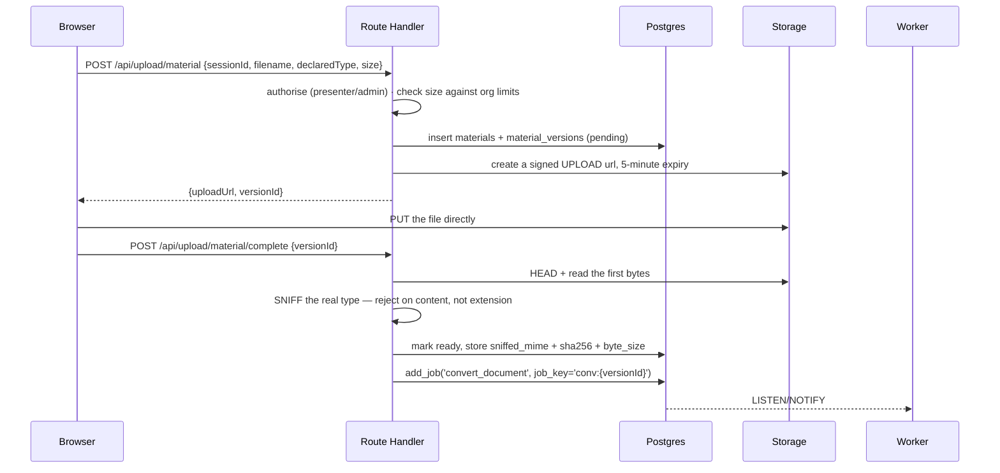
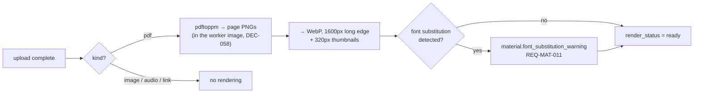

# 07 — Content Pipeline

**Status:** `draft` · **Serves:** `REQ-MAT-001` … `REQ-MAT-012`, `REQ-EVT-009` … `REQ-EVT-014`,
`REQ-DSG-018`
**Cites:** `02-domain-model.md` (frozen), `03-permissions-rls.md`, `04-architecture.md`

---

## 1. Upload flow

**The browser uploads directly to Storage. Bytes never traverse Vercel.**



**Why direct-to-Storage rather than through the handler:** A16 allows **200 MB** audio. A 200 MB
body through a serverless function is a timeout, a memory ceiling and a bill, all for the privilege
of proxying bytes. The handler does authorisation and bookkeeping; Storage does transfer.

**Why the type is sniffed after upload, not before:** the pre-upload check reads a *declared* type
from a client that may be lying. The only trustworthy check is on the stored bytes
(`REQ-MAT-012`). A file that fails sniffing is deleted and its version row marked rejected — it
**never becomes retrievable** (`REQ-MAT-012`).

---

## 2. Validation

### 2.1 Type — content sniffing, never extension

| Kind | Accepted magic bytes / container | Note |
|---|---|---|
| `pdf` | `%PDF-` | |
| `powerpoint` | ZIP + `ppt/presentation.xml` | **recognised to be refused** — uploads are PDF-only (DEC-058) |
| `keynote` | ZIP + `index.apxl` / `Index.zip` | **recognised to be refused** (DEC-058; DEC-006's download-only is withdrawn) |
| `image` | PNG / JPEG / WebP magic | **SVG rejected** (DEC-009) |
| `audio` | MP3 / M4A / WAV / OGG | |
| `video_link`, `external_link` | URL validation | no file |

**SVG is rejected everywhere in the product** (DEC-009, `REQ-DSG-018`), not only in the designer.
An SVG renamed `.png` fails on its bytes. The reason is the designer's privileged Chromium, but the
rule is applied uniformly because a format accepted in one place will eventually be rendered in
another.

### 2.2 Size (A16, `REQ-MAT-009`)

Documents **50 MB** · audio **200 MB** · images **20 MB** · poster uploads **30 MB** —
org-configurable via `ENT-org_settings`. Enforced **server-side**; the client-side check is a
courtesy. An over-limit upload fails naming **the limit and the file's actual size**, because
"file too large" without a number is a support ticket.

### 2.3 What is not done

**No virus scanning at launch.** Stated rather than omitted: files are uploaded by authenticated
members of a single organization into a members-only platform, and the converter that parses the
riskiest of them holds no credentials (§4.2). If the threat model changes — more orgs, less
trusted membership — a scanning step slots in front of `convert_document` without touching
anything else. Recorded in `12-security-privacy.md`.

---

## 3. Storage layout

```
materials/      {org_id}/sessions/{session_id}/materials/{version_id}/{filename}
material-pages/ {org_id}/sessions/{session_id}/pages/{version_id}/{n}.webp
                {org_id}/sessions/{session_id}/pages/{version_id}/thumbs/{n}.webp
photos/         {org_id}/sessions/{session_id}/photos/{photo_id}.webp
design-assets/  {org_id}/design/assets/{asset_id}.{ext}
exports/        {org_id}/exports/{document_id}/{preset}.{ext}
fonts/          {sha256}.{woff2|ttf}
```

**Every path begins with `org_id` except `fonts`**, which is content-addressed and shared
platform-wide by design (`06` §6.4).

**Paths are built by one server-side function.** This is the only place in the whole design where
isolation depends on application correctness rather than on a constraint (`03` §6), so: one path
builder, a restrictive prefix policy, and a nightly assertion that no object sits outside its org's
prefix.

---

## 4. Rendering

### 4.1 The pipeline



### 4.2 Where rendering runs — amended by DEC-058

**Inside the worker image.** Until DEC-058 a separate credential-free app ran LibreOffice for
PowerPoint (`04` §7.1); with uploads PDF-only there is no LibreOffice, and poppler (`pdfinfo`,
`pdffonts`, `pdftoppm`) plus `cwebp` are installed in `worker/Dockerfile` beside Chromium, with
the one font set (`REQ-DSG-016`). `JOB-convert_document` keeps its name for the enqueue contract
but **inspects** — page count and font table — and `JOB-render_pages` renders. Both read and write
their own bytes through Storage's REST API with the worker's own key (`worker/src/content/`).

### 4.3 PowerPoint and Keynote are refused — DEC-058 (DEC-006 withdrawn)

Both are still **recognised** by the sniffer (§2.1) so that a deck declared as anything else is
refused by name, and neither is a kind an upload can declare. `materials_kind_pdf_only` (`0077`)
makes the row impossible. The presenter exports to PDF first; the upload form offers PDF, image,
audio and the two link kinds.

### 4.4 Font substitution detection — `REQ-MAT-011`, for a PDF

poppler substitutes silently when a PDF **names a font it does not embed** and the image lacks
it. For Arabic, substitution does not merely change the look — it can change **shaping**, and the
result is a page that reads wrong.

Detection: `JOB-convert_document` reads `pdffonts`' table, keeps every font with `emb = no` whose
family fontconfig does not know, and records those names. The result is written to
`materials.font_substitution_warning` and surfaced **on the material itself**, not only in a job
log:

> **«قد تختلف الخطوط عن ملفك الأصلي.»**
> «الخط "{family}" غير مضمَّن في ملف PDF، فقد تختلف الحروف العربية عن الأصل. صدّر الملف مع تضمين الخطوط وارفعه من جديد.»

### 4.5 Outputs

| Output | Format | Size |
|---|---|---|
| Page image | WebP, quality 82 | long edge 1600 px |
| Thumbnail | WebP, quality 70 | long edge 320 px |
| Page count | `material_pages` rows | — |

WebP rather than PNG for a 40-page deck: roughly a quarter of the bytes at visually identical
quality, and the viewer is the most bandwidth-heavy screen in the product on a phone in a meeting
room.

---

## 5. The viewer — `REQ-MAT-003`

Page-by-page, in-browser, **without downloading the source**.

| Aspect | Behaviour |
|---|---|
| Loading | Progressive: page 1 eagerly, ±2 pages prefetched, the rest on demand |
| Navigation | Keyboard (arrows, Page Up/Down, Home/End), swipe, thumbnail rail |
| **RTL** | **Arrow keys follow the reading direction.** In an Arabic interface, "next" advances the way the member expects |
| Zoom | Pinch and buttons; double-tap to fit |
| Accessibility | Page count announced; thumbnail rail is a labelled list; focus visible (`REQ-NFR-007`) |
| Download | Only when `allow_download` (§6) |
| Offline | None — PWA is out of scope (D64, `REQ-NFR-011`) |

**The RTL detail is the one that gets implemented wrong.** A viewer built LTR-first advances "next"
on the right-arrow key and slides content leftward. In Arabic the deck reads right to left, so the
same gesture must advance the other way. This is not a mirrored icon — it is the navigation model,
and it is a named test case in `13-testing-quality.md`.

Images get a gallery, audio an in-page player with elapsed/total duration, video links an embedded
player, other links open externally with `rel="noopener noreferrer"` and an explicit indication
that they leave the platform (`REQ-MAT-007`).

---

## 6. Download control — `REQ-MAT-005`

`allow_download` is **per material**, set by the presenter. It is enforced **where the bytes are**,
not in the UI and not in RLS:

| Path | With `allow_download = true` | With `false` |
|---|---|---|
| View in the viewer | signed URLs for `material-pages` | **identical** — page images, never the source |
| Download the source | signed URL for `materials`, 5-min expiry | **no URL is ever minted** |
| Admin download | always permitted | always permitted, **and audited** |

RLS gates the **row**; Storage gates the **file**. A member denied download never receives a URL,
so there is nothing to replay or share. Signed URLs expire in **5 minutes** for sources and **60
minutes** for page images, which are re-requested constantly during a read.

**The honest limit:** page images are still images of the slides. Someone determined to keep a copy
can screenshot them. `allow_download` is a friction and a statement of intent, not DRM, and the UI
should not imply otherwise.

---

## 7. Versioning — `REQ-MAT-010`

Replacing a material creates a **new `material_versions` row**; prior versions stay in a version
list showing who replaced it and when.

- Members see the **current** version.
- Admins can retrieve **any** prior version.
- Each version gets its **own page images** — re-rendering, not reusing.
- A version referenced by a **مهمة تحضيرية** warns before replacement (`REQ-MAT-008`).

Old page images are retained with their version. Deleting them would break an admin's ability to
see what a member actually read before the session.

---

## 8. Availability — `REQ-MAT-006`

`phase`: **قبل الجلسة** (pre-reads, downloadables) or **بعد الجلسة** (slides, recordings).

Enforced in the **read policy**, not in the DAL (`03` §5.5a): an `after` material is invisible to
members until the session reaches `completed`. Presenters and staff see both phases throughout.

Doing this in application code alone would leave the row reachable through any other read path —
search, a notification payload, a realtime message. In the policy, it is closed everywhere at once.

---

## 9. Photos — DEC-005, `REQ-EVT-009` … `REQ-EVT-014`

### 9.1 The upload gate

**Checked-in attendees, presenters, admins** (D33) — via `has_checked_in()`, the same function
that gates ratings, attendance points and attendee certificates (`03` §2). One definition, four
rights, no drift.

### 9.2 EXIF stripping — `REQ-EVT-011`

**Server-side, before the file is stored.** Not as a cleanup job.

```
upload → strip EXIF/XMP/ICC (GPS, device, timestamps) in place → store → insert row
```

`ENT-photos` carries `check (exif_stripped)` — so **a row cannot exist for an unstripped image**,
even if a future code path forgets to strip. The constraint and the policy conjunct (`03` §5.6c)
say the same thing twice on purpose.

**Amended under DEC-047 (wave 2):** the strip is byte-level — the JPEG APP segments, PNG ancillary chunks and WebP RIFF chunks that carry metadata are removed without decoding the image, in the worker, with no image library; the e2e asserts on the stored bytes. Re-encoding to WebP through the converter is a later size optimisation, not part of the correctness requirement.

A phone photo taken in a meeting room carries GPS coordinates, a device identifier, and a precise
timestamp. Sharing it org-wide with that intact tells everyone in the organization where a
colleague was, on what device, to the second.

### 9.3 Publishing immediately, with three safeguards

D34 stands: photos appear at once, no pre-moderation. Plus (DEC-005):

1. **EXIF stripping** (§9.2).
2. **«احذف الصور التي أظهر فيها»** — one click, **hides instantly**, pending review
   (`REQ-EVT-012`). The hide is a **trigger on `ENT-photo_takedowns` insert**, so it takes effect
   before any human sees the request. The uploader is notified that the photo was hidden pending
   review, **without being told who asked**.
3. **An upload notice** (`REQ-EVT-013`), at the point of upload, not in a policy page:

   > **«ستظهر هذه الصور لجميع أعضاء المؤسسة.»**
   > «نزيل بيانات الموقع تلقائيًا من كل صورة. ويمكن لأي زميل يظهر في صورة أن يطلب إخفاءها.»

**Why the takedown is instant while a report is not** (OQ-008): auto-hiding on *report* hands any
member a mute button for any other member. The takedown is different in kind — the person asking is
the person **in** the photo, and the cost of a wrong instant hide (a moderator restores it) is far
below the cost of a wrong delay.

### 9.4 Removal and points

Moderator or admin removal is audited with a reason (`REQ-EVT-014`) and triggers the **compensating
ledger entry** in `05` §2.4 — the award is reversed, and any *penalty* is a separate action, off by
default.

---

## 10. Audio, video, images, links — `REQ-MAT-007`

| Kind | Handling |
|---|---|
| **Audio** | In-page player, keyboard operable, elapsed + total duration. Transcoded to a single web-safe format on upload; the original is kept for download when permitted. |
| **Video links** | Embedded player for YouTube and similar. **No video files are hosted** — D26 says "video links", and hosting video is a different product. |
| **Images** | Gallery, WebP variants, lazy-loaded, with alt text required from the uploader (`REQ-NFR-007`). |
| **Other links** | Open externally, `rel="noopener noreferrer"`, with a visible indication that they leave the platform. |

---

## 11. Jobs this document depends on

Owned by `11-background-jobs.md`; listed here so the pipeline reads end to end.

| Job | Trigger | Idempotency key |
|---|---|---|
| `JOB-convert_document` | material version ready, kind = pdf (DEC-058) | `conv:{version_id}` |
| `JOB-render_pages` | conversion produced a PDF | `pages:{version_id}` |
| `JOB-process_photo` | photo uploaded | `photo:{photo_id}` |
| `JOB-transcode_audio` | audio version ready | `audio:{version_id}` |
| `JOB-cleanup_rejected` | nightly | `cleanup:{date}` |

---

## 12. Proposed entities

**None.** `ENT-materials`, `ENT-material_versions`, `ENT-material_pages`, `ENT-photos`,
`ENT-photo_takedowns` and `ENT-design_assets` cover this document as frozen.
