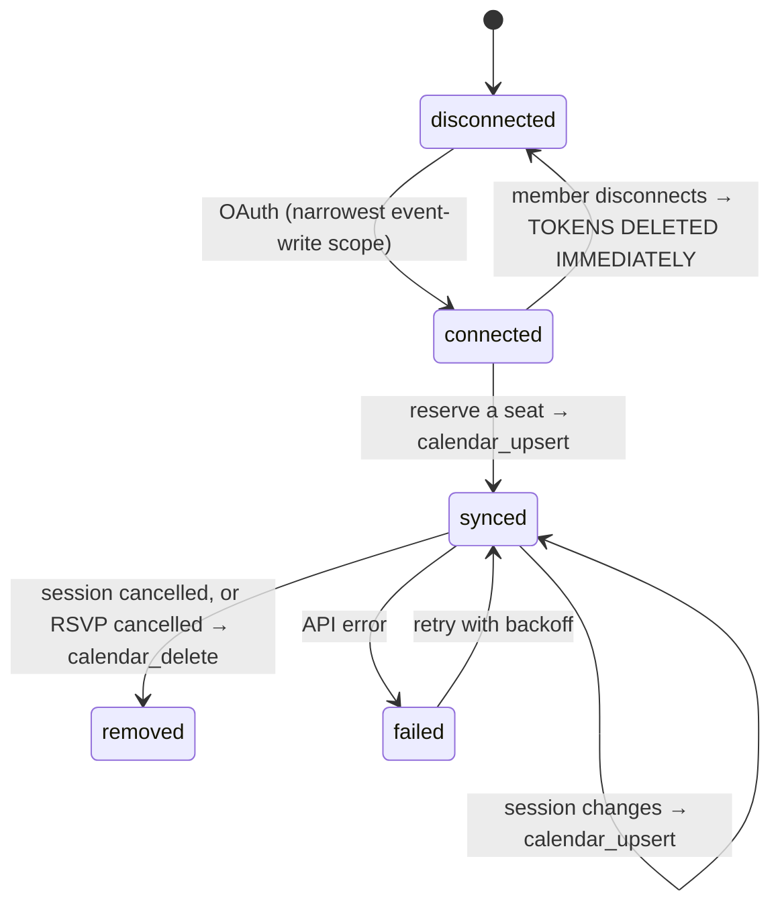

# 08 — Notifications and Calendar

**Status:** `draft` · **Owns:** the `MSG-*` ID space and the notification matrix
**Serves:** `REQ-NTF-001` … `REQ-NTF-008`, `REQ-CAL-001` … `REQ-CAL-008`
**Cites:** `02-domain-model.md` (frozen), `04-architecture.md`

> **Two channels, and only two** (D56): **داخل التطبيق** and **البريد الإلكتروني**. No SMS, no
> WhatsApp, no push — not disabled, **absent**. No code path, dependency or configuration field
> exists for a third (`REQ-NTF-001`).

All copy in this document is written in **Arabic**, because that is the language it ships in.

---

## 1. The notification matrix

`REQ-NTF-002`. **No notification is sent that is not in this table.**

Columns: **Trigger** → **`MSG-*`** → recipients → channels → whether a member can switch it off →
the category it belongs to for preferences.

### 1.1 Proposals

| Trigger | `MSG-*` | To | Channels | Optional? | Category |
|---|---|---|---|---|---|
| Proposal submitted | `MSG-proposal_submitted` | org admins | in-app, email | yes | `admin_queue` |
| Named as co-presenter | `MSG-copresenter_invited` | the named member | in-app, email | **no** | `proposals` |
| Co-presenter declined | `MSG-copresenter_declined` | proposer | in-app | yes | `proposals` |
| Changes requested | `MSG-proposal_changes` | proposer, co-presenters | in-app, email | **no** | `proposals` |
| Approved | `MSG-proposal_approved` | proposer, co-presenters | in-app, email | **no** | `proposals` |
| Rejected | `MSG-proposal_rejected` | proposer, co-presenters | in-app, email | **no** | `proposals` |

### 1.2 Sessions

> **Noted under DEC-047:** three reminder messages exist while `org_settings.reminder_offsets_minutes` is a free `int[]`; `reminder_message_key()` (migration `0034`) gives an offset with no message of its own the nearest by magnitude. A fourth, offset-agnostic message is the honest fix, left to M7-console.

| Trigger | `MSG-*` | To | Channels | Optional? | Category |
|---|---|---|---|---|---|
| Session published | `MSG-session_published` | all active members | in-app, email | yes | `new_sessions` |
| Assigned as presenter | `MSG-presenter_assigned` | the presenter | in-app, email | **no** | `proposals` |
| **Time or venue changed** | `MSG-session_changed` | confirmed + waitlisted | in-app, email | **no** | `my_sessions` |
| **Session cancelled** | `MSG-session_cancelled` | confirmed + waitlisted | in-app, email | **no** | `my_sessions` |
| Reminder −7d | `MSG-reminder_7d` | confirmed | in-app, email | yes | `reminders` |
| Reminder −1d | `MSG-reminder_1d` | confirmed | in-app, email | yes | `reminders` |
| Reminder −2h | `MSG-reminder_2h` | confirmed | in-app, email | yes | `reminders` |
| Reminder, any other offset | `MSG-reminder_generic` | confirmed | in-app, email | yes | `reminders` — for an org offset outside ±20% of the three above (DEC-047, migration `0062`) |
| Nudge to non-responders | `MSG-rsvp_nudge` | members who have not responded | in-app | yes | `new_sessions` |

### 1.3 RSVP

| Trigger | `MSG-*` | To | Channels | Optional? | Category |
|---|---|---|---|---|---|
| Seat confirmed | `MSG-rsvp_confirmed` | the member | in-app | yes | `my_sessions` |
| Joined the waitlist | `MSG-rsvp_waitlisted` | the member | in-app | yes | `my_sessions` |
| **Promoted off the waitlist** | `MSG-rsvp_promoted` | the member | in-app, email | **no** | `my_sessions` |
| RSVP deadline approaching (**no job schedules it — `11` §7 gap, DEC-047; not implemented in wave 2**) | `MSG-rsvp_deadline_soon` | waitlisted | in-app | yes | `my_sessions` |
| Priority window open | `MSG-priority_window` | perk holders | in-app | yes | `new_sessions` |

### 1.4 During and after

| Trigger | `MSG-*` | To | Channels | Optional? | Category |
|---|---|---|---|---|---|
| Check-in recorded | `MSG-check_in_confirmed` | the member | in-app | yes | `my_sessions` |
| Rating prompt (+1h) | `MSG-rating_prompt` | checked-in attendees | in-app, email | yes | `ratings` |
| Materials added after | `MSG-materials_added` | checked-in attendees | in-app, email | yes | `my_sessions` |
| Reply to your comment | `MSG-comment_reply` | comment author | in-app, email | yes | `social` |
| Mentioned in a comment | `MSG-mentioned` | mentioned member | in-app, email | yes | `social` |
| **Your photo was hidden** | `MSG-photo_hidden` | uploader | in-app | **no** | `moderation` |
| Content removed | `MSG-content_removed` | author | in-app | **no** | `moderation` |
| Report received | `MSG-report_filed` | moderators, admins | in-app | yes | `admin_queue` |

### 1.5 Recognition and certificates

| Trigger | `MSG-*` | To | Channels | Optional? | Category |
|---|---|---|---|---|---|
| Badge earned | `MSG-badge_earned` | the member | in-app, email | yes | `recognition` |
| Level reached | `MSG-level_reached` | the member | in-app, email | yes | `recognition` |
| Streak completed | `MSG-streak_completed` | the member | in-app | yes | `recognition` |
| Points adjusted manually | `MSG-points_adjusted` | the member | in-app | **no** | `recognition` |
| Monthly board closed | `MSG-leaderboard_closed` | top 10 + the member's own rank | in-app | yes | `recognition` |
| **Certificate issued** | `MSG-certificate_issued` | recipient | in-app, **email** | **no** | `certificates` |
| Certificate revoked | `MSG-certificate_revoked` | recipient | in-app, email | **no** | `certificates` |

### 1.6 Account

| Trigger | `MSG-*` | To | Channels | Optional? | Category |
|---|---|---|---|---|---|
| Role changed | `MSG-role_changed` | the member | in-app, email | **no** | `account` |
| Deactivated | `MSG-account_deactivated` | the member | email | **no** | `account` |
| Calendar disconnected | `MSG-calendar_disconnected` | the member | in-app | **no** | `account` |
| Data export ready | `MSG-export_ready` | the member | in-app, email | **no** | `account` |

### 1.7 The seventeen a member cannot switch off

> **Corrected under DEC-047:** the heading said eleven; the list below has always had seventeen keys and the list is authoritative (`REQ-NTF-003` names four and says "certain notifications"). Migration `0026`'s matrix carries all seventeen and `tests/rls/notify-contract.test.ts` pins them by name.

`REQ-NTF-003` requires the non-optional set be **marked as such**, so it is listed once here rather
than inferred from the tables:

`MSG-copresenter_invited` · `MSG-proposal_approved` / `_rejected` / `_changes` ·
`MSG-presenter_assigned` · `MSG-session_changed` · `MSG-session_cancelled` · `MSG-rsvp_promoted` ·
`MSG-photo_hidden` · `MSG-content_removed` · `MSG-points_adjusted` · `MSG-certificate_issued` /
`_revoked` · `MSG-role_changed` · `MSG-account_deactivated` · `MSG-calendar_disconnected` ·
`MSG-export_ready`.

The test each one passes: **a member who never saw it would be materially worse off.** Someone who
misses «تم إلغاء الجلسة» travels to an empty room. Someone who misses «نُقلت من قائمة الانتظار»
holds a seat they do not know about, and it goes to waste. Someone who misses
«عُدِّلت نقاطك» cannot question an adjustment they never saw.

Everything else is optional, including every reminder.

---

## 2. Preferences

`ENT-notification_preferences`, `(member_id, category, channel)`.

| Category | العربية | Default |
|---|---|---|
| `new_sessions` | جلسات جديدة | on |
| `my_sessions` | جلساتي | on |
| `reminders` | التذكيرات | on |
| `ratings` | التقييمات | on |
| `social` | التعليقات والإشارات | on |
| `recognition` | النقاط والتكريم | on |
| `certificates` | الشهادات | on (not switchable) |
| `moderation` | إشعارات الإشراف | on (not switchable) |
| `proposals` | المقترحات | on |
| `admin_queue` | قائمة عمل المشرف | on (admins/moderators only) |
| `account` | الحساب | on (not switchable) |

A member turns a category off **per channel** — email off, in-app on, is the common case. A
non-optional message ignores the preference **on both channels**, and the preferences screen shows
those rows as fixed with a short explanation rather than as a toggle that silently does nothing.

---

## 3. Email templates

`ENT-notification_templates`, org-editable within the brand kit (`REQ-NTF-007`). Arabic-first, RTL,
following A30's typography rules — because an email that breaks Arabic shaping is as bad as an
export that does.

### 3.1 Constraints specific to email

- **Tables for layout, inline CSS.** Email clients in 2026 still do not support modern CSS reliably.
- **`dir="rtl"` on `<html>` and on every table cell.** Outlook ignores inherited direction more
  often than it honours it.
- **Web fonts do not load in most clients** — so email falls back to a declared stack, and the
  templates are designed to look right in the fallback rather than to depend on the brand face.
- **Western digits, always** — `REQ-INT-006`, `DEC-124`. (This line read «numerals follow the org setting» until `DEC-161`; the setting was abolished by `DEC-124` and its column dropped by `0082`.)
- **A plain-text alternative** for every message. Some corporate clients strip HTML entirely.

### 3.2 The templates

> **Corrected under `DEC-160` §4 and `DEC-161`.** The matrix in force (`0062`) gives **25** messages an email channel and the mail renderer carries **25** templates; this list carried 23 until wave 10. `MSG-proposal_submitted` and `MSG-presenter_assigned` have had templates since wave 2. `tests/unit/mail-render.test.ts` diffs the template file against the matrix read out of the promoted migration, and `tests/unit/mail-pinned.test.ts` pins all 25 rendered messages, so the gap cannot reopen quietly in either direction.

| `MSG-*` | Arabic subject |
|---|---|
| `MSG-proposal_submitted` | «مقترح جديد بانتظار المراجعة — {{title}}» |
| `MSG-proposal_approved` | «تم قبول مقترحك — {{title}}» |
| `MSG-proposal_rejected` | «بخصوص مقترحك — {{title}}» |
| `MSG-proposal_changes` | «نحتاج بعض التعديلات على مقترحك» |
| `MSG-copresenter_invited` | «دعوة للمشاركة في تقديم جلسة» |
| `MSG-session_published` | «جلسة جديدة: {{title}}» |
| `MSG-presenter_assigned` | «أُسندت إليك جلسة — {{title}}» |
| `MSG-session_changed` | «تغيّرت تفاصيل جلسة {{title}}» |
| `MSG-session_cancelled` | «أُلغيت جلسة {{title}}» |
| `MSG-rsvp_promoted` | «حصلت على مقعد في {{title}}» |
| `MSG-reminder_7d` | «بعد أسبوع: {{title}}» |
| `MSG-reminder_1d` | «غدًا: {{title}}» |
| `MSG-reminder_2h` | «بعد ساعتين: {{title}}» |
| `MSG-reminder_generic` | «تذكير: {{title}}» |
| `MSG-rating_prompt` | «كيف كانت جلسة {{title}}؟» |
| `MSG-materials_added` | «أُضيفت مواد جلسة {{title}}» |
| `MSG-comment_reply` | «رد على تعليقك» |
| `MSG-mentioned` | «ذكرك {{name}} في تعليق» |
| `MSG-badge_earned` | «حصلت على شارة {{badge}}» |
| `MSG-level_reached` | «وصلت إلى مستوى {{level}}» |
| `MSG-certificate_issued` | «شهادتك من {{org}}» |
| `MSG-certificate_revoked` | «بخصوص شهادتك {{serial}}» |
| `MSG-role_changed` | «تغيّر دورك في {{org}}» |
| `MSG-account_deactivated` | «تم إيقاف حسابك» |
| `MSG-export_ready` | «بياناتك جاهزة للتحميل» |

### 3.3 Worked example — `MSG-session_changed`

The one that matters most operationally, because a vague version sends people to the wrong room.

```
الموضوع: تغيّرت تفاصيل جلسة «{{session.title}}»

مرحبًا {{member.name}}،

تغيّرت تفاصيل جلسة «{{session.title}}» التي حجزت مقعدًا فيها:

  الموعد:   {{old.startsAt}}  ←  {{new.startsAt}}
  المكان:   {{old.venue}}     ←  {{new.venue}}

{{#if calendarSynced}}
حدّثنا الموعد في تقويمك تلقائيًا.
{{/if}}

[ عرض الجلسة ]        [ إلغاء حجزي ]

—
كريم معرفة · شارك المعرفة.. واصنع الأثر
```

**It states the old value and the new one** (`REQ-SES-009`), side by side. "Session details have
changed, please check the page" makes the member do the diffing, and some of them will not.

Only changed lines render — a venue change does not print an unchanged time.

### 3.4 Sender identity

OQ-016. **One platform-verified sending domain** for all orgs, with the org name in the **From
display name** and the org's admin contact as **reply-to**:

```
From:     كريم معرفة <no-reply@…>
Reply-To: {{org.email_reply_to}}
```

Per-org sending domains (SPF/DKIM per tenant) are real operational work per org and there is one
org at launch (DEC-004). It needs no schema change later — the sending identity is already a column
on `ENT-org_settings`.

---

## 4. Reminder scheduling

A19, `REQ-NTF-004`. Defaults **7 days · 1 day · 2 hours** before; rating prompt **1 hour** after
completion. Org-configurable via `org_settings.reminder_offsets_minutes`.

### 4.1 Job keys are the whole mechanism

```
job_key = remind:{session_id}:{offset_minutes}:{member_id}
```

graphile-worker's `job_key` **replaces** a pending job with the same key rather than adding one.
So:

| Event | Result |
|---|---|
| Member reserves a seat | 3 reminder jobs scheduled |
| **Session is rescheduled** | Same 3 keys, new `run_at` — the reminders **move**, they do not duplicate |
| Member cancels | Jobs removed by key |
| **Org changes the reminder schedule** | Old-offset keys removed, new-offset keys added |
| Session is cancelled | All reminder keys removed; `MSG-session_cancelled` sent instead |

This is the concrete reason graphile-worker was chosen over pg-boss (DEC-018): "rescheduling moves
the reminder" falls out of the queue's own semantics rather than needing a cancel-and-recreate
dance that has a window in which both or neither exists.

### 4.2 Two kinds of reminder

**To confirmed attendees** — the three offsets, carrying outstanding **مهام تحضيرية**
(`REQ-TSK-005`) and the venue with its map link.

**To non-responders** — `MSG-rsvp_nudge`, in-app only, once, at the −7d mark, to active members who
have neither reserved nor dismissed the session. §6 of the brief asks for reminders to
non-responders; **in-app only and once** is the restraint that keeps that from becoming the reason
people mute the platform.

### 4.3 Rating prompt

`MSG-rating_prompt`, 1 hour after `completed`, to checked-in attendees who have not yet rated
(`REQ-RAT-007`). Members who have already rated are **not** prompted — the job filters at send
time, not at schedule time, because most ratings arrive in that first hour.

---

## 5. Delivery

### 5.1 All mail is sent from the worker

Never from a request handler. This is why `RESEND_API_KEY` lives on the worker's host (Railway since Launch; this line said «Fly» until `DEC-161`) and **not on Vercel**
(`04` §10) — and it means a mail outage cannot slow down a request a member is waiting on.

### 5.2 Logging — `REQ-NTF-008`

`ENT-email_deliveries` records every send: `provider_message_id`, status, error, timestamps. The
Resend webhook (`/api/webhooks/resend`) updates delivery and bounce status.

An org admin sees bounces and failures **with the reason** (`REQ-NTF-008`). Retained 180 days
(OQ-019). A bounce spike alerts (`REQ-NFR-016`) — in an org where every address is on a corporate
domain, a bounce spike usually means a mail-server change, not bad addresses, and it is worth
knowing within the hour.

### 5.3 In-app inbox — `REQ-NTF-006`

`ENT-notifications`, with read/unread state and an accurate cross-device unread count, backed by
the `(org_id, member_id, read_at nulls first, created_at desc)` index. Updates live via Realtime
(A18).

---

## 6. Calendar

### 6.1 ICS — `REQ-CAL-001`

Route Handler, `/api/sessions/[id]/ics`. Carries title, description, start, end, the venue address,
the org time zone (A20), and a link back to the event page.

**The Arabic-specific requirement:** the ICS must be **UTF-8 encoded with correctly folded lines**.
RFC 5545 folds at 75 **octets**, and Arabic characters are 2 octets in UTF-8 — folding by character
count rather than octet count produces a file that Outlook renders as mojibake or refuses outright.
This is a named test case (`13-testing-quality.md`), verified against Apple Calendar, Outlook and
Google.

`DTSTART;TZID=Asia/Riyadh` with an embedded `VTIMEZONE`, not a floating local time, so a member in
another zone sees the right hour.

### 6.2 Add-to-calendar links — `REQ-CAL-002`

Google, Outlook and Apple, alongside the ICS download. Each pre-filled and URL-encoded — and tested
with Arabic titles, which is where naive encoding breaks.

### 6.3 Google Calendar sync — `REQ-CAL-003` … `REQ-CAL-008`



| Lifecycle event | Job | Idempotency |
|---|---|---|
| Connect | — | one row per member, `unique (member_id)` |
| Seat confirmed **or promoted** | `JOB-calendar_upsert` | `cal:{rsvp_id}` |
| Session time/venue changed | `JOB-calendar_upsert` per attendee | `cal:{rsvp_id}` |
| Session cancelled | `JOB-calendar_delete` per attendee | `caldel:{rsvp_id}` |
| Member cancels | `JOB-calendar_delete` | `caldel:{rsvp_id}` |
| Disconnect | rows **deleted** | — |

Four properties:

- **Idempotency is a constraint.** `unique (member_id, session_id)` on `ENT-calendar_events` is
  `REQ-CAL-004`; the job cannot create a second event even if it runs twice.
- **No dual-write window.** The job is enqueued **inside** the transaction that creates the RSVP
  (`03` §5.3).
- **Promotion creates, it does not update** (`REQ-RSV-004`) — a waitlisted member has no event yet,
  so `calendar_upsert` inserts one.
- **Tolerates a manually deleted event** (`REQ-CAL-006`): a 404 from Google on delete is success,
  not an error.

### 6.4 Tokens

`ENT-calendar_connections`, encrypted, and **readable by nobody** — not the member, not the org
admin, not a moderator (`03` §5.9c, A33). Only the worker's narrow job interface reads them.

The **one place in the product where admin access is narrower than member self-access**, and
deliberately so: an OAuth token is a credential for a personal Google account, not org data. An
admin who could read it could act as that member in their own calendar — something no requirement
asks for and no member would expect.

**Disconnect deletes the rows immediately** (`REQ-CAL-007`), outside the retention schedule
entirely. Existing calendar events are left alone, and the member is told plainly that they will no
longer update.

### 6.5 Failures never block

`REQ-CAL-008`. Sync is a background job. A Google outage retries with backoff and surfaces to the
member; **the RSVP stands regardless**. Nothing in the reservation path waits on a third-party API.

---

## 7. Jobs

Owned by `11-background-jobs.md`:

| Job | Key |
|---|---|
| `JOB-send_notification` | `notify:{message_id}` |
| `JOB-schedule_reminders` | `sched:{session_id}` |
| `JOB-send_reminder` | `remind:{session}:{offset}:{member}` |
| `JOB-rating_prompt` | `rate:{session_id}` |
| `JOB-calendar_upsert` | `cal:{rsvp_id}` |
| `JOB-calendar_delete` | `caldel:{rsvp_id}` |
| `JOB-refresh_calendar_tokens` | `caltok:{connection_id}` |

---

## 8. Proposed entities

**None.** `ENT-notifications`, `ENT-notification_templates`, `ENT-notification_preferences`,
`ENT-email_deliveries`, `ENT-calendar_connections` and `ENT-calendar_events` cover this document as
frozen.
