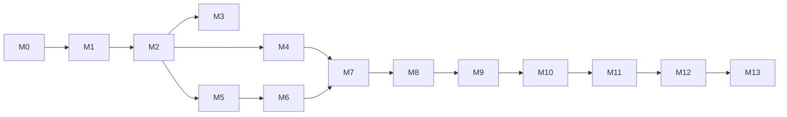

# 14 — Roadmap

**Status:** `draft` · **Owns:** the milestone order
**Cites:** every preceding document

> **No MVP cut and no "phase 2" bucket** (`_source-brief.md` §1). Everything in scope ships as one
> product; the milestones only order the build. A milestone is done when it is **demonstrable** —
> someone can be shown it working — not when its code is merged.

---

## 1. Standing constraints

These hold across **every** milestone, without exception (A38, `REQ-NFR-019`, `REQ-NFR-020`):

1. Every milestone ships to the **same Vercel project and domain** currently serving the live
   pre-launch site.
2. **`main` stays deployable** at all times.
3. `/`, `/ar`, `/en`, `/ar/register`, `/og.png` are a **frozen public contract**, guarded by
   `scripts/qa.mjs` in CI.
4. **`registrations` is never dropped** (DEC-002).
5. Every migration is **forward-only** and tested against production-shaped data first.
6. **Deploys are frozen during scheduled sessions** once M2 ships — Server Action IDs rotate on
   deploy, and this product is used live in a room (`04` §9.2).

★ **Constraint 3 is re-cut in M13, and only there** (`DEC-078`). From M13 the frozen contract is
the **URLs, the registration behaviour and the accessibility floor** — appearance may change through
a `DECISIONS.md` entry and a re-baselined visual diff. Until M13 it holds verbatim: `npm run qa`
stays 44/44 and `npm run visual` stays 0.000 % for every milestone before it.

---

## 2. Milestones

```mermaid
gantt
    dateFormat X
    axisFormat %s
    section Foundation
    M0 foundation and de-risking      :m0, 0, 3
    section Core
    M1 tenancy, identity, RLS spine   :m1, after m0, 4
    M2 sessions, RSVP, check-in       :m2, after m1, 4
    M3 notifications and calendar     :m3, after m2, 2
    section Value
    M4 scoring and leaderboards       :m4, after m2, 3
    M5 content pipeline               :m5, after m2, 3
    M6 designer and certificates      :m6, after m5, 4
    section Operate
    M7 org console and branding       :m7, after m4, 3
    M8 super admin and hardening      :m8, after m7, 2
    section Design
    M9 the system and the shell       :m9, after m8, 2
    M10 the member surfaces           :m10, after m9, 3
    M11 the console                   :m11, after m10, 3
    M12 the two studios               :m12, after m11, 3
    M13 marketing and the closing pass:m13, after m12, 2
```

`M3`, `M4` and `M5` all depend on `M2` and on nothing else, so they can run in parallel if there is
capacity. `M6` needs `M5`'s storage and job plumbing.

---

## M0 — Foundation and de-risking

**No user-visible change. The existing QA must stay 35/35 green.**

| Work | Why here |
|---|---|
| ✅ **`scripts/qa.mjs` fixed** (DEC-023) | Was stale *and* could write to production. Now 44/44 and repeatable, behind `npm run qa`, refusing any non-localhost `SUPABASE_URL`. The `qa` gate can be turned on |
| **Local Supabase for dev + Postgres container in CI** (DEC-025) | Replaces three hosted projects — same safety for M1, **$0**. Docker was already installed (DEC-026). A hosted staging is deferred until someone needs to share one |
| Playwright, jsdom, `@testing-library` | `REQ-NFR-018`. A23 assumed these; they are absent |
| ✅ **GitHub Actions CI** (DEC-028) | 7 jobs. `scripts/policy-diff.mjs` written — `13` §3.5 called it the highest-value automation and it did not exist |
| `scripts/traceability.mjs` + its gate | `13` §10 — the only mechanism that actually holds |
| Radix + the ~8 inline SVG glyphs | DEC-019 |
| **Monorepo restructure** for `designer-runtime` | Touches the live site — do it first, with a visual diff |
| graphile-worker + the **`LISTEN`/`NOTIFY` boot probe**, run locally and in CI (no Fly — DEC-034) | `11` §1.2 — the failure is silent |
| ~~The credential-free converter app~~ — removed at Launch (DEC-058) | `04` §7.1 |
| **Wire the browser Supabase client** (DEC-020, **DEC-021**) | No longer a spike — the owner confirmed the trade. Retire the `README.md:35` invariant here, pointing at both entries |
| ✅ **Shaping parity harness** (DEC-024) | **Done and green.** Chromium is deterministic to 0.000%; substitution caught at 2–10%. D66 is achievable — M6 can be planned on it. Export-path coverage still belongs to M6 |
| **Decide the hosting region** (OQ-026) | Cheap now; a data migration later |
| `NEXT_SERVER_ACTIONS_ENCRYPTION_KEY` set and stable | `04` §9.2 |

**Demonstrable:** `scripts/qa.mjs` passes again and blocks a deliberate regression of a frozen route. CI runs and blocks on a deliberately broken policy. The worker renders a poster
with correct Arabic and the parity suite catches a substituted font. The live site is byte-identical.

**Risk:** the monorepo restructure and the font work both touch the live site. Sequence them first,
with a visual diff of the landing page before and after.

---

## M1 — Tenancy, identity and the RLS spine · ★ **the dangerous one**

**Retrofitting auth and RLS onto a live database whose only policy is `anon`-insert. Do not
compress this milestone.**

| Work | Requirements |
|---|---|
| `orgs`, `org_domains`, `org_settings`, `companies`, `members`, `categories`, `venues` | `REQ-TEN-001` … `REQ-TEN-008` |
| Google auth + **the Custom Access Token Hook** | `REQ-AUT-001` … `REQ-AUT-004` |
| Domain-gated auto-provisioning | `REQ-AUT-003` |
| The **DAL** with `requireSession()` and `getClaims()` narrowing on `data` | `REQ-NFR-004` |
| `proxy.ts`: CSP nonce + optimistic cookie check | `REQ-NFR-003` |
| **RLS on every table shipped so far**, with the generated isolation sweep | `REQ-NFR-001` |
| `audit_log`, append-only | `REQ-ADM-018` |
| Profiles with **two visibility tiers** | `REQ-PRF-004`, A33 |
| Sign-in, choose-org, no-access screens | SCR-002 … SCR-004 |

**Demonstrable:** two members of two different orgs sign in; each sees only their own org; the
isolation sweep passes over every table; a super admin gets **zero rows** from every data table.
*Demonstrated locally (DEC-039): the hosted project is untouched until Launch.*

**Risks, and the mitigations:**

| Risk | Mitigation |
|---|---|
| ★ **The auth hook is a single point of failure for all sign-in.** It must never raise, must return the event unchanged when no member row exists, and needs three separate grants for `supabase_auth_admin`. Failure looks like a generic auth outage. | Test it against a user with no member row, a suspended org, and a missing grant, **before** it goes near production |
| Enabling RLS on `registrations` | **Do not touch it.** It is frozen legacy (DEC-002) |
| The grant-vs-policy trap | Already paid for once here (migration `0002`). CI asserts every policied table has its grant |

---

## M2 — Sessions, proposals, RSVP, check-in

The product's core loop.

| Work | Requirements |
|---|---|
| Proposals + review + state machine | `REQ-PRO-001` … `REQ-PRO-008` |
| Sessions, scheduling, venues, publish gate | `REQ-SES-001` … `REQ-SES-013` |
| `JOB-start_session`, `JOB-complete_session` on the clock | `REQ-SES-004` |
| **RSVP with capacity in the transaction**, waitlist, promotion | `REQ-RSV-001` … `REQ-RSV-011` |
| ★ **Check-in**: stored rotating codes, in-transaction rate limiting, burn, manual backup, the overlap exclusion constraint | `REQ-CHK-001` … `REQ-CHK-014` |
| The event page and the host view | SCR-012, SCR-014, SCR-016 |
| Comments, reactions, reports | `REQ-EVT-001` … `REQ-EVT-008` |
| Ratings with the check-in gate and the min-3 aggregate | `REQ-RAT-001` … `REQ-RAT-006` |
| Realtime for counts and comments | A18, DEC-021 |

**Demonstrable:** ★ **the full critical path, in a real room.** Propose → approve → schedule →
publish → RSVP past capacity → promote → check in with a rotating code → comment → rate. E2E-01
passes minus the points and certificate steps.

**From here on, deploys are frozen during scheduled sessions.**

---

## M3 — Notifications and calendar

| Work | Requirements |
|---|---|
| The notification matrix, in-app + email | `REQ-NTF-001` … `REQ-NTF-008` |
| Resend, from the **worker only** | `04` §10 |
| Arabic RTL email templates | `08` §3 |
| Preferences, with the eleven non-optional marked | `REQ-NTF-003` |
| Reminders with **move-on-reschedule** `job_key`s | `REQ-NTF-004` |
| ICS with **75-octet folding** | `REQ-CAL-001` |
| Google Calendar sync, full lifecycle | `REQ-CAL-003` … `REQ-CAL-008` |

**Demonstrable:** reschedule a session — every attendee is notified with **old and new values**,
synced calendars update, and the three reminders **move** rather than duplicating. Open the ICS in
Outlook on Windows and read the Arabic correctly.

---

## M4 — Scoring, leaderboards, recognition

| Work | Requirements |
|---|---|
| The ledger, append-only, with deterministic idempotency keys | `REQ-PTS-001`, `REQ-PTS-012` |
| The rollup + `JOB-audit_balances` | `REQ-PTS-011` |
| The action catalogue seeded to A10; admin configuration | `REQ-PTS-004` … `REQ-PTS-008` |
| Caps, cooldowns, reversals, manual adjustment | `REQ-PTS-006`, `REQ-PTS-013`, `REQ-PTS-009` |
| Badges, levels, streaks, perks — with the defaults | `REQ-REC-001` … `REQ-REC-009` |
| Leaderboards + **frozen snapshots** with the denominator | `REQ-LDR-001` … `REQ-LDR-008` |
| The member's own history screen | SCR-022 |

**Demonstrable:** a member reads their whole points history and can explain every point **without
asking anyone** (`REQ-PTS-003`). An admin changes a value and the change applies forward only.
Rebuilding the rollup reproduces every balance exactly. **سباق الشركات** shows both metrics.

**This milestone redeems the promises the live marketing copy already makes** — «نقاط للمقدّمين
والحاضرين», «سباق بين شركات المجموعة», «تكريم سنوي». Until it ships, the site promises something
the platform does not do.

---

## M5 — Content pipeline

| Work | Requirements |
|---|---|
| Direct-to-Storage uploads with server-side sniffing | `REQ-MAT-002`, `REQ-MAT-012` |
| Six buckets, prefix policies, the **single path builder** | `03` §6 |
| `JOB-convert_document` — since DEC-058, poppler in the worker image | `04` §7.1 |
| Page rendering + the viewer, with **RTL navigation** | `REQ-MAT-003` |
| ~~Keynote download-only~~ — withdrawn, uploads PDF-only (DEC-058) | `REQ-MAT-004` |
| Font-substitution detection and its warning | `REQ-MAT-011` |
| `allow_download`, phase gating, versioning | `REQ-MAT-005`, `REQ-MAT-006`, `REQ-MAT-010` |
| Photos: **EXIF stripping**, the check-in gate, instant takedown | `REQ-EVT-009` … `REQ-EVT-014` |
| Pre-session tasks | `REQ-TSK-001` … `REQ-TSK-005` |
| Search with Arabic normalisation | `REQ-DSC-001` … `REQ-DSC-007` |

**Demonstrable:** upload an Arabic PDF, read it page by page in the viewer with the arrows going
the right way, and see the font-substitution warning when the file names a font it does not embed
(as amended by DEC-058). Upload a photo and confirm the stored bytes carry **no EXIF**.

---

## M6 — The designer and certificates

The largest single milestone. `05`, `06` and `07` all feed it.

| Work | Requirements |
|---|---|
| The layer model, schema, and the DOM/SVG editor | `REQ-DSG-005`, `REQ-DSG-022` |
| Dynamic fields with **real-data preview** | `REQ-DSG-006` |
| Template versioning + the platform/org libraries | `REQ-DSG-007`, `REQ-DSG-008` |
| The A27 baseline templates, under the brand constraint | `REQ-DSG-026` |
| Presets, safe areas, auto-fit | `REQ-DSG-009`, `REQ-DSG-025` |
| Export pipeline, all formats, caching by fingerprint | `REQ-DSG-011` … `REQ-DSG-013` |
| ★ **Parity Tiers A, B and C in production** | `REQ-DSG-014`, `REQ-DSG-015` |
| **Google Fonts materialisation** with the golden gate | `REQ-DSG-017` |
| Image layers, **no SVG**, PPI guard, focal cropping | `REQ-DSG-018`, `REQ-DSG-019` |
| Auto-generated posters + the **live/detached** rule | `REQ-DSG-002`, `REQ-DSG-003` |
| QR layers, both kinds | `REQ-DSG-023`, `REQ-CRT-010` |
| Certificates: **gapless serial**, random verification code, PDF, email | `REQ-CRT-001` … `REQ-CRT-014` |
| The public verification page | SCR-006 |
| The centralised brand kit | `REQ-DSG-021` |

**Demonstrable:** publish a session and get **every A12 variant** with no design work. Edit one and
watch it detach. Print an A3 poster and a certificate; scan both QRs — one lands on the session
after sign-in, the other on `/verify`. **Try the serial at `/verify` and get not-found.** The
parity suite passes all 28 assertions.

**Risks:** font subsetting dropping `rlig`/`mark` (caught by goldens, never auto-refreshed); the
2 GB image's cold-start on Fly; Chromium memory under concurrent A3 renders (hence `render`
concurrency 2).

---

## M7 — Org admin console and per-org branding

| Work | Requirements |
|---|---|
| The full admin console — every surface in D60 | `REQ-ADM-004` … `REQ-ADM-018` |
| Moderation queues, with takedowns **separate** from reports | `REQ-ADM-010` |
| CSV exports, **UTF-8 with BOM**, audited | `REQ-ADM-017` |
| The audit log viewer | `REQ-ADM-018` |
| Per-org brand kit flowing to UI, templates and email | `REQ-DSG-021` |
| The moderator scope, **enforced by policy** | `REQ-ADM-020` |

**Demonstrable:** ★ **stand up a second org.** Different brand, different scoring, different
templates, different members — and prove that neither org can see a single row of the other's. This
is the milestone that actually proves DEC-004's multi-tenancy claim; until it happens, isolation is
tested but not exercised.

---

## M8 — Super admin, observability, launch hardening

| Work | Requirements |
|---|---|
| The super-admin console | `REQ-ADM-001`, `REQ-ADM-003` |
| **Break-glass impersonation**, audited in the org's own log | `REQ-ADM-002`, `REQ-ADM-019` |
| Platform template library management | `REQ-DSG-008` |
| Sentry, job dashboards, **every alert in `11` §3.2** | `REQ-NFR-016` |
| Retention and anonymisation jobs | `REQ-NFR-012`, `REQ-PRF-007` |
| The nightly storage-prefix assertion | `03` §6 |
| Data export for members | `REQ-PRF-006` |
| Accessibility audit against WCAG 2.2 AA | `REQ-NFR-007` |
| **Real-device pass** on the full matrix | `13` §8 |
| Performance budgets enforced | `REQ-NFR-008` |
| Legal pages, PDPL documentation | `REQ-NFR-015` |

**Demonstrable:** a super admin creates an org, sets its first admin, and **cannot read a single
row of its data**. A break-glass session appears in the org's own audit log. Every alert fires in a
drill.

---

## Launch — rehearsal and cutover · DEC-039

**The only milestone that touches the hosted project.** Everything before it is proven on local
Supabase and in CI (DEC-025, DEC-039); this is the day the accumulated migrations, the hooks and
the sign-in configuration reach production, once.

| Work | Where the script is |
|---|---|
| Schema-only dump of production → fresh local database → every migration on top → the full RLS suite | `STATUS.md`, "PR C — production cutover checklist", step 1 |
| Asymmetric JWT signing keys on the hosted project | step 2 |
| `supabase db push` — the owner's explicit go, `registrations` counted before and after | step 3 |
| Hosted Auth: 900 s expiry, the access token hook, the before-user-created hook, Google, redirect URLs | steps 4–5 |
| `NEXT_PUBLIC_SUPABASE_URL` and the publishable key on Vercel, then redeploy — the guard of DEC-038 lifts | step 6 |
| The first org and the platform admin by one-off SQL, never a migration | step 7 |
| Verification: first admin lands as `admin`; a member as `member`; an unlisted domain refused at Google's return; `npm run qa` 44/44 against production; the CSP reports reviewed before any enforcement (OQ-028) | steps 8–9 |

**Demonstrable:** a real member signs in with Google on the live domain and lands on `/ar/app`; the
marketing site is byte-identical to the day before.

**Risk:** the same as M1's — the hook is a single point of failure for sign-in, and this is the
first time it runs on the hosted project. The rehearsal is not optional, and the day is chosen so
that a rollback (disable the hook, remove the two variables — the guard returns) costs nothing.

---

---

## The design milestone — M9 … M13 · `DEC-069`

**Opened by the owner on 2026-09-15**, the day after Launch, with fifteen asks
(«the pages are plain and the UI/UX is nearly non-existent … do not build on the current UI/UX.
Rebuild from scratch»). The specification is **[`16-ui-redesign.md`](16-ui-redesign.md)**, which is
`settled` and may only change through a `DECISIONS.md` entry. It is a **rebuild, not a refinement**,
and it is rolled out **in place, group by group** — no `v2` tree, no long-lived branch, no flag.

★ **This is five milestones and five waves, not one.** The repository's unit is one wave per lead
session; plan on **six or seven sessions**. Three things force that boundary whatever the pace:
context fills on a lead driving four teammates, the gate lock serialises at roughly 6–8 hours of
held wall time per wave, and **the owner merges every PR** (DEC-041), which is a human checkpoint
between waves by design. **A rebuild is also slower than the greenfield waves were:** M1–M8 wrote
new screens against a spec on an empty slate with four blocking gates; this replaces 49 existing
screens without breaking them, rebuilds two studios, replaces the mail system and unfreezes
marketing — against fourteen (`DEC-087`).

★ **If the milestone needs to be shorter, the lever is scope.** M9 + M10 deliver **ten of the
fifteen asks** and are the half a member actually touches. **Finish M9, let the owner look at it
running, and let M10 confirm the direction before committing to M11–M13.**

---

## ★★ RESEQUENCED 2026-09-15 by the owner — read this before M9 below

The owner reviewed M9 running locally and **reordered the milestone** (`DEC-110`). The tables for
M9–M13 below are still the right *contents*; their **sequence is superseded**.

**What changed and why.** `16` §15 shipped the system first and the screens after. That is correct
engineering and it produced an increment nobody can review: M9 redesigns no screens, so the app
looks exactly as it did while every primitive underneath it changed. The owner's words —
«the designs aren't matching the mockups… is everything clear?» — are the sequencing failing, not
the work.

**The new order.**

| | |
|---|---|
| **Next** | **The screens, to the canvas, including the admin console** (`DEC-110`). Every app screen at phone and desktop in Arabic RTL. The admin console is in from the start; it has had no design attention at all. |
| With them | **The landing screen becomes the sessions timeline** (`DEC-112`) — `/app` renders what a member can attend, one column, filters in the list. `16` §6.6's dashboard is withdrawn. |
| With them | **The shell defect sweep** (`DEC-111`) — the disclosures do not close on navigation, outside click or `Escape`, and two can be open at once. Blocking, with a gate. |
| With them | **Check-in becomes a manual switch** (`DEC-113`) — opened and closed by the presenter, a moderator or an admin, with a hard ceiling at `ends_at + 2 h`. |
| Alongside | M9's remaining system work — the motion system, `RouteProgress`, `Splash`, the three `(auth)` screens — carried **with the screens that need it**, not ahead of them. |
| Unchanged | The marketing half stays frozen until last (invariant 1, `DEC-078`). `registrations` is never touched. The DAL, RLS, migrations, worker and renderer are unaffected. |

★ **The design system M9 built is not wasted and is not re-litigated.** It is what every rebuilt
screen now consumes: 34 primitives, the status vocabulary, the loading and failure models, the form
model, the focus layer. The sequencing changed; the foundation did not.

★ **The canvas is a reference, not a specification** (`DEC-114`). Where it disagrees with
`01-prd.md` the PRD wins; where it disagrees with a `DECISIONS.md` entry the entry wins. A mockup
that contradicts a requirement is a **question**, not an instruction.

---

## M9 — النظام · the system and the shell

**The foundation. Nothing else can start cleanly until it exists, and no screen is redesigned in
it.** Four teammates plus the lead (`DEC-101`).

| Work | Requirements |
|---|---|
| `src/components/ui/index.ts` — every signature, day-one stubs, **hour one**; the 31 primitives in 34 files | `REQ-UIX-001` |
| Tokens, motion tokens, the platform-fixed status colours | `REQ-UIX-003`, `REQ-UIX-014` |
| The shell: desktop two-row, contextual phone tab bar, search entry, account menu; both page shells | `REQ-UIX-002` |
| The form model — `Field`, `FormSummary`, `formStateFrom()` | `REQ-UIX-009`, `REQ-UIX-010`, `REQ-UIX-011` |
| The loading model — `Link` + `RouteProgress`, `Splash`, `Skeleton`, ~12 `loading.tsx` | `REQ-UIX-005`, `REQ-UIX-006`, `REQ-UIX-007` |
| The failure model — `RouteError`, the hand-written Arabic `global-error.tsx`, ~12 `error.tsx`, a `not-found.tsx` per dynamic segment | `REQ-UIX-016` |
| Focus — the skip link, the scroll-padding tokens, the focus-obscured gate | `REQ-UIX-017` |
| `sessionPhase()` · `seatState()` · `viewerRelation()` + `SessionStatusBadge` | `REQ-UIX-003`, `REQ-UIX-004` |
| §5.3's **49-cell affordance matrix**, wired — **and the five live bugs of `16` §5.4.1** | `REQ-UIX-015` |
| `ui-lint`, `loading-coverage`, `error-coverage`, the `(dev)` gallery and its visual baseline | `REQ-UIX-001`, `REQ-NFR-018` |
| The three `(auth)` screens, which were in no milestone | `REQ-UIX-011`, `SC 3.3.8` |
| Empty states and the destructive-action dialog, as primitives | `REQ-UIX-012`, `REQ-UIX-013` |

**Demonstrable:** ★ **every existing screen still works, on the new shell, with loading and status —
and asks 4, 5 and 6 are already answered before a single screen has been redesigned.** A member
cannot register for a session that has ended; a failed form says which fields were missed and links
to them; a finished session is visibly finished. The five live affordance bugs are gone — including
the check-in link that was the primary button on every live session for every member and whose RPC
refused.

**Risk:** the bottom tab bar covers the last ~64 px of **all 49 existing screens at once**. The
`padding-block-end` ships in the **same commit** as the bar and the proof capture is a 390 px
screenshot of an **old, untouched** screen.

---

## M10 — عضو · the member surfaces

| Work | Requirements |
|---|---|
| Home — one «التالية لك» card, not five rails; when nothing is upcoming, home **becomes** browse | `REQ-UIX-002`, `REQ-UIX-012` |
| Browse — the date-grouped schedule, the chip row, the tag cloud, the card in four densities | `REQ-DSC-001` … `REQ-DSC-006` |
| The event page — hero on a dark band, the two-state action card, sub-nav, presenter cards | `REQ-SES-013`, `REQ-UIX-004`, `REQ-UIX-015` |
| `/app/me` as a tabbed hub, and the six screens under it | `REQ-PRF-001` |
| **Objectives** — `0082`, the proposal field, the event-page section | `REQ-SES-014`, `REQ-PRO-010` |
| **Tags** — `0083`, the combobox on propose, chips, the cloud | `REQ-DSC-002`, `REQ-DSC-004` |
| Bookmark and share on every surface that shows a session | `REQ-DSC-006` |
| The member-picker combobox, adopted by the proposal form | `REQ-UIX-008` |
| **The motion system** — the vocabulary, two Tier-1 moments, five Tier-2, the reduced-motion and frame-budget gates | `REQ-UIX-018`, `REQ-UIX-019`, `REQ-UIX-020` |
| **Avatars end to end** — `0089`, the upload route, EXIF strip, derivatives, initials, the Google import prompt, six placements, and **the `lh3.googleusercontent.com` CSP entry removed** | `REQ-PRF-008` … `REQ-PRF-011` |
| The five screens that were in no milestone — check-in, host, rate, the viewer, `s/[id]` | `REQ-CHK-003`, `REQ-MAT-002`, `REQ-DSC-006` |

**Demonstrable:** asks **2, 8, 9, 11**, plus avatars and motion. A member reserves a seat, the card
cross-fades to its confirmed state, a dot ignites and a line draws to two neighbours — and the
calendar button appears **where the reserve button was**, because it was never offered before there
was a seat to put in a calendar.

---

## M11 — إدارة · the console

| Work | Requirements |
|---|---|
| The admin left rail and a real dashboard — counts that are links, queues with ages | `REQ-ADM-004` |
| `DataTable` across every list, **with a stacked card list below `md`** | `REQ-ADM-005` … `REQ-ADM-009` |
| `create_session()` carries **every** proposal field — `0084`, promoted at sync 1 | `REQ-PRO-009` |
| The two-tab schedule and the content-edit diff, on top of `0084` | `REQ-PRO-009`, `REQ-SES-001` |
| **The survey** — `0085`, four entities, the combined rate screen, SCR-064, the CSV | `REQ-SUR-001` … `REQ-SUR-009` |
| **Downloads** — the poster menu reuses `signExportUrl()`; photos need their own signer, `JOB-zip_session_photos` and `0086` | `REQ-DSG-027`, `REQ-ADM-021` |
| **Tag management** — rename, merge, delete, usage counts | `REQ-DSC-008` |
| Moderation queues, exports, audit and settings on the system | `REQ-ADM-010`, `REQ-ADM-017`, `REQ-ADM-018` |

**Demonstrable:** asks **3, 7, 10**. An admin schedules an approved proposal **without re-typing a
word of it**; a presenter cannot see the survey results, proven by policy and not by a hidden link;
staff download the poster and the album, and both downloads are in the audit log.

★ The platform console moves to **M13** — cosmetic work on screens only the owner sees — which keeps
this wave at four teammates with one hard ordering instead of five with two.

---

## M12 — الاستوديو · the studio and the email studio

| Work | Requirements |
|---|---|
| The editor shell — top bar, left-rail tabs, inspector accordion, variant strip | `REQ-DSG-029` |
| **Direct manipulation** — drag, resize, rotate, marquee, align/distribute, snapping | `REQ-DSG-028` |
| **The single-pointer path for every dragged operation**, and the keyboard pass | `REQ-DSG-028`, `SC 2.5.7` |
| Focal-point cropping through derivation — `0087` | `REQ-DSG-030` |
| The poster three-card chooser with working controls and the one-way detach dialog | `REQ-DSG-020`, `REQ-UIX-013` |
| The certificate three-step flow with preflight and per-item status | `REQ-DSG-031` |
| Template management and the platform-library separation | `REQ-DSG-008` |
| **The email block model**, the compiler and the generated text alternative — `0088` | `REQ-NTF-009`, `REQ-NTF-013` |
| The three-pane editor with the **production-renderer** preview and three modes | `REQ-NTF-010` |
| «أرسل اختبارًا» through the live transport, and the checks panel | `REQ-NTF-011` |
| The eight designed platform templates, light and dark, AR and EN | `REQ-NTF-014` |
| Binding declaration per message key, enforced by the trigger | `REQ-NTF-012` |
| `verify/[code]`, which was in no milestone — and where `REQ-INT-010` fails silently | `REQ-CRT-007`, `REQ-INT-010` |

**Demonstrable:** ask **12** and ask **13**. An admin positions a layer with a finger and with a
tap, and the parity goldens do not move. An admin designs a reminder, previews it in three modes,
sends it to themselves, and opens it in Outlook on Windows.

**Constraint:** parity stays 0.000 %. Any golden diff is a lead-reviewed change (DEC-048).

---

## M13 — الواجهة العامة · marketing and the closing pass

**The only milestone that touches a page serving real visitors, sequenced last for that reason.**

| Work | Requirements |
|---|---|
| `qa.mjs` split into `qa:contract` (28, still blocking) and `qa:appearance` (13, rewritten) | `REQ-NFR-019`, `DEC-078` |
| The marketing rebuild on the system, keeping the constellation, the sting and the dark hero | `REQ-NFR-019` |
| The register form re-presented — action, names, validation and no-JS path **byte-identical** | `REQ-NFR-019` |
| The platform console on the system, deferred from M11 | `REQ-ADM-001` … `REQ-ADM-003` |
| `app/me/privacy` and the legal pages, which were in no milestone | `REQ-PRF-006`, `REQ-NFR-015` |
| **Status-colour contrast enforced** — `save_brand_kit()` refuses a palette on which a badge fails AA | `REQ-NFR-007`, `DEC-073` |
| `REQ-NFR-007` accessibility pass over every screen — WCAG 2.2 AA, each track in its own folders | `REQ-NFR-007` |
| `REQ-NFR-008` performance pass — the per-screen budgets | `REQ-NFR-008` |
| `templates.ts`'s string path retired once every key has a block template | `REQ-NTF-014` |
| The visual re-baseline, a new `og.png`, `STATUS.md` | `REQ-NFR-019` |

**Demonstrable:** the live marketing site is rebuilt on the same system as the app, **`qa:contract`
is green and was never allowed to go red**, `registrations` was never touched, and a real phone
opens the preview URL before anything is promoted.

**Risk:** this is the one milestone that can break a live signup. Mitigated by the split — the
behavioural two-thirds of the suite stays blocking throughout — and by the register form's
behaviour being preserved byte-for-byte while only its presentation changes.

---

## 3. Dependencies

| Dependency | Why it is hard |
|---|---|
| M1 → M2 | Nothing has an owner until members and orgs exist |
| M2 → M4 | Points key off the **check-in event**; without M2 there is nothing to award |
| M2 → M5 | Materials belong to sessions (`REQ-MAT-001`) — there are no standalone uploads |
| M5 → M6 | The designer reuses M5's storage layout and job plumbing |
| M4 + M6 → M7 | The console configures what M4 and M6 built |
| M7 → M8 | A super admin manages orgs; a second org must exist first |
| M8 → M9 | The design milestone rebuilds screens that must all exist first — it is a rebuild, not a build |
| M9 → M10 … M13 | Nothing is redesigned before the system, the shell and the status vocabulary exist (`16` §16.0) |
| M10 → M11 | The console's tables and forms sit on primitives the member surfaces exercise first |
| M11 → M12 | `0084`'s proposal fields and the survey precede the studios; the studios precede nothing |
| M12 → M13 | Marketing is unfrozen **last**, after the system is proven across 49 app screens (`DEC-078`) |

---

## 4. What is demonstrable, in one line each

| M | Demo |
|---|---|
| **M0** | CI blocks a broken policy; the worker renders correct Arabic; the live site is unchanged |
| **M1** | Two orgs, complete isolation, proved by the sweep — including against a super admin |
| **M2** | The whole core loop, **run in a real room** with a rotating check-in code |
| **M3** | Reschedule a session: notified with old→new, calendars updated, reminders moved |
| **M4** | A member explains every point they hold, unaided |
| **M5** | An Arabic deck read page by page, with RTL navigation and a substitution warning |
| **M6** | A printed A3 poster and certificate; both QRs work; the serial does not |
| **M7** | A **second org**, with its own brand and scoring, invisible to the first |
| **M8** | A super admin who cannot read org data, and whose attempt is in the org's own log |
| **M9** | Every existing screen works on the new shell, with loading and status — **asks 4, 5 and 6 answered before a screen is redesigned** |
| **M10** | A member reserves a seat and the calendar button appears **where the reserve button was** |
| **M11** | An admin schedules an approved proposal without re-typing a word; a presenter is refused the survey results by policy |
| **M12** | A layer positioned by finger **and** by tap; an email designed, previewed in three modes and opened in Outlook |
| **M13** | The live marketing site rebuilt on the same system, `qa:contract` never once red, `registrations` untouched |

---

## 5. The eight risks worth restating

| # | Risk | Where it is handled |
|---|---|---|
| 1 | **M1 is the dangerous milestone** — auth and RLS onto a live database | M1; do not compress it |
| 2 | **The auth hook is a single point of failure for all sign-in** | M1 risk table; three grants; never raises |
| 3 | **Storage prefixes are the only application-correctness dependency** | `03` §6 — path builder, prefix policy, nightly assertion |
| 4 | **Font subsetting is the likeliest silent Arabic killer** | `10` §4.2; goldens never auto-refreshed |
| 5 | **Server Action IDs rotate on deploy**, and this is used live in a room | `04` §9.2 — freeze deploys during sessions |
| 6 | **Rating anonymity is fragile at small N** | OQ-009 — withhold below 3, and say so |
| 7 | **The monorepo restructure and font swap touch the live site** | M0, sequenced first, with a visual diff |
| 8 | **Points-per-active-member is gameable** | `05` §6.2 — freeze the denominator, require a reason |
