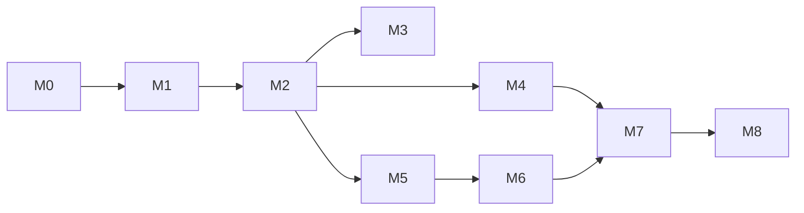

# 14 — Roadmap

**Status:** `draft` · **Owns:** the milestone order
**Cites:** every preceding document

> **No MVP cut and no "phase 2" bucket** (`_source-brief.md` §1). Everything in scope ships as one
> product; the milestones only order the build. A milestone is done when it is **demonstrable** —
> someone can be shown it working — not when its code is merged.

---

## 1. Standing constraints

These hold across **every** milestone, without exception (A38, `REQ-NFR-019`, `REQ-NFR-020`):

1. Every milestone ships to the **same Vercel project and domain** currently serving the live
   pre-launch site.
2. **`main` stays deployable** at all times.
3. `/`, `/ar`, `/en`, `/ar/register`, `/og.png` are a **frozen public contract**, guarded by
   `scripts/qa.mjs` in CI.
4. **`registrations` is never dropped** (DEC-002).
5. Every migration is **forward-only** and tested against production-shaped data first.
6. **Deploys are frozen during scheduled sessions** once M2 ships — Server Action IDs rotate on
   deploy, and this product is used live in a room (`04` §9.2).

---

## 2. Milestones

```mermaid
gantt
    dateFormat X
    axisFormat %s
    section Foundation
    M0 foundation and de-risking      :m0, 0, 3
    section Core
    M1 tenancy, identity, RLS spine   :m1, after m0, 4
    M2 sessions, RSVP, check-in       :m2, after m1, 4
    M3 notifications and calendar     :m3, after m2, 2
    section Value
    M4 scoring and leaderboards       :m4, after m2, 3
    M5 content pipeline               :m5, after m2, 3
    M6 designer and certificates      :m6, after m5, 4
    section Operate
    M7 org console and branding       :m7, after m4, 3
    M8 super admin and hardening      :m8, after m7, 2
```

`M3`, `M4` and `M5` all depend on `M2` and on nothing else, so they can run in parallel if there is
capacity. `M6` needs `M5`'s storage and job plumbing.

---

## M0 — Foundation and de-risking

**No user-visible change. The existing QA must stay 35/35 green.**

| Work | Why here |
|---|---|
| ✅ **`scripts/qa.mjs` fixed** (DEC-023) | Was stale *and* could write to production. Now 44/44 and repeatable, behind `npm run qa`, refusing any non-localhost `SUPABASE_URL`. The `qa` gate can be turned on |
| **Local Supabase for dev + Postgres container in CI** (DEC-025) | Replaces three hosted projects — same safety for M1, **$0**. Needs Docker installed (owner's action). A hosted staging is deferred until someone needs to share one |
| Playwright, jsdom, `@testing-library` | `REQ-NFR-018`. A23 assumed these; they are absent |
| GitHub Actions CI with the four blocking gates | `13` §9.1 |
| `scripts/traceability.mjs` + its gate | `13` §10 — the only mechanism that actually holds |
| Radix + the ~8 inline SVG glyphs | DEC-019 |
| **Monorepo restructure** for `designer-runtime` | Touches the live site — do it first, with a visual diff |
| graphile-worker on Fly + the **`LISTEN`/`NOTIFY` boot probe** | `11` §1.2 — the failure is silent |
| The credential-free converter app | `04` §7.1 |
| **Wire the browser Supabase client** (DEC-020, **DEC-021**) | No longer a spike — the owner confirmed the trade. Retire the `README.md:35` invariant here, pointing at both entries |
| ✅ **Shaping parity harness** (DEC-024) | **Done and green.** Chromium is deterministic to 0.000%; substitution caught at 2–10%. D66 is achievable — M6 can be planned on it. Export-path coverage still belongs to M6 |
| **Decide the hosting region** (OQ-026) | Cheap now; a data migration later |
| `NEXT_SERVER_ACTIONS_ENCRYPTION_KEY` set and stable | `04` §9.2 |

**Demonstrable:** `scripts/qa.mjs` passes again and blocks a deliberate regression of a frozen route. CI runs and blocks on a deliberately broken policy. The worker renders a poster
with correct Arabic and the parity suite catches a substituted font. The live site is byte-identical.

**Risk:** the monorepo restructure and the font work both touch the live site. Sequence them first,
with a visual diff of the landing page before and after.

---

## M1 — Tenancy, identity and the RLS spine · ★ **the dangerous one**

**Retrofitting auth and RLS onto a live database whose only policy is `anon`-insert. Do not
compress this milestone.**

| Work | Requirements |
|---|---|
| `orgs`, `org_domains`, `org_settings`, `companies`, `members`, `categories`, `venues` | `REQ-TEN-001` … `REQ-TEN-008` |
| Google auth + **the Custom Access Token Hook** | `REQ-AUT-001` … `REQ-AUT-004` |
| Domain-gated auto-provisioning | `REQ-AUT-003` |
| The **DAL** with `requireSession()` and `getClaims()` narrowing on `data` | `REQ-NFR-004` |
| `proxy.ts`: CSP nonce + optimistic cookie check | `REQ-NFR-003` |
| **RLS on every table shipped so far**, with the generated isolation sweep | `REQ-NFR-001` |
| `audit_log`, append-only | `REQ-ADM-018` |
| Profiles with **two visibility tiers** | `REQ-PRF-004`, A33 |
| Sign-in, choose-org, no-access screens | SCR-002 … SCR-004 |

**Demonstrable:** two members of two different orgs sign in; each sees only their own org; the
isolation sweep passes over every table; a super admin gets **zero rows** from every data table.

**Risks, and the mitigations:**

| Risk | Mitigation |
|---|---|
| ★ **The auth hook is a single point of failure for all sign-in.** It must never raise, must return the event unchanged when no member row exists, and needs three separate grants for `supabase_auth_admin`. Failure looks like a generic auth outage. | Test it against a user with no member row, a suspended org, and a missing grant, **before** it goes near production |
| Enabling RLS on `registrations` | **Do not touch it.** It is frozen legacy (DEC-002) |
| The grant-vs-policy trap | Already paid for once here (migration `0002`). CI asserts every policied table has its grant |

---

## M2 — Sessions, proposals, RSVP, check-in

The product's core loop.

| Work | Requirements |
|---|---|
| Proposals + review + state machine | `REQ-PRO-001` … `REQ-PRO-008` |
| Sessions, scheduling, venues, publish gate | `REQ-SES-001` … `REQ-SES-013` |
| `JOB-start_session`, `JOB-complete_session` on the clock | `REQ-SES-004` |
| **RSVP with capacity in the transaction**, waitlist, promotion | `REQ-RSV-001` … `REQ-RSV-011` |
| ★ **Check-in**: stored rotating codes, in-transaction rate limiting, burn, manual backup, the overlap exclusion constraint | `REQ-CHK-001` … `REQ-CHK-014` |
| The event page and the host view | SCR-012, SCR-014, SCR-016 |
| Comments, reactions, reports | `REQ-EVT-001` … `REQ-EVT-008` |
| Ratings with the check-in gate and the min-3 aggregate | `REQ-RAT-001` … `REQ-RAT-006` |
| Realtime for counts and comments | A18, DEC-021 |

**Demonstrable:** ★ **the full critical path, in a real room.** Propose → approve → schedule →
publish → RSVP past capacity → promote → check in with a rotating code → comment → rate. E2E-01
passes minus the points and certificate steps.

**From here on, deploys are frozen during scheduled sessions.**

---

## M3 — Notifications and calendar

| Work | Requirements |
|---|---|
| The notification matrix, in-app + email | `REQ-NTF-001` … `REQ-NTF-008` |
| Resend, from the **worker only** | `04` §10 |
| Arabic RTL email templates | `08` §3 |
| Preferences, with the eleven non-optional marked | `REQ-NTF-003` |
| Reminders with **move-on-reschedule** `job_key`s | `REQ-NTF-004` |
| ICS with **75-octet folding** | `REQ-CAL-001` |
| Google Calendar sync, full lifecycle | `REQ-CAL-003` … `REQ-CAL-008` |

**Demonstrable:** reschedule a session — every attendee is notified with **old and new values**,
synced calendars update, and the three reminders **move** rather than duplicating. Open the ICS in
Outlook on Windows and read the Arabic correctly.

---

## M4 — Scoring, leaderboards, recognition

| Work | Requirements |
|---|---|
| The ledger, append-only, with deterministic idempotency keys | `REQ-PTS-001`, `REQ-PTS-012` |
| The rollup + `JOB-audit_balances` | `REQ-PTS-011` |
| The action catalogue seeded to A10; admin configuration | `REQ-PTS-004` … `REQ-PTS-008` |
| Caps, cooldowns, reversals, manual adjustment | `REQ-PTS-006`, `REQ-PTS-013`, `REQ-PTS-009` |
| Badges, levels, streaks, perks — with the defaults | `REQ-REC-001` … `REQ-REC-009` |
| Leaderboards + **frozen snapshots** with the denominator | `REQ-LDR-001` … `REQ-LDR-008` |
| The member's own history screen | SCR-022 |

**Demonstrable:** a member reads their whole points history and can explain every point **without
asking anyone** (`REQ-PTS-003`). An admin changes a value and the change applies forward only.
Rebuilding the rollup reproduces every balance exactly. **سباق الشركات** shows both metrics.

**This milestone redeems the promises the live marketing copy already makes** — «نقاط للمقدّمين
والحاضرين», «سباق بين شركات المجموعة», «تكريم سنوي». Until it ships, the site promises something
the platform does not do.

---

## M5 — Content pipeline

| Work | Requirements |
|---|---|
| Direct-to-Storage uploads with server-side sniffing | `REQ-MAT-002`, `REQ-MAT-012` |
| Six buckets, prefix policies, the **single path builder** | `03` §6 |
| `JOB-convert_document` on the credential-free app | `04` §7.1 |
| Page rendering + the viewer, with **RTL navigation** | `REQ-MAT-003` |
| **Keynote download-only** | `REQ-MAT-004` |
| Font-substitution detection and its warning | `REQ-MAT-011` |
| `allow_download`, phase gating, versioning | `REQ-MAT-005`, `REQ-MAT-006`, `REQ-MAT-010` |
| Photos: **EXIF stripping**, the check-in gate, instant takedown | `REQ-EVT-009` … `REQ-EVT-014` |
| Pre-session tasks | `REQ-TSK-001` … `REQ-TSK-005` |
| Search with Arabic normalisation | `REQ-DSC-001` … `REQ-DSC-007` |

**Demonstrable:** upload an Arabic PowerPoint, read it page by page in the viewer with the arrows
going the right way, and see the font-substitution warning when the deck uses a font the worker
lacks. Upload a photo and confirm the stored bytes carry **no EXIF**.

---

## M6 — The designer and certificates

The largest single milestone. `05`, `06` and `07` all feed it.

| Work | Requirements |
|---|---|
| The layer model, schema, and the DOM/SVG editor | `REQ-DSG-005`, `REQ-DSG-022` |
| Dynamic fields with **real-data preview** | `REQ-DSG-006` |
| Template versioning + the platform/org libraries | `REQ-DSG-007`, `REQ-DSG-008` |
| The A27 baseline templates, under the brand constraint | `REQ-DSG-026` |
| Presets, safe areas, auto-fit | `REQ-DSG-009`, `REQ-DSG-025` |
| Export pipeline, all formats, caching by fingerprint | `REQ-DSG-011` … `REQ-DSG-013` |
| ★ **Parity Tiers A, B and C in production** | `REQ-DSG-014`, `REQ-DSG-015` |
| **Google Fonts materialisation** with the golden gate | `REQ-DSG-017` |
| Image layers, **no SVG**, PPI guard, focal cropping | `REQ-DSG-018`, `REQ-DSG-019` |
| Auto-generated posters + the **live/detached** rule | `REQ-DSG-002`, `REQ-DSG-003` |
| QR layers, both kinds | `REQ-DSG-023`, `REQ-CRT-010` |
| Certificates: **gapless serial**, random verification code, PDF, email | `REQ-CRT-001` … `REQ-CRT-014` |
| The public verification page | SCR-006 |
| The centralised brand kit | `REQ-DSG-021` |

**Demonstrable:** publish a session and get **every A12 variant** with no design work. Edit one and
watch it detach. Print an A3 poster and a certificate; scan both QRs — one lands on the session
after sign-in, the other on `/verify`. **Try the serial at `/verify` and get not-found.** The
parity suite passes all 28 assertions.

**Risks:** font subsetting dropping `rlig`/`mark` (caught by goldens, never auto-refreshed); the
2 GB image's cold-start on Fly; Chromium memory under concurrent A3 renders (hence `render`
concurrency 2).

---

## M7 — Org admin console and per-org branding

| Work | Requirements |
|---|---|
| The full admin console — every surface in D60 | `REQ-ADM-004` … `REQ-ADM-018` |
| Moderation queues, with takedowns **separate** from reports | `REQ-ADM-010` |
| CSV exports, **UTF-8 with BOM**, audited | `REQ-ADM-017` |
| The audit log viewer | `REQ-ADM-018` |
| Per-org brand kit flowing to UI, templates and email | `REQ-DSG-021` |
| The moderator scope, **enforced by policy** | `REQ-ADM-020` |

**Demonstrable:** ★ **stand up a second org.** Different brand, different scoring, different
templates, different members — and prove that neither org can see a single row of the other's. This
is the milestone that actually proves DEC-004's multi-tenancy claim; until it happens, isolation is
tested but not exercised.

---

## M8 — Super admin, observability, launch hardening

| Work | Requirements |
|---|---|
| The super-admin console | `REQ-ADM-001`, `REQ-ADM-003` |
| **Break-glass impersonation**, audited in the org's own log | `REQ-ADM-002`, `REQ-ADM-019` |
| Platform template library management | `REQ-DSG-008` |
| Sentry, job dashboards, **every alert in `11` §3.2** | `REQ-NFR-016` |
| Retention and anonymisation jobs | `REQ-NFR-012`, `REQ-PRF-007` |
| The nightly storage-prefix assertion | `03` §6 |
| Data export for members | `REQ-PRF-006` |
| Accessibility audit against WCAG 2.2 AA | `REQ-NFR-007` |
| **Real-device pass** on the full matrix | `13` §8 |
| Performance budgets enforced | `REQ-NFR-008` |
| Legal pages, PDPL documentation | `REQ-NFR-015` |

**Demonstrable:** a super admin creates an org, sets its first admin, and **cannot read a single
row of its data**. A break-glass session appears in the org's own audit log. Every alert fires in a
drill.

---

## 3. Dependencies

| Dependency | Why it is hard |
|---|---|
| M1 → M2 | Nothing has an owner until members and orgs exist |
| M2 → M4 | Points key off the **check-in event**; without M2 there is nothing to award |
| M2 → M5 | Materials belong to sessions (`REQ-MAT-001`) — there are no standalone uploads |
| M5 → M6 | The designer reuses M5's storage layout and job plumbing |
| M4 + M6 → M7 | The console configures what M4 and M6 built |
| M7 → M8 | A super admin manages orgs; a second org must exist first |

---

## 4. What is demonstrable, in one line each

| M | Demo |
|---|---|
| **M0** | CI blocks a broken policy; the worker renders correct Arabic; the live site is unchanged |
| **M1** | Two orgs, complete isolation, proved by the sweep — including against a super admin |
| **M2** | The whole core loop, **run in a real room** with a rotating check-in code |
| **M3** | Reschedule a session: notified with old→new, calendars updated, reminders moved |
| **M4** | A member explains every point they hold, unaided |
| **M5** | An Arabic deck read page by page, with RTL navigation and a substitution warning |
| **M6** | A printed A3 poster and certificate; both QRs work; the serial does not |
| **M7** | A **second org**, with its own brand and scoring, invisible to the first |
| **M8** | A super admin who cannot read org data, and whose attempt is in the org's own log |

---

## 5. The eight risks worth restating

| # | Risk | Where it is handled |
|---|---|---|
| 1 | **M1 is the dangerous milestone** — auth and RLS onto a live database | M1; do not compress it |
| 2 | **The auth hook is a single point of failure for all sign-in** | M1 risk table; three grants; never raises |
| 3 | **Storage prefixes are the only application-correctness dependency** | `03` §6 — path builder, prefix policy, nightly assertion |
| 4 | **Font subsetting is the likeliest silent Arabic killer** | `10` §4.2; goldens never auto-refreshed |
| 5 | **Server Action IDs rotate on deploy**, and this is used live in a room | `04` §9.2 — freeze deploys during sessions |
| 6 | **Rating anonymity is fragile at small N** | OQ-009 — withhold below 3, and say so |
| 7 | **The monorepo restructure and font swap touch the live site** | M0, sequenced first, with a visual diff |
| 8 | **Points-per-active-member is gameable** | `05` §6.2 — freeze the denominator, require a reason |
